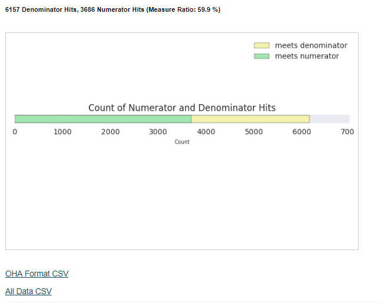

# Reliance Insight Report Catalog

### Click on a report name below for a detailed description 

## [A. OHA CCO Incentive and Performance Reports](#oha-cco-incentive-and-performance-reports)

| Report Name    | Description               |
| -------------  |-------------              |
| [Diabetes: HbA1c Poor Control](#diabetes-hba1c-poor-control)        | Percentage of patients 18-75 years of age with diabetes who had hemoglobin A1c > 9.0% during the measurement period.         |
| [Adolescent Well Care Visits](#adolescent-well-care-visits)      | Percentage of adolescents and young adults (ages 12-21) who had at least one well-care visit during the measurement year.         |
| [Alcohol and Drug Misuse (SBIRT)](#alcohol-and-drug-misuse-sbirt))      | Percentage of members (ages 12 and older) who received appropriate "screening, brief intervention, and referral to treatment" (SBIRT) for alcohol or other substance abuse.         |
| [Cervical Cancer Screening](#cervical-cancer-screening)      |  Percentage of women 21-64 years of age who were screened for cervical cancer using either of the following criteria: * Women age 21-64 who had cervical cytology performed every 3 years * Women age 30-64 who had cervical cytology/human papillomavirus (HPV) co-testing performed every 5 years        |
| [Childhood Immunization Status](#childhood-immunization-status)  | Percentage of children 2 years of age who had four diphtheria, tetanus and acellular pertussis (DTaP); three polio (IPV), one measles, mumps and rubella (MMR); three H influenza type B (HiB); three hepatitis B (Hep B); one chicken pox (VZV); four pneumococcal conjugate (PCV); one hepatitis A (Hep A); two or three rotavirus (RV); and two influenza (flu) vaccines by their second birthday       |
| [Chlamydia Screening in Women](#chlamydia-screening-in-women)      |  Percentage of sexually active women (ages 16-24) who had a test for chlamydia infection.  |
| [Cigarette Smoking Prevalence (Bundled Measure)](#cigarette-smoking-prevalence)      | Bundled measure is intended to address both cessation benefits offered by CCOs and cigarette smoking prevalence: 1) Meeting minimum cessation benefit requirements 2) Submitting EHR-based cigarette smoking and tobacco prevalence data according to data submission requirements 3) Meeting benchmark or improvement target established by the Metrics & Scoring Committee         |
| [Colorectal Cancer Screening](#colorectal-cancer-screening)      | Percent of adult members (ages 50-75) who had appropriate screening for colorectal cancer.  |
| [Controlling Hypertension](#)  | Percentage of patients 18-85 years of age who had a diagnosis of hypertension and whose blood pressure was adequately controlled (<140/90mmHg) during the measurement period.        |
| [Ambulatory care: Emergency department utilization](#)      | Rate of patient visits to an emergency department.         |
| [Disparity Measure: Emergency Department Utilization for Individuals Experiencing Mental Illness ](#)  | Rate of visits to an emergency department among adult members experiencing mental illness.        |
| [Screening for Clinical Depression and Follow-Up Plan](#)      |  Percentage of members (ages 12 and older) who had appropriate screening and follow-up planning for major depression.        |
| [Developmental Screening in the First Three Years of Life ](#)      | Percentage of children who were screened for risks of developmental, behavioral and social delays using standardized screening tools in the 12 months preceding their first, second or third birthday.         |
| [Effective Contraceptive Use](#)        | Percentage of women (ages 15-50) with evidence of one of the most effective or moderately effective contraceptive methods during the measurement year: IUD, implant, contraception injection, contraceptive pills, sterilization, patch, ring, or diaphragm.         |
| [Weight Assessment and Counseling for Nutrition and Physical Activity for Children and Adolescents](#)      |  Percentage of patients (age 3-17) who had an outpatient visit with a PCP or OB/GYN and who had evidence of the following during the measurement period. Three rates are reported. 1. Percentage of patients with height, weight, and body mass index (BMI) percentile documentation 2. Percentage of patients with counseling for nutrition 3. Percentage of patients with counseling for physical activity        |

## [B. QCDR Reports](#qcdr-reports)
| Report Name    | Description               |
| -------------  |-------------              |
| [Diabetes: Hemoglobin A1c (HbA1c) Poor Control (>9%)](#)        | Percentage of patients 18-75 years of age with diabetes who had hemoglobin A1c > 9.0% during the measurement period.         |
| [Breast Cancer Screening](#) | Percentage of women 50-74 years of age who had a mammogram to screen for breast cancer. |
| [Colorectal Cancer Screening](#) | Percentage of adults 50-75 years of age who had appropriate screening for colorectal cancer. |
| [Preventive Care and Screening: Body Mass Index (BMI) Screening and Follow-Up Plan](#) | Percentage of patients aged 18 years and older with a BMI documented during the current encounter or during the previous six months AND with a BMI outside of normal parameters, a follow-up plan is documented during the encounter or during the previous six months of the current encounter.  Normal Parameters: Age 18 years and older BMI => 18.5 and < 25 kg/m2 |
| [Ischemic Vascular Disease (IVD): Use of Aspirin or Another Antiplatelet](#) | Percentage of patients 18 years of age and older who were diagnosed with acute myocardial infarction (AMI), coronary artery bypass graft (CABG) or percutaneous coronary interventions (PCI) in the 12 months prior to the measurement period, or who had an active diagnosis of ischemic vascular disease (IVD) during the measurement period, and who had documentation of use of aspirin or another antiplatelet during the measurement period. |
| [Preventive Care and Screening: Tobacco Use: Screening and Cessation Intervention](#) | Percentage of patients aged 18 years and older who were screened for tobacco use one or more times within 24 months AND who received cessation counseling intervention if identified as a tobacco user. |
| [Controlling High Blood Pressure](#) | Percentage of patients 18-85 years of age who had a diagnosis of hypertension and whose blood pressure was adequately controlled (<140/90mmHg) during the measurement period. |
| [Cervical Cancer Screening](#) | Percentage of women 21-64 years of age who were screened for cervical cancer using either of the following criteria: * Women age 21-64 who had cervical cytology performed every 3 years * Women age 30-64 who had cervical cytology/human papillomavirus (HPV) co-testing performed every 5 years |

## [C. HEDIS Reports](#hedis-reports)
| Report Name    | Description               |
| -------------  |-------------              |
| [Flu Vaccinations for Adults Ages 18-64](#) | The percentage of commercial and Medicaid members 18–64 years of age who received an influenza vaccination between July 1 of the measurement year and the date when the CAHPS 5.0H survey was completed. |
| [Flu Vaccinations for Adults Ages 65 and Older](#)      | Description The percentage of Medicare members 65 years of age and older who received an influenza vaccination between July 1 of the measurement year and the date when the Medicare CAHPS survey was completed.  |

## [D. Custom Reports](#custom-reports)
| Report Name    | Description               |
| -------------  |-------------              |
| [Hepatitis C Diagnosis and Hepatic Labs](#) | Returns all patients with a diagnosis of Hepatitis C. Includes HIV status, most recent liver panel lab results, most recent fibrosis lab results, and calculated AST to Platelet Ratio Index (APRI Score).  |
| [Diabetes by Type](#) | This report displays two outputs.  The first output is percentage of patients with type 1 diabetes who had hemoglobin A1c > 9.0% during the measurement period. The second output is percentage of patients with type 2 diabetes who had hemoglobin A1c > 9.0% during the measurement period.  | 
| [Positive Pregnancy](#) | Real time identification of pregnant population |  

## [E. Appendix](#appendix)
[Consolidated Patient Chart](#consolidated-patient-chart)  
[Glossary](#glossary)

## OHA CCO Incentive and Performance Reports  
The Oregon Health Authority (OHA) uses quality health metrics to show how well Coordinated Care Organizations (CCOs) are improving care, making quality care accessible, eliminating health disparities, and curbing the rising cost of health care. These outcome and quality measures are developed by the OHA Metrics and Scoring Committee and can be found here:   
<http://www.oregon.gov/OHA/HPA/ANALYTICS/Pages/CCO-Baseline-Data.aspx>  
The default measurement period for the following reports is Calendar Year 2017, but the user can choose a measurement period of their choice.

### Diabetes: HbA1c Poor Control
**Measure Description**  
Percentage of patients 18-75 years of age with diabetes who had hemoglobin A1c > 9.0% during the measurement period.   
OHA 2017 Benchmark Measure Ratio (total numerator hits/total denominator hits) is 19%.  
**Denominator**  
Patients 18-75 years of age who had a diagnosis of diabetes during or any time prior to the measurement period and who received a qualifying outpatient service during the measurement period.  
**Numerator**  
Patients whose most recent HbA1c level (performed during the measurement period) is >9.0%.  
**Data Sources**  
ADTs, CCDs, LABs, and Encounters   
**Input Parameters**   
Start Date, End Date, and Records to Display Below  
**Output**  
Total denominator hits, total numerator hits, measure ratio (total numerator hits/total denominator hits), stacked bar chart of measure ratio, distribution plot of HbA1c values in denominator population, list of patients that meet denominator and numerator requirements.  
OHA Format CSV Download and All Data CSV Download (contains all column headings below)  
**Example Output**  
  
**Column headings**  
`mpid_CPC | patient_date_of_birth | sex | patient_medicaid_id | sending_facility | date_of_service_denom | sending_facility_num | date_of_service_num | HbA1c | provider_name | ordering_provider | meets_denominator | meets_numerator | date_of_service_bmi | bmi | date_of_service_bp | bp_systolic | bp_diastolic | measurement_period_begin | measurement_period_end`

**Link to Measure Specifications**  
<http://www.oregon.gov/oha/HPA/ANALYTICS/CCOData/Diabetes%20HbA1c%20Poor%20Control%20-%202017%20%28revised%20Feb%202017%29.pdf>

### Adolescent Well Care Visits
**Measure Description**  
Percentage of adolescents and young adults (ages 12-21) who had at least one well-care visit during the measurement year.  
**Denominator**  
Members age 12-21 years as of December 31 of the measurement year. See HEDIS® 2017 Technical Specifications for Health Plans (Volume 2) for details.  
**Required exclusions for denominator:**  
Patients with more than one gap in continuous enrollment of up to 45 days during the measurement year.  
**Numerator**  
At least one comprehensive well-care visit during the measurement year. See HEDIS® 2017 Technical Specifications for Health Plans (Volume 2) for details.

**Data Sources**  
ADTs, CCDs, LABs, and Encounters   
**Input Parameters**   
Start Date, End Date, and Records to Display Below  
**Output**  
Total denominator hits, total numerator hits, measure ratio (total numerator hits/total denominator hits), stacked bar chart of measure ratio, list of patients that meet denominator and numerator requirements.  
OHA Format CSV Download and All Data CSV Download (contains all column headings below)  

**Example Output**  
  
**Column headings**  
`mpid_CPC | patient_date_of_birth | sex | patient_medicaid_id | sending_facility | date_of_service_denom |sending_facility_num | date_of_service_num | meets_denominator | meets_numerator | provider_name | measurement_period_begin | measurement_period_end`

**Link to Measure Specifications**  
<http://www.oregon.gov/oha/HPA/ANALYTICS/CCOData/Adolescent-Well-Care-Visits-2017.pdf>

### Alcohol and Drug Misuse (SBIRT)
**Measure Description**  
Percentage of members (ages 12 and older) who received appropriate "screening, brief intervention, and referral to treatment" (SBIRT) for alcohol or other substance abuse.  
**Denominator**  
Unique count of members age 12 years as of December 31 of the measurement year who received an outpatient service between January 1 - December 31 of the measurement year, as identified by the specified CPT codes for office or other outpatient visits, home visits, and preventative medicine. See OHA spec link below for details.  
**Numerator**  
Unique counts of members age 12 years and older as of December 31 of the measurement year with one or more screening, brief intervention, and referral to treatment (SBIRT) services.  
**Required exclusions for numerator**  
Exclude SBIRT screening and/or brief intervention services provided in emergency department settings. OHA uses the HEDIS Ambulatory care ED visits method to identify claims for exclusion.

**Data Sources**  
ADTs, CCDs, LABs, Encounters, and Claims   
**Input Parameters**   
Start Date, End Date, and Records to Display Below  
**Output**  
Total denominator hits, total numerator hits, measure ratio (total numerator hits/total denominator hits), stacked bar chart of measure ratio, list of patients that meet denominator and numerator requirements.  
OHA Format CSV Download and All Data CSV Download (contains all column headings below)  

**Example Output**  
  
**Column headings**  
`mpid_CPC | patient_date_of_birth | sex | patient_medicaid_id | sending_facility | date_of_service_denom | date_of_service_num | meets_denominator | meets_numerator | meets_numerator_exception | provider_name | measurement_period_begin | measurement_period_end`

**Link to Measure Specifications**  
<http://www.oregon.gov/oha/HPA/ANALYTICS/CCOData/Alcohol-and-Drug-Misuse-(SBIRT)-2017.pdf>

### Cervical Cancer Screening
**Measure Description**
Percentage of women 21-64 years of age who were screened for cervical cancer using either of the following criteria: 
* Women age 21-64 who had cervical cytology performed every 3 years 
* Women age 30-64 who had cervical cytology/human papillomavirus (HPV) co-testing performed every 5 years

**Denominator**  
Women 24-64 years of age as of December 31 of the measurement year. See HEDIS® 2017 Technical Specification for Health Plans (Volume 2) for details. 

**Required exclusions for denominator**
 * Patients with more than one gap in continuous enrollment of up to 45 days during the measurement year.
 * Exclude women with hysterectomy with no residual cervix, cervical agenesis or acquired absence of cervix (Absence of Cervix Value Set) any time during the member’s history through December 31 of the measurement year. 

**Numerator**  
* Step1: Women age 24-64 years of age as of December 31 of the measurement year who received cervical cytology (Cervical Cytology Value Set) during the measurement year or the two years prior to the measurement year.
* Step2: From the women who did not meet step 1 criteria, identify women 30-64 years of age as of December 31
of the measurement year who had cervical cytology (Cervical Cytology Value Set) and a human papillomavirus (HPV) test (HPV Tests Value Set) with service dates four or less day apart during the measurement year or the four years prior to the measurement year and who were 30-64 years of age on the date of both tests.  
* Step3: Sum the events from steps 1 and 2 to obtain the rate.  

**Data Sources**  
ADTs, CCDs, LABs, Encounters, Transcriptions, and Claims   
**Input Parameters**   
Start Date, End Date, and Records to Display Below  
**Output**  
Total denominator hits, total numerator hits, measure ratio (total numerator hits/total denominator hits), stacked bar chart of measure ratio, list of patients that meet denominator and numerator requirements.  
OHA Format CSV Download and All Data CSV Download (contains all column headings below)  

**Example Output**  

**Column headings**  
`mpid_CPC | patient_date_of_birth | sex | patient_medicaid_id | sending_facility | date_of_service_denom | date_of_service_num | date_of_service_denom_excl | meets_denominator | meets_numerator | meets_denominator_exclusion | provider_name | measurement_period_begin | measurement_period_end`

**Link to Measure Specifications**  
<http://www.oregon.gov/oha/HPA/ANALYTICS/CCOData/Cervical%20Cancer%20Screening%20-%202017%20(updated%20Oct%202017).pdf>

### Childhood Immunization Status  
**Measure Description**
Percentage of children who received recommended vaccines (DTaP, IPV, MMR, HiB, Hepatitis B, VZV) before their second birthday.  
**Denominator**  
Children who turn 2 years of age during the measurement year. See HEDIS® 2017 Technical Specification for Health Plans (Volume 2) for details.  
**Required exclusions for denominator**  
Patients with more than one gap in continuous enrollment of up to 45 days during the 12 months prior to child's 2nd birthday.  
**Numerator**  
OHA is using HEDIS® 2017 Combination 2 for the state performance measure: The number of children who turned 2 years of age in the measurement year and had all of the following specified vaccinations (minimum threshold in brackets): DTaP (4), IPV (3), MMR (1), HiB (3), HepB (3), VZV (1).  
**Data Sources**  
ADTs, CCDs, LABs, Encounters, Transcriptions, and Claims   
**Input Parameters**   
Start Date, End Date, and Records to Display Below  
**Output**  
Total denominator hits, total numerator hits, measure ratio (total numerator hits/total denominator hits), stacked bar chart of measure ratio for each immunization and overall, list of patients that meet denominator and numerator requirements.  
OHA Format CSV Download, All Data CSV Download (contains all column headings below) and Immunization DOS CSV (every immunizatons and DOS for each patient)

**Example Output**  

**Column headings**  
`mpid_CPC | patient_date_of_birth | sex | patient_medicaid_id | 
        sending_facility | date_of_service_denom | meets_denominator | 
        date_of_service_dtap |dtap_num | dtap count |
        date_of_service_ipv | ipv_num | ipv count |
        date_of_service_mmr | mmr_num | mmr count |
        date_of_service_hib | hib_num | hib count |
        date_of_service_hepb | hepb_num | hepB count |hepb_dx |
        date_of_service_vzv | vzv_num | vzv count | vzv_dx |
        all_vacs |provider_name | measurement_period_begin | measurement_period_end`

**Link to Measure Specifications**  
<http://www.oregon.gov/oha/HPA/ANALYTICS/CCOData/childhood-immunizations-2017.pdf>

### Chlamydia Screening in Women
**Measure Description**  
Assesses women 16–24 years of age who were identified as sexually active and who had at least one test for chlamydia during the measurement year.   
**Denominator**  
Women 16-24 years of age as of December 31 of the measurement year, who are identified as ‘sexually active’ using either the claim/encounter data or the pharmacy data.   
**Required exclusions for denominator**  
OHA adopts the HEDIS® 2017 optional exclusion rule: Exclude members who qualified for the denominator based on a pregnancy test alone and who meet either of the following: 1) A pregnancy test (Pregnancy Tests Value Set) during the measurement year followed within seven days
(inclusive) by a prescription for isotretinoin, or 2) A pregnancy test (Pregnancy Tests Value Set) during the measurement year followed within seven days (inclusive) by an x-ray (Diagnostic Radiology Value Set).  
**Numerator**  
At least one chlamydia test (Chlamydia Tests Value Set) during the measurement year.  
**Data Sources**  
ADTs, CCDs, LABs, Encounters, Transcriptions, and Claims   
**Input Parameters**   
Start Date, End Date, and Records to Display Below  
**Output**  
Total denominator hits, total numerator hits, measure ratio (total numerator hits/total denominator hits), stacked bar chart of measure ratio, list of patients that meet denominator and numerator requirements.  
OHA Format CSV Download, All Data CSV Download (contains all column headings below).  

**Example Output**  
  

**Column headings**  
` mpid_CPC | patient_date_of_birth | sex | patient_medicaid_id | sending_facility | date_of_service_denom | date_of_service_num | meets_denominator | meets_numerator | provider_name | measurement_period_begin | measurement_period_end `

**Link to Measure Specifications**  
<http://www.oregon.gov/oha/HPA/ANALYTICS/CCOData/Chlamydia%20Screening%20-%202017%20(updated%20Oct%202017).pdf>  

### Cigarette Smoking Prevalence  
**Measure Description**  
Bundled measure is intended to address both cessation benefits offered by CCOs and cigarette smoking prevalence.  

**Rate 1**  
**Denominator**  
Unique Medicaid members 13 years old or older by the beginning of the measurement year, who had a qualifying visit with the provider during the measurement period.  
**Numerator**  
Unique members age 13 years or older who had a qualifying visit with the provider during the measurement period, who have their smoking and/or tobacco use status recorded as structured data. 

**Rate 2**   
**Denominator**  
Unique Medicaid members age 13 years or older who had a qualifying visit with the provider during the measurement period and who have their smoking and/or tobacco use status recorded as structured data (Rate 1 numerator).  
**Numerator**  
Of patients in the Rate 2 denominator, those who are cigarette smokers. See below for additional information on identifying cigarette smoking in the numerator.  

**Rate 3**  
**Denominator**  
Unique Medicaid members age 13 years or older who had a qualifying visit with the provider during the measurement period and who have their smoking and/or tobacco use status recorded as structured data (Rate 1 numerator).  
**Numerator**  
Of patients in the Rate 3 denominator, those who are cigarette smokers and/or tobacco users. See below for additional information on identifying tobacco use in the numerator.   

**Required exclusions for numerator**  
Members with missing smoking or tobacco use status will be excluded from rates 2 and 3. Note that e-cigarettes and marijuana (medical or recreational) should be excluded from both
the cigarette smoking rate and the broader tobacco use rate.  In addition, the measure is focused on cigarette and tobacco use, not nicotine use.

**Data Sources**  
ADTs, CCDs, LABs, Encounters, Transcriptions, and Claims   
**Input Parameters**   
Start Date, End Date, and Records to Display Below  
**Output**  
Total denominator hits, total numerator hits, measure ratio (total numerator hits/total denominator hits), stacked bar chart of measure ratio for each rate, list of patients that meet denominator and numerator requirements.  
OHA Format CSV Download, All Data CSV Download (contains all column headings below).  

**Example Output**  
  

**Column headings**  
`mpid_CPC | patient_date_of_birth | sex | patient_medicaid_id |sending_facility | 
        date_of_service_denom | date_of_service_num1 | date_of_service_num2 | date_of_service_num3 | provider_name | meets_smoke_denominator,
        meets_numerator | meets_numerator_status_1 | meets_numerator_status_2 | measurement_period_begin | measurement_period_end`

**Link to Measure Specifications**  
<http://www.oregon.gov/oha/HPA/ANALYTICS/CCOData/Cigarette%20Smoking%20Prevalence%20Bundle%20-%202017.pdf>  

### Colorectal Cancer Screening
**Measure Description**   
Percent of adult members (ages 51-75) who had appropriate screening for colorectal cancer.  
**Denominator**  
Medicaid enrollees age 51-75 years as of December 31st of the measurement year.  
**Numerator**  
Unique number of individuals receiving at least one of the approved screenings for colorectal cancer either during the measurement year or years prior to the measurement year.  
**Required exclusions for denominator**  
Either of the following any time during the member’s history through December 31 of the measurement year: Colorectal Cancer Value Set or Total Colectomy Value Set.  
**Data Sources**  
ADTs, CCDs, LABs, Encounters, Transcriptions, and Claims   
**Input Parameters**   
Start Date, End Date, and Records to Display Below  
**Output**  
Total denominator hits, total numerator hits, measure ratio (total numerator hits/total denominator hits), stacked bar chart of measure ratio, list of patients that meet denominator and numerator requirements.  
OHA Format CSV Download, All Data CSV Download (contains all column headings below).  

**Example Output**  
  

**Column headings**  
`mpid_CPC | patient_date_of_birth | sex | patient_medicaid_id | sending_facility | date_of_service_denom | date_of_service_num | meets_denominator | meets_numerator | meets_denominator_exclusion | provider_name | measurement_period_begin | measurement_period_end`

**Link to Measure Specifications**  
<http://www.oregon.gov/oha/HPA/ANALYTICS/CCOData/colorectal-cancer-screening-2017.pdf>  

## QCDR Reports

## HEDIS Reports

## Custom Reports

## Appendix

### Consolidated Patient Chart  
The Consolidated Patient Chart (CPC) is a tool that allows users to more easily access patient records. CPC consists of three main sections: Summary, a quick overview of the patient; History, a timeline and charts of the patient's measurements; and Details, an in-depth analysis of the records.  

### Glossary 
__Denominator__    
The lower part of a fraction used to calculate a rate, proportion, or ratio. The denominator is associated with a given patient population that may be counted as eligible to meet a measure’s inclusion requirements.  The denominator is a subset of the initial patient population (IPP) and might be the same as the IPP.  
__Exceptions__    
The members of the denominator that were considered for membership in the numerator, but were rejected, and meet the logic required for the exception criteria.  
__Exclusions__    
The members of the denominator that should not be considered for inclusion in the numerator.  
__Initial Patient Population__      
The set of patients (or episodes of care) to be evaluated by the measure.    
__Measurement Period__    
The time period for which the eMeasure applies.  
__Numerator__      
A subset of the Denominator. The numerator criteria are the processes or outcomes expected for each patient, procedure, or other unit of measurement defined in the denominator.    
__Performance Ratio__    
Performance Ratio = Numerator Count / (Denominator Count – Exclusion Count – Exception Count)  

