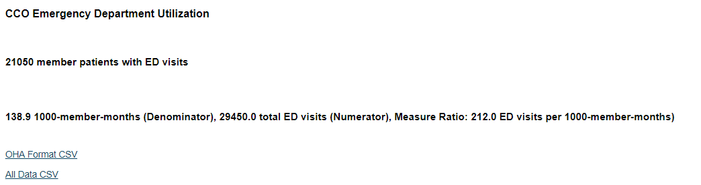
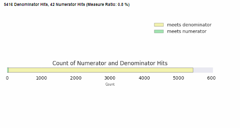
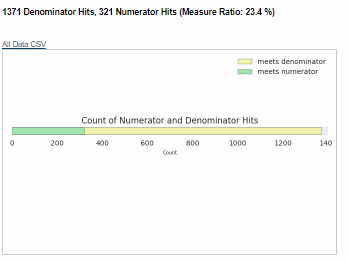
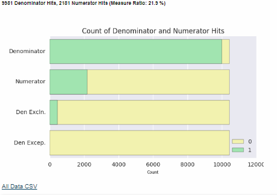
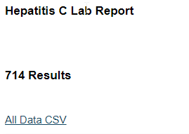
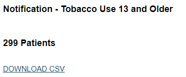
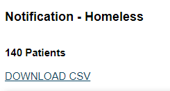
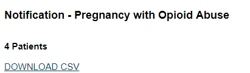

# Reliance Insight Report Catalog

## Table of Contents
**A. [OHA 2017 CCO Incentive and Performance Reports](#a-oha-2017-cco-incentive-and-performance-reports)**    
**B. [OHA 2018 CCO Incentive and Performance Reports](#b-oha-2018-cco-incentive-and-performance-reports)**  
**C. [QCDR Reports](#c-qcdr-reports)**  
**D. [HEDIS Reports](#d-hedis-reports)**  
**E. [Uniform Data System (UDS) Reports](#e-uniform-data-system-uds-reports)**  
**F. [Certified Community Behavioral Health Clinics (CCBHC) Measures](#f-certified-community-behavioral-health-clinics-ccbhc-measures)**  
**G. [Custom Reports](#g-custom-reports)**  
**H. [Notification Reports](#h-notification-reports)**  
**I. [Appendix](#i-appendix)**  

### Click on a report name below for a detailed description 

## [A. OHA 2017 CCO Incentive and Performance Reports](#oha-2017-cco-incentive-and-performance-reports)

| Report Name    | Description               |
| -------------  |-------------              |
| [Diabetes: HbA1c Poor Control](#diabetes-hba1c-poor-control)        | Percentage of patients 18-75 years of age with diabetes who had hemoglobin A1c > 9.0% during the measurement period.         |
| [Adolescent well-care visits](#adolescent-well-care-visits)      | Percentage of adolescents and young adults (ages 12-21) who had at least one well-care visit during the measurement year.         |
| [Alcohol and Drug Misuse (SBIRT)](#alcohol-and-drug-misuse-sbirt))      | Percentage of members (ages 12 and older) who received appropriate "screening, brief intervention, and referral to treatment" (SBIRT) for alcohol or other substance abuse.         |
| [Cervical Cancer Screening](#cervical-cancer-screening)      |  Percentage of women 21-64 years of age who were screened for cervical cancer using either of the following criteria: * Women age 21-64 who had cervical cytology performed every 3 years * Women age 30-64 who had cervical cytology/human papillomavirus (HPV) co-testing performed every 5 years        |
| [Childhood Immunization Status](#childhood-immunization-status)  | Percentage of children who received recommended vaccines (DTaP, IPV, MMR, HiB, Hepatitis B, VZV) before their second birthday.      |
| [Chlamydia Screening in Women](#chlamydia-screening-in-women)      |  Percentage of sexually active women (ages 16-24) who had a test for chlamydia infection.  |
| [Cigarette Smoking Prevalence (Bundled Measure)](#cigarette-smoking-prevalence)      | Bundled measure is intended to address both cessation benefits offered by CCOs and cigarette smoking prevalence: 1) Meeting minimum cessation benefit requirements 2) Submitting EHR-based cigarette smoking and tobacco prevalence data according to data submission requirements 3) Meeting benchmark or improvement target established by the Metrics & Scoring Committee         |
| [Colorectal Cancer Screening](#colorectal-cancer-screening)      | Percent of adult members (ages 50-75) who had appropriate screening for colorectal cancer.  |
| [Controlling High Blood Pressure](#controlling-high-blood-pressure)  | Percentage of patients 18-85 years of age who had a diagnosis of hypertension and whose blood pressure was adequately controlled (<140/90mmHg) during the measurement period.        |
| [Ambulatory care: Emergency Department utilization](#ambulatory-care-emergency-department-utilization)      | Rate of patient visits to an emergency department.         |
| [Disparity Measure: Emergency Department Utilization for Individuals Experiencing Mental Illness ](#emergency-department-utilization-for-individuals-experiencing-mental-illness-beta)  | Rate of visits to an emergency department among adult members experiencing mental illness.        |
| [Screening for Clinical Depression and Follow-Up Plan](#screening-for-clinical-depression-and-follow-up-plan)      |  Percentage of members (ages 12 and older) who had appropriate screening and follow-up planning for major depression.        |
| [Developmental Screening in the First Three Years of Life](#developmental-screening-in-the-first-three-years-of-life)      | Percentage of children who were screened for risks of developmental, behavioral and social delays using standardized screening tools in the 12 months preceding their first, second or third birthday.         |
| [Effective Contraceptive Use](#effective-contraceptive-use)        | Percentage of women (ages 15-50) with evidence of one of the most effective or moderately effective contraceptive methods during the measurement year: IUD, implant, contraception injection, contraceptive pills, sterilization, patch, ring, or diaphragm.         |
| [Weight Assessment and Counseling for Nutrition and Physical Activity for Children and Adolescents](#weight-assessment-and-counseling-for-nutrition-and-physical-activity-for-children-and-adolescents)      |  Percentage of patients (age 3-17) who had an outpatient visit with a PCP or OB/GYN and who had evidence of the following during the measurement period. Three rates are reported. 1. Percentage of patients with height, weight, and body mass index (BMI) percentile documentation 2. Percentage of patients with counseling for nutrition 3. Percentage of patients with counseling for physical activity        |
| [Preventive Care and Screening: Body Mass Index (BMI) Screening and Follow-Up Plan](#preventive-care-and-screening-body-mass-index-bmi-screening-and-follow-up-plan) | Percentage of patients aged 18 years and older with a BMI documented during the current encounter or during the previous six months AND with a BMI outside of normal parameters, a follow-up plan is documented during the encounter or during the previous six months of the current encounter.  Normal Parameters: Age 18 years and older BMI => 18.5 and < 25 kg/m2 |

## [B. OHA 2018 CCO Incentive and Performance Reports](#oha-2018-cco-incentive-and-performance-reports)
| Report Name    | Description               |
| -------------  |-------------              |
| [Adolescent well-care visits](#adolescent-well-care-visits-1)        | Percentage of adolescents and young adults (ages 12-21) who had at least one well-care visit during the measurement year.         |
| [Ambulatory Care: Emergency Department utilization](#ambulatory-care-emergency-department-utilization-1)        | Rate of patient visits to an emergency department.         |
| [Childhood immunization status](#childhood-immunization-status-1)        | Percentage of children who received recommended vaccines (DTaP, IPV, MMR, HiB, Hepatitis B, VZV) before their second birthday.         |
| [Cigarette smoking prevalence ](#cigarette-smoking-prevalence-1)        | Bundled measure is intended to address both cessation benefits offered by CCOs and cigarette smoking prevalence: 1) Meeting minimum cessation benefit requirements 2) Submitting EHR-based cigarette smoking and tobacco prevalence data according to data submission requirements 3) Meeting benchmark or improvement target established by the Metrics & Scoring Committee.         |
| [Colorectal cancer screening](#colorectal-cancer-screening-1)        | Percent of adult members (ages 50-75) who had appropriate screening for colorectal cancer.         |
| [Controlling high blood pressure](#controlling-high-blood-pressure-1)        | Percentage of adult members (ages 18–85) with a diagnosis of hypertension (high blood pressure) whose condition was adequately controlled.         |
| [Depression screening and follow up plan](#depression-screening-and-follow-up-plan)        | Percentage of members (ages 12 and older) who had appropriate screening and follow-up planning for major depression.         |
| [Developmental screening in the first 36 months of life](#developmental-screening-in-the-first-36-months-of-life)        | Percentage of children who were screened for risks of developmental, behavioral and social delays using standardized screening tools in the 12 months preceding their first, second or third birthday.         |
| [Diabetes: HbA1c Poor Control](#diabetes-hba1c-poor-control-1)        | Percentage of patients 18-75 years of age with diabetes who had hemoglobin A1c ˃ 9.0% during the measurement period.         |
| [Disparity measure: Emergency department utilization among members with mental illness](#emergency-department-utilization-for-individuals-experiencing-mental-illness)        | Rate of visits to an emergency department among adult members experiencing mental illness.         |
| [Effective contraceptive use among women at risk of unintended pregnancy](#effective-contraceptive-use-among-women-at-risk-of-unintended-pregnancy)        | Percentage of women (ages 15-50) with evidence of one of the most effective or moderately effective contraceptive methods during the measurement year: IUD, implant, contraception injection, contraceptive pills, sterilization, patch, ring, or diaphragm.         |
| [Weight assessment and counseling in children and adolescents](#weight-assessment-and-counseling-for-nutrition-and-physical-activity-for-children-and-adolescents-1)        | Percentage of patients (age 3-17) who had an outpatient visit with a PCP or OB/GYN and who had evidence of the following during the measurement period. Three rates are reported. 1. Percentage of patients with height, weight, and body mass index (BMI) percentile documentation 2. Percentage of patients with counseling for nutrition 3. Percentage of patients with counseling for physical activity         |
| [Timeliness of Prenatal and Postpartum Care](#timeliness-of-prenatal-and-postpartum-care)        | Percentage of women with live births who received a prenatal care visit within the first trimester and percentage of women receiving postpartum care within 21-56 days of delivery.         |

## [C. QCDR Reports](#qcdr-reports)
| Report Name    | Description               |
| -------------  |-------------              |
| [Diabetes: Hemoglobin A1c (HbA1c) Poor Control (>9%)](#diabetes-hemoglobin-a1c-hba1c-poor-control-9)        | Percentage of patients 18-75 years of age with diabetes who had hemoglobin A1c > 9.0% during the measurement period.         |
| [Breast Cancer Screening](#breast-cancer-screening) | Percentage of women 50-74 years of age who had a mammogram to screen for breast cancer. |
| [Colorectal Cancer Screening](#colorectal-cancer-screening-2) | Percentage of adults 50-75 years of age who had appropriate screening for colorectal cancer. |
| [Preventive Care and Screening: Body Mass Index (BMI) Screening and Follow-Up Plan](#preventive-care-and-screening-body-mass-index-bmi-screening-and-follow-up-plan-1) | Percentage of patients aged 18 years and older with a BMI documented during the current encounter or during the previous six months AND with a BMI outside of normal parameters, a follow-up plan is documented during the encounter or during the previous six months of the current encounter.  Normal Parameters: Age 18 years and older BMI => 18.5 and < 25 kg/m2 |
| [Ischemic Vascular Disease (IVD): Use of Aspirin or Another Antiplatelet](#ischemic-vascular-disease-ivd-use-of-aspirin-or-another-antiplatelet) | Percentage of patients 18 years of age and older who were diagnosed with acute myocardial infarction (AMI), coronary artery bypass graft (CABG) or percutaneous coronary interventions (PCI) in the 12 months prior to the measurement period, or who had an active diagnosis of ischemic vascular disease (IVD) during the measurement period, and who had documentation of use of aspirin or another antiplatelet during the measurement period. |
| [Preventive Care and Screening: Tobacco Use: Screening and Cessation Intervention](#preventive-care-and-screening-tobacco-use-screening-and-cessation-intervention) | Percentage of patients aged 18 years and older who were screened for tobacco use one or more times within 24 months AND who received cessation counseling intervention if identified as a tobacco user. |
| [Controlling High Blood Pressure](#controlling-high-blood-pressure-2) | Percentage of patients 18-85 years of age who had a diagnosis of hypertension and whose blood pressure was adequately controlled (<140/90mmHg) during the measurement period. |
| [Cervical Cancer Screening](#cervical-cancer-screening-1) | Percentage of women 21-64 years of age who were screened for cervical cancer using either of the following criteria: * Women age 21-64 who had cervical cytology performed every 3 years * Women age 30-64 who had cervical cytology/human papillomavirus (HPV) co-testing performed every 5 years |
| [Documentation of Current Medications in the Medical Record](#) | **IN PROGRESS**   Percentage of visits for patients aged 18 years and older for which the eligible professional or eligible clinician attests to documenting a list of current medications using all immediate resources available on the date of the encounter. This list must include ALL known prescriptions, over-the-counters, herbals, and vitamin/mineral/dietary (nutritional) supplements AND must contain the medications' name, dosage, frequency and route of administration. |
| [Anti-depressant Medication Management](#) | **IN PROGRESS**   Percentage of patients 18 years of age and older who were treated with antidepressant medication, had a diagnosis of major depression, and who remained on an antidepressant medication treatment. Two rates are reported. a. Percentage of patients who remained on an antidepressant medication for at least 84 days (12 weeks). b. Percentage of patients who remained on an antidepressant medication for at least 180 days (6 months). |
| [Falls: Screening for Future Fall Risk](#) | **IN PROGRESS**   Percentage of patients 65 years of age and older who were screened for future fall risk during the measurement period. |
| [Hypertension: Improvement in Blood Pressure](#) | **IN PROGRESS**   Percentage of patients aged 18-85 years of age with a diagnosis of hypertension whose blood pressure improved during the measurement period. |
| [Maternal Depression Screening](#) | **IN PROGRESS**   The percentage of children who turned 6 months of age during the measurement year, who had a face-to-face visit between the clinician and the child during child's first 6 months, and who had a maternal depression screening for the mother at least once between 0 and 6 months of life. |
| [Functional Status Assessments for Congestive Heart Failure](#) | **IN PROGRESS**   Percentage of patients 18 years of age and older with congestive heart failure who completed initial and follow-up patient-reported functional status assessments. |
| [Depression Remission at Twelve Months](#) | **IN PROGRESS**   The percentage of patients 18 years of age or older with major depression or dysthymia who reached remission 12 months (+/- 30 days) after an index visit. |
| [Child and Adolescent Major Depressive Disorder (MDD): Suicide Risk Assessment](#) | **IN PROGRESS**   Percentage of patient visits for those patients aged 6 through 17 years with a diagnosis of major depressive disorder with an assessment for suicide risk |
| [Use of High-Risk Medications in the Elderly ](#) | **IN PROGRESS**   Percentage of patients 65 years of age and older who were ordered high-risk medications. Two rates are reported. a. Percentage of patients who were ordered at least one high-risk medication. b. Percentage of patients who were ordered at least two of the same high-risk medications. |
| [Children Who Have Dental Decay or Cavities](#) | **IN PROGRESS**   Percentage of children, age 0-20 years, who have had tooth decay or cavities during the measurement period. |

## [D. HEDIS Reports](#hedis-reports)
| Report Name    | Description               |
| -------------  |-------------              |
| [Flu Vaccinations for Adults Ages 18-64](#flu-vaccinations-for-adults-ages-18-64) | The percentage of commercial and Medicaid members 18–64 years of age who received an influenza vaccination between July 1 of the measurement year and the date when the CAHPS 5.0H survey was completed. |
| [Flu Vaccinations for Adults Ages 65 and Older](#flu-vaccinations-for-adults-ages-65-and-older)      | Description The percentage of Medicare members 65 years of age and older who received an influenza vaccination between July 1 of the measurement year and the date when the Medicare CAHPS survey was completed.  |

## [E. Uniform Data System (UDS) Reports](#uds-reports)
| Report Name    | Description               |
| -------------  |-------------              |
| [Cervical Cancer Screening](#) |	**IN PROGRESS**   Percentage of women 21-64 years of age who were screened for cervical cancer using either of the following criteria: 1) Women age 21-64 who had cervical cytology performed every 3 years 2) Women age 30-64 who had cervical cytology/human papillomavirus (HPV) co-testing performed every 5 years  |
| [Childhood Immunization Status](#childhood-immunization-status-cms) |  Percentage of children 2 years of age who had four diphtheria, tetanus and acellular pertussis (DTaP); three polio (IPV), one measles, mumps and rubella (MMR); three H influenza type B (HiB); three hepatitis B (Hep B); one chicken pox (VZV); four pneumococcal conjugate (PCV); one hepatitis A (Hep A); two or three rotavirus (RV); and two influenza (flu) vaccines by their second birthday.  | 
| [Colorectal Cancer Screening](#) | **IN PROGRESS**   Percentage of adults 50-75 years of age who had appropriate screening for colorectal cancer. |  
| [Controlling High Blood Pressure](#) | **IN PROGRESS**   Percentage of patients 18-85 years of age who had a diagnosis of hypertension and whose blood pressure was adequately controlled (<140/90mmHg) during the measurement period |  
| [Coronary Artery Disease (CAD): Lipid Therapy (in progress) ](#) | **IN PROGRESS**   Percentage of patients aged 18 years and older with a diagnosis of CAD who were prescribed a lipid-lowering therapy   |  
| [Dental Sealants for Children between 6-9 Years (in progress) ](#) | **IN PROGRESS**   Percentage of children, age 6-9 years, at moderate to high risk for caries who received a sealant on a first permanent molar during the measurement period. |  
| [Diabetes: Hemoglobin A1c (HbA1c) Poor Control (>9%)](#) | **IN PROGRESS**   Percentage of patients 18-75 years of age with diabetes who had hemoglobin A1c (HbA1c) greater than 9.0 percent during the measurement period. |  
| [Early Entry into Prenatal Care (in progress) ](#) | **IN PROGRESS**   Percentage of prenatal care patients who entered prenatal care during their first trimester. |  
| [HIV Linkage to Care (in progress) ](#) | **IN PROGRESS**   Percentage of patients newly diagnosed with HIV who were seen for follow-up treatment within 90 days of diagnosis. |  
| [Ischemic Vascular Disease (IVD): Use of Aspirin or Another Antiplatelet](#) | **IN PROGRESS**   Percentage of patients aged 18 years of age and older who were diagnosed with acute myocardial infarction (AMI), or who had a coronary artery bypass graft (CABG) or percutaneous coronary interventions (PCIs) in the 12 months prior to the measurement period or who had an active diagnosis of IVD during the measurement period, and who had documentation of use of aspirin or another antiplatelet during the measurement period. |  
| [Preventive Care and Screening: Body Mass Index (BMI) Screening and Follow-Up Plan](#preventive-care-and-screening-body-mass-index-bmi-screening-and-follow-up-plan-2) | Percentage of patients aged 18 years and older with BMI documented during the most recent visit or within the previous six months to that visit and when the BMI is outside of normal parameters, a follow-up plan is documented during the visit or during the previous six months of that visit |  
| [Preventive Care and Screening: Screening for Depression and Follow-Up Plan](#) | **IN PROGRESS**   Percentage of patients aged 12 years and older screened for depression on the date of the visit using an age appropriate standardized depression screening tool and if positive, a follow-up plan is documented on the date of the positive screen. |  
| [Preventive Care and Screening: Tobacco Use: Screening and Cessation Intervention](#) | **IN PROGRESS**   Percentage of patients aged 18 and older who were screened for tobacco use one or more times within 24 months and who received cessation counseling intervention if defined as a tobacco user. |  
| [Use of Appropriate Medications for Asthma](#use-of-appropriate-medications-for-asthma) | Percentage of patients 5-64 years of age who were identified as having persistent asthma and were appropriately ordered medication during the measurement period |  
| [Weight Assessment and Counseling for Nutrition and Physical Activity for Children and Adolescents](#weight-assessment-and-counseling-for-nutrition-and-physical-activity-for-children-and-adolescents-2) | Percentage of patients 3 -17 years of age who had a medical visit and who had evidence of height, weight, and body mass index (BMI) percentile documentation and who had documentation of counseling for nutrition and who had documentation of counseling for physical activity during the measurement year |  

## [F. Certified Community Behavioral Health Clinics (CCBHC) Measures](#)
| Report Name    | Description               |
| -------------  |-------------              |
| [Deaths by Suicide](#) | Percentage of consumers aged 12 years and older who died by suicide during the measurement year  |
| [Preventive Care and Screening: Body Mass Index (BMI) Screening and Follow-Up Plan](#preventive-care-and-screening-body-mass-index-bmi-screening-and-follow-up-plan-3) | Percentage of patients aged 18 years and older with BMI documented during the most recent visit or within the previous six months to that visit and when the BMI is outside of normal parameters, a follow-up plan is documented during the visit or during the previous six months of that visit |  
| [Weight Assessment and Counseling for Nutrition and Physical Activity for Children and Adolescents](#weight-assessment-and-counseling-for-nutrition-and-physical-activity-for-children-and-adolescents-3)      |	**IN PROGRESS**   Percentage of patients (age 3-17) who had an outpatient visit with a PCP or OB/GYN and who had evidence of the following during the measurement period. Three rates are reported. 1. Percentage of patients with height, weight, and body mass index (BMI) percentile documentation 2. Percentage of patients with counseling for nutrition 3. Percentage of patients with counseling for physical activity        |
| [Controlling High Blood Pressure](#) | **IN PROGRESS**   Percentage of patients 18-85 years of age who had a diagnosis of hypertension and whose blood pressure was adequately controlled (<140/90mmHg) during the measurement period || [Deaths by Suicide ](#) | Percentage of consumers aged 12 years and older who died by suicide during the measurement year  |
| [Preventive Care and Screening: Tobacco Use: Screening and Cessation Intervention](#) | **IN PROGRESS**   Percentage of patients aged 18 and older who were screened for tobacco use one or more times within 24 months and who received cessation counseling intervention if defined as a tobacco user. | 
| [Screening for Clinical Depression and Follow-Up Plan](#screening-for-clinical-depression-and-follow-up-plan)      |  Percentage of members (ages 12 and older) who had appropriate screening and follow-up planning for major depression.        |
| [Suicide Attempts](#) | The percentage of consumers aged 12 years and older who attempted suicide during the measurement year, where the suicide attempt resulted in injury requiring medical services  |
| [Follow-Up After Emergency Department Visit for Mental Health](#) | **IN PROGRESS**   The percentage of emergency department (ED) visits for consumers 6 years of age and older with a primary diagnosis of mental illness, who had an outpatient visit, an intensive outpatient encounter or a partial hospitalization for mental illness. Two rates are reported: 1. The percentage of ED visits for which the consumer received follow-up within 30 days of the ED visit. 2. The percentage of ED visits for which the consumer received follow-up within 7 days of the ED visit.  |
| [Diabetes Care For People With Serious Mental Illness: Hemoglobin A1c (HbA1c) Poor Control (>9.0%) ](#)        | **IN PROGRESS**   The percentage of consumers 18–75 years of age with a serious mental illness and diabetes (type 1 and type 2) whose most recent Hemoglobin A1c (HbA1c) level during the measurement year is >9.0%         |

## [G. Custom Reports](#custom-reports)
| Report Name    | Description               |
| -------------  |-------------              |
| [Hepatitis C Diagnosis and Hepatic Labs](#hepatitis-c-diagnosis-and-hepatic-labs) | Returns all patients with a diagnosis of Hepatitis C. Includes HIV status, most recent liver panel lab results, most recent fibrosis lab results, and calculated AST to Platelet Ratio Index (APRI Score).  |
| [Diabetes by Type](#diabetes-by-type) | This report displays two outputs.  The first output is percentage of patients with type 1 diabetes who had hemoglobin A1c > 9.0% during the measurement period. The second output is percentage of patients with type 2 diabetes who had hemoglobin A1c > 9.0% during the measurement period.  | 
| [Positive Pregnancy](#positive-pregnancy) | Real time identification of pregnant population | 
| [Homeless](#homeless) | Real time identification of homeless population based on clinical codes and text search |
| [Food Insecurity](#food-insecurity) | Real time identification of population with indications of food insecurity based on clinical codes and text search |

## [H. Notification Reports](#notification-reports)
| Report Name    | Description               |
| -------------  |-------------              |
| [Alcohol and Drug Misuse (SBIRT)](#) | Percentage of members (ages 12 and older) who received appropriate "screening, brief intervention, and referral to treatment" (SBIRT) for alcohol or other substance abuse. |
| [Tobacco](#tobacco) | This report provides a list of patients aged 13 and older screened and positive for cigarette smoking and/or tobacco use. |
| [Diabetes Management](#) | Percentage of patients 18-75 years of age with diabetes who had hemoglobin A1c > 7.0%. |
| [Homeless](#) | This report generates a list of potentially homeless patients identified by annotations made by healthcare providers, a given home addresses of a hospital, homeless shelter or place of worship and variations of text and standard code set identification extracted from transcribed clinical records. |
| [Hypertension](#) | Percentage of patients 18-85 years of age who had a diagnosis of hypertension and whose blood pressure exceeded (<125/90mmHg). |
| [Depression Screen](#) | This report provides a list of patients aged 12 and older screened for clinical depression on the encounter date, using an age appropriate standardized depression screening tool and documenting a follow-up on the date of the positive screen. |
| [Disparity measure: Emergency department utilization among members with mental illness](#) | Rate of visits to an emergency department among adult members experiencing mental illness. |
| [ED visit](#) | This report provides a list of patients that have visited the Emergency Department. |
| [Opioid Use + Positive Pregnancy](#) | This report provides a list of patients identified as pregnant and have a history or current diagnosis of opioid abuse. |
| [Alerts for lab results](#) | This report lists patients that have received a new lab result for their organization. |

## [I. Appendix](#appendix)
[Community Health Record](#community-health-record)  
[Glossary](#glossary)
 

## OHA 2017 CCO Incentive and Performance Reports  
The Oregon Health Authority (OHA) uses quality health metrics to show how well Coordinated Care Organizations (CCOs) are improving care, making quality care accessible, eliminating health disparities, and curbing the rising cost of health care. These outcome and quality measures are developed by the OHA Metrics and Scoring Committee and can be found here:   
<http://www.oregon.gov/OHA/HPA/ANALYTICS/Pages/CCO-Baseline-Data.aspx>  
The default measurement period for the following reports is Calendar Year 2017, but the user can choose a measurement period of their choice.

### Diabetes: HbA1c Poor Control
**Measure Description**  
Percentage of patients 18-75 years of age with diabetes who had hemoglobin A1c > 9.0% during the measurement period.   
OHA 2017 Benchmark Measure Ratio (total numerator hits/total denominator hits) is 19%.  
**Denominator**  
Patients 18-75 years of age who had a diagnosis of diabetes during or any time prior to the measurement period and who received a qualifying outpatient service during the measurement period.  
**Numerator**  
Patients whose most recent HbA1c level (performed during the measurement period) is >9.0%.  
**Data Sources**  
ADTs, CCDs, LABs, and Encounters   
**Input Parameters**   
Start Date, End Date, and Records to Display Below  
**Output**  
Total denominator hits, total numerator hits, measure ratio (total numerator hits/total denominator hits), stacked bar chart of measure ratio, distribution plot of HbA1c values in denominator population, list of patients that meet denominator and numerator requirements.  
OHA Format CSV Download and All Data CSV Download (contains all column headings below)  
**Example Output**  
  
**Column headings**  
`mpid_CPC | patient_name | patient_date_of_birth | sex | patient_medicaid_id | sending_facility | date_of_service_denom | sending_facility_num | date_of_service_num | HbA1c | provider_name | ordering_provider | meets_denominator | meets_numerator | date_of_service_bmi | bmi | date_of_service_bp | bp_systolic | bp_diastolic | measurement_period_begin | measurement_period_end`

### Adolescent Well Care Visits
**Measure Description**  
Percentage of adolescents and young adults (ages 12-21) who had at least one well-care visit during the measurement year.  
**Denominator**  
Members age 12-21 years as of December 31 of the measurement year. See HEDIS® 2017 Technical Specifications for Health Plans (Volume 2) for details.  
**Required exclusions for denominator:**  
Patients with more than one gap in continuous enrollment of up to 45 days during the measurement year.  
**Numerator**  
At least one comprehensive well-care visit during the measurement year. See HEDIS® 2017 Technical Specifications for Health Plans (Volume 2) for details.  
**Data Sources**  
ADTs, CCDs, LABs, and Encounters   
**Input Parameters**   
Start Date, End Date, and Records to Display Below  
**Output**  
Total denominator hits, total numerator hits, measure ratio (total numerator hits/total denominator hits), stacked bar chart of measure ratio, list of patients that meet denominator and numerator requirements.  
OHA Format CSV Download and All Data CSV Download (contains all column headings below)  

**Example Output**  
  
**Column headings**  
`mpid_CPC | patient_date_of_birth | sex | patient_medicaid_id | sending_facility | date_of_service_denom |sending_facility_num | date_of_service_num | meets_denominator | meets_numerator | provider_name | measurement_period_begin | measurement_period_end`

### Alcohol and Drug Misuse (SBIRT)
**Measure Description**  
Percentage of members (ages 12 and older) who received appropriate "screening, brief intervention, and referral to treatment" (SBIRT) for alcohol or other substance abuse.  
**Denominator**  
Unique count of members age 12 years as of December 31 of the measurement year who received an outpatient service between January 1 - December 31 of the measurement year, as identified by the specified CPT codes for office or other outpatient visits, home visits, and preventative medicine. See OHA spec link below for details.  
**Numerator**  
Unique counts of members age 12 years and older as of December 31 of the measurement year with one or more screening, brief intervention, and referral to treatment (SBIRT) services.  
**Required exclusions for numerator**  
Exclude SBIRT screening and/or brief intervention services provided in emergency department settings. OHA uses the HEDIS Ambulatory care ED visits method to identify claims for exclusion.  
**Data Sources**  
ADTs, CCDs, LABs, Encounters, and Claims   
**Input Parameters**   
Start Date, End Date, and Records to Display Below  
**Output**  
Total denominator hits, total numerator hits, measure ratio (total numerator hits/total denominator hits), stacked bar chart of measure ratio, list of patients that meet denominator and numerator requirements.  
OHA Format CSV Download and All Data CSV Download (contains all column headings below)  

**Example Output**  
  
**Column headings**  
`mpid_CPC | patient_date_of_birth | sex | patient_medicaid_id | sending_facility | date_of_service_denom | date_of_service_num | meets_denominator | meets_numerator | meets_numerator_exception | provider_name | measurement_period_begin | measurement_period_end`

**Link to Measure Specifications**  
<http://www.oregon.gov/oha/HPA/ANALYTICS/CCOData/Alcohol-and-Drug-Misuse-(SBIRT)-2017.pdf>

### Cervical Cancer Screening
**Measure Description**
Percentage of women 21-64 years of age who were screened for cervical cancer using either of the following criteria: 
* Women age 21-64 who had cervical cytology performed every 3 years 
* Women age 30-64 who had cervical cytology/human papillomavirus (HPV) co-testing performed every 5 years  
**Denominator**  
Women 24-64 years of age as of December 31 of the measurement year. See HEDIS® 2017 Technical Specification for Health Plans (Volume 2) for details.  
**Required exclusions for denominator**
 * Patients with more than one gap in continuous enrollment of up to 45 days during the measurement year.
 * Exclude women with hysterectomy with no residual cervix, cervical agenesis or acquired absence of cervix (Absence of Cervix Value Set) any time during the member’s history through December 31 of the measurement year.  
**Numerator**  
* Step1: Women age 24-64 years of age as of December 31 of the measurement year who received cervical cytology (Cervical Cytology Value Set) during the measurement year or the two years prior to the measurement year.
* Step2: From the women who did not meet step 1 criteria, identify women 30-64 years of age as of December 31
of the measurement year who had cervical cytology (Cervical Cytology Value Set) and a human papillomavirus (HPV) test (HPV Tests Value Set) with service dates four or less day apart during the measurement year or the four years prior to the measurement year and who were 30-64 years of age on the date of both tests.  
* Step3: Sum the events from steps 1 and 2 to obtain the rate.  
**Data Sources**  
ADTs, CCDs, LABs, Encounters, Transcriptions, and Claims   
**Input Parameters**   
Start Date, End Date, and Records to Display Below  
**Output**  
Total denominator hits, total numerator hits, measure ratio (total numerator hits/total denominator hits), stacked bar chart of measure ratio, list of patients that meet denominator and numerator requirements.  
OHA Format CSV Download and All Data CSV Download (contains all column headings below)  
**Example Output**  
  
**Column headings**  
`mpid_CPC | patient_date_of_birth | sex | patient_medicaid_id | sending_facility | date_of_service_denom | date_of_service_num | date_of_service_denom_excl | meets_denominator | meets_numerator | meets_denominator_exclusion | provider_name | measurement_period_begin | measurement_period_end`

**Link to Measure Specifications**  
<http://www.oregon.gov/oha/HPA/ANALYTICS/CCOData/Cervical%20Cancer%20Screening%20-%202017%20(updated%20Oct%202017).pdf>  

### Childhood Immunization Status  
**Measure Description**
Percentage of children who received recommended vaccines (DTaP, IPV, MMR, HiB, Hepatitis B, VZV) before their second birthday.  
**Denominator**  
Children who turn 2 years of age during the measurement year. See HEDIS® 2017 Technical Specification for Health Plans (Volume 2) for details.  
**Required exclusions for denominator**  
Patients with more than one gap in continuous enrollment of up to 45 days during the 12 months prior to child's 2nd birthday.  
**Numerator**  
OHA is using HEDIS® 2017 Combination 2 for the state performance measure: The number of children who turned 2 years of age in the measurement year and had all of the following specified vaccinations (minimum threshold in brackets): DTaP (4), IPV (3), MMR (1), HiB (3), HepB (3), VZV (1).  
**Data Sources**  
ADTs, CCDs, LABs, Encounters, Transcriptions, and Claims   
**Input Parameters**   
Start Date, End Date, and Records to Display Below  
**Output**  
Total denominator hits, total numerator hits, measure ratio (total numerator hits/total denominator hits), stacked bar chart of measure ratio for each immunization and overall, list of patients that meet denominator and numerator requirements.  
OHA Format CSV Download, All Data CSV Download (contains all column headings below) and Immunization DOS CSV (every immunizatons and DOS for each patient)

**Example Output**  

**Column headings**  
`mpid_CPC | patient_date_of_birth | sex | patient_medicaid_id | 
        sending_facility | date_of_service_denom | meets_denominator | 
        date_of_service_dtap |dtap_num | dtap count |
        date_of_service_ipv | ipv_num | ipv count |
        date_of_service_mmr | mmr_num | mmr count |
        date_of_service_hib | hib_num | hib count |
        date_of_service_hepb | hepb_num | hepB count |hepb_dx |
        date_of_service_vzv | vzv_num | vzv count | vzv_dx |
        all_vacs |provider_name | measurement_period_begin | measurement_period_end`

### Chlamydia Screening in Women
**Measure Description**  
Assesses women 16–24 years of age who were identified as sexually active and who had at least one test for chlamydia during the measurement year.   
**Denominator**  
Women 16-24 years of age as of December 31 of the measurement year, who are identified as ‘sexually active’ using either the claim/encounter data or the pharmacy data.   
**Required exclusions for denominator**  
OHA adopts the HEDIS® 2017 optional exclusion rule: Exclude members who qualified for the denominator based on a pregnancy test alone and who meet either of the following: 1) A pregnancy test (Pregnancy Tests Value Set) during the measurement year followed within seven days
(inclusive) by a prescription for isotretinoin, or 2) A pregnancy test (Pregnancy Tests Value Set) during the measurement year followed within seven days (inclusive) by an x-ray (Diagnostic Radiology Value Set).  
**Numerator**  
At least one chlamydia test (Chlamydia Tests Value Set) during the measurement year.  
**Data Sources**  
ADTs, CCDs, LABs, Encounters, Transcriptions, and Claims   
**Input Parameters**   
Start Date, End Date, and Records to Display Below  
**Output**  
Total denominator hits, total numerator hits, measure ratio (total numerator hits/total denominator hits), stacked bar chart of measure ratio, list of patients that meet denominator and numerator requirements.  
OHA Format CSV Download, All Data CSV Download (contains all column headings below).  

**Example Output**  
  

**Column headings**  
` mpid_CPC | patient_date_of_birth | sex | patient_medicaid_id | sending_facility | date_of_service_denom | date_of_service_num | meets_denominator | meets_numerator | provider_name | measurement_period_begin | measurement_period_end `

**Link to Measure Specifications**  
<http://www.oregon.gov/oha/HPA/ANALYTICS/CCOData/Chlamydia%20Screening%20-%202017%20(updated%20Oct%202017).pdf>  

### Cigarette Smoking Prevalence  
**Measure Description**  
Bundled measure is intended to address both cessation benefits offered by CCOs and cigarette smoking prevalence.  

**Rate 1**  
**Denominator**  
Unique Medicaid members 13 years old or older by the beginning of the measurement year, who had a qualifying visit with the provider during the measurement period.  
**Numerator**  
Unique members age 13 years or older who had a qualifying visit with the provider during the measurement period, who have their smoking and/or tobacco use status recorded as structured data. 

**Rate 2**   
**Denominator**  
Unique Medicaid members age 13 years or older who had a qualifying visit with the provider during the measurement period and who have their smoking and/or tobacco use status recorded as structured data (Rate 1 numerator).  
**Numerator**  
Of patients in the Rate 2 denominator, those who are cigarette smokers. See below for additional information on identifying cigarette smoking in the numerator.  

**Rate 3**  
**Denominator**  
Unique Medicaid members age 13 years or older who had a qualifying visit with the provider during the measurement period and who have their smoking and/or tobacco use status recorded as structured data (Rate 1 numerator).  
**Numerator**  
Of patients in the Rate 3 denominator, those who are cigarette smokers and/or tobacco users. See below for additional information on identifying tobacco use in the numerator.   

**Required exclusions for numerator**  
Members with missing smoking or tobacco use status will be excluded from rates 2 and 3. Note that e-cigarettes and marijuana (medical or recreational) should be excluded from both
the cigarette smoking rate and the broader tobacco use rate.  In addition, the measure is focused on cigarette and tobacco use, not nicotine use.

**Data Sources**  
ADTs, CCDs, LABs, Encounters, Transcriptions, and Claims   
**Input Parameters**   
Start Date, End Date, and Records to Display Below  
**Output**  
Total denominator hits, total numerator hits, measure ratio (total numerator hits/total denominator hits), stacked bar chart of measure ratio for each rate, list of patients that meet denominator and numerator requirements.  
OHA Format CSV Download, All Data CSV Download (contains all column headings below).  

**Example Output**  
  

**Column headings**  
`mpid_CPC | patient_date_of_birth | sex | patient_medicaid_id |sending_facility | 
        date_of_service_denom | date_of_service_num1 | date_of_service_num2 | date_of_service_num3 | provider_name | meets_smoke_denominator,
        meets_numerator | meets_numerator_status_1 | meets_numerator_status_2 | measurement_period_begin | measurement_period_end`

### Colorectal Cancer Screening
**Measure Description**   
Percent of adult members (ages 51-75) who had appropriate screening for colorectal cancer.  
**Denominator**  
Medicaid enrollees age 51-75 years as of December 31st of the measurement year.  
**Numerator**  
Unique number of individuals receiving at least one of the approved screenings for colorectal cancer either during the measurement year or years prior to the measurement year.  
**Required exclusions for denominator**  
Either of the following any time during the member’s history through December 31 of the measurement year: Colorectal Cancer Value Set or Total Colectomy Value Set.  
**Data Sources**  
ADTs, CCDs, LABs, Encounters, Transcriptions, and Claims   
**Input Parameters**   
Start Date, End Date, and Records to Display Below  
**Output**  
Total denominator hits, total numerator hits, measure ratio (total numerator hits/total denominator hits), stacked bar chart of measure ratio, list of patients that meet denominator and numerator requirements.  
OHA Format CSV Download, All Data CSV Download (contains all column headings below).  

**Example Output**  
  

**Column headings**  
`mpid_CPC | patient_date_of_birth | sex | patient_medicaid_id | sending_facility | date_of_service_denom | date_of_service_num | meets_denominator | meets_numerator | meets_denominator_exclusion | provider_name | measurement_period_begin | measurement_period_end`

### Controlling High Blood Pressure
**Measure Description**   
Percentage of adult members (ages 18–85) with a diagnosis of hypertension (high blood pressure) whose condition was adequately controlled.  
**Denominator**  
Patients 18-85 years of age who had a diagnosis of essential hypertension within the first six months of the measurement period or any time prior to the measurement period and who received a qualifying outpatient service during the measurement period.  
**Numerator**  
Patients whose blood pressure at the most recent visit is adequately controlled (systolic blood pressure <140 mmHg and diastolic blood pressure <90 mmHg) during the measurement period.    
**Required exclusions for denominator**  
Patients with evidence of end stage renal disease, chronic kidney disease (Stage 5), dialysis or renal transplant before or during the measurement period, diagnosis of pregnancy during the measurement period.  
**Data Sources**  
ADTs, CCDs, LABs, Encounters, Transcriptions, and Claims   
**Input Parameters**   
Start Date, End Date, Include Transcriptions, and Records to Display Below  
**Output**  
Total denominator hits, total numerator hits, measure ratio (total numerator hits/total denominator hits), stacked bar chart of measure ratio, list of patients that meet denominator and numerator requirements.  
OHA Format CSV Download, All Data CSV Download (contains all column headings below).  

**Example Output**  
  

**Column headings**  
`mpid_CPC | patient_name | patient_date_of_birth | sex | patient_medicaid_id | sending_facility | date_of_service_denom | date_of_service_num | sending_facility_num | bp_systolic | bp_diastolic | meets_denominator | meets_numerator | meets_denominator_exclusion | provider_name | measurement_period_begin | measurement_period_end`

### Ambulatory care: Emergency Department utilization  
**Measure Description**   
Rate of patient visits to an emergency department.  
**Denominator**  
Estimated 1,000 member month of the adult members enrolled with the organization. The adult members are identified as age 18 or older at the end of the measurement year. OHA uses claims with a 36-month rolling look back period, and the members who had two or more visits are identified for inclusion in the denominator. *Note: estimated enrollment months are calculated from patients' 2018 enrollment rate (member months/measurement months) mutiplied by 36 months.*  
**Numerator**  
Number of emergency department visits when the member is enrolled with the organization. Count each visit to an ED that does not result in an inpatient encounter once; count multiple ED visits on the same date of service as one visit. Do not include ED visits that result in an inpatient stay. See HEDIS® 2017 Technical Specifications for Health Plans (Volume2) and [Value Set workbook](http://ihpsocal.org/wp-content/uploads/2015/12/HEDIS-2017-Volume-2-Technical-Specifications-Final-Update-201610.pdf) for details.  
**Required exclusions for numerator**  
Mental health and chemical dependency services are excluded.     
**Data Sources**  
ADTs, CCDs, LABs, Encounters, Transcriptions, and Claims   
**Input Parameters**   
Start Date, End Date, and Records to Display Below  
**Output**  
Total denominator hits, total numerator hits, measure ratio (total numerator hits/total denominator hits), stacked bar chart of measure ratio, list of patients that meet denominator and numerator requirements (and also whether they are 'unengnaged', defined by whether they have not had an outpatient visit for more than 24 months).  
OHA Format CSV Download, All Data CSV Download (contains all column headings below).  
**Example Output**  
  

**Column headings**  
`mpid_CPC | patient_name | patient_date_of_birth | sex | patient_medicaid_id | sending_facility | date_of_service_denom | date_of_service_num | provider_name | estimated_enrollment_months | ED_count | unengaged | measurement_period_begin | measurement_period_end`

**Link to Measure Specifications**  
<http://ihpsocal.org/wp-content/uploads/2015/12/HEDIS-2017-Volume-2-Technical-Specifications-Final-Update-201610.pdf> 

### Emergency Department Utilization for Individuals Experiencing Mental Illness 
**Measure Description**   
Rate of visits to an emergency department among adult members experiencing mental illness.  
**Denominator**  
 Estimated 1,000 member month of the adult members enrolled with the organization, who are identified as having experienced mental illness. The adult members are identified as age 18 or older at the end of the measurement year. OHA uses claims with a 36-month rolling look back period, and the members who had two or more visits1 with any of the principal diagnoses in the Members Experiencing Mental Illness Value Set are identified for inclusion in the denominator. *Note: estimated enrollment months are calculated from patients' 2018 enrollment rate (member months/measurement months) mutiplied by 36 months.*  
**Numerator**  
Number of emergency department visits when the member is enrolled with the organization. Count each visit to an ED that does not result in an inpatient encounter once; count multiple ED visits on the same date of service as one visit. Do not include ED visits that result in an inpatient stay. See HEDIS® 2017 Technical Specifications for Health Plans (Volume2) and [Value Set workbook](http://ihpsocal.org/wp-content/uploads/2015/12/HEDIS-2017-Volume-2-Technical-Specifications-Final-Update-201610.pdf) for details.  
**Required exclusions for numerator**  
Mental health and chemical dependency services are excluded.   
**Data Sources**  
ADTs, CCDs, LABs, Encounters, Transcriptions, and Claims   
**Input Parameters**   
Start Date, End Date, and Records to Display Below   
**Output**  
Total denominator hits, total numerator hits, measure ratio (total numerator hits/total denominator hits), stacked bar chart of measure ratio, list of patients that meet denominator and numerator requirements (and also whether they are 'unengnaged', defined by whether they have not had an outpatient visit for more than 24 months).  
OHA Format CSV Download, All Data CSV Download (contains all column headings below).  
**Example Output**  
  
**Column headings**  
`mpid_CPC | patient_name | patient_date_of_birth | sex | patient_medicaid_id | sending_facility | date_of_service_denom | date_of_service_num | provider_name | estimated_enrollment_months | ED_count | unengaged | measurement_period_begin | measurement_period_end`

**Link to Measure Specifications**  
<http://www.oregon.gov/oha/HPA/ANALYTICS/CCOData/disparity-ED-utilization-mental-illness-2018.pdf> 

### Screening for Clinical Depression and Follow-Up Plan
**Measure Description**   
Percentage of members (ages 12 and older) who had appropriate screening and follow-up planning for major depression.
**Denominator**  
All patients aged 12 years and older1 before the beginning of the measurement period, with at least one eligible encounter during the measurement period. Eligible encounters are identified through the Depression Screening Encounter Codes Grouping Value Set (2.16.840.1.113883.3.600.1916).  
**Required exclusions for denominator**   
Patients with active diagnosis for depression or diagnosis of bipolar disorder.  
**Denominator Exceptions**  
Any of the following criteria also remove patients from the denominator: 
* Patient reasons: Patient refuses to participate
* Medical Reasons: Patient is in an urgent or emergent situation where time is of the essence and to delay treatment would jeopardize the patient’s health OR situations where the patient's functional capacity or motivation to improve may impact the accuracy of results of standardized depression assessment tools. For example: certain court appointed cases or cases of delirium
status.  

**Numerator**  
Patients screened for clinical depression on the date of the encounter, using an age appropriate standardized tool AND if positive, a follow-up plan is documented on the date of the positive screen.     
**Data Sources**  
ADTs, CCDs, LABs, Encounters, Transcriptions, and Claims   
**Input Parameters**  
Start Date, End Date, and Records to Display Below   
**Output**  
Total denominator hits, total numerator hits, measure ratio (total numerator hits/total denominator hits), stacked bar chart of measure ratio, list of patients that meet denominator and numerator requirements.  
OHA Format CSV Download, All Data CSV Download (contains all column headings below).  
**Example Output**  
  
**Column headings**  
`mpid_CPC | patient_date_of_birth | sex | patient_medicaid_id | sending_facility | provider_name | date_of_service_denom | 
        meets_denominator | meets_denominator_exclusions_active | meets_denominator_exclusions_bipolar | meets_denominator_exceptions | date_of_service_screen |numerator_screen | 
        date_of_service_pos |meets_num_pos | date_of_service_pos_fol | meets_num_pos_fol | meets_numerator | measurement_period_begin | measurement_period_end`

### Developmental Screening in the First Three Years of Life
**Measure Description**   
Percentage of children who were screened for risks of developmental, behavioral and social delays using standardized screening tools in the 12 months preceding their first, second or third birthday.  
**Denominator**  
Children who turn 1, 2, or 3 years of age in the measurement year and had continuous enrollment in a CCO for the 12 months prior to their birthdate in the measurement year, regardless if they had a medical/clinical visit or not in the measurement year. See Core Set of Children’s Health Care Quality Measures for details.   
**Numerator**  
Children in the denominator who had a claim with CPT code 96110 in the 12 months preceding the birthday in the measurement year. See new Clarification section below.  
**Data Sources**  
ADTs, CCDs, LABs, Encounters, Transcriptions, and Claims   
**Input Parameters**  
Start Date, End Date, and Records to Display Below   
**Output**  
Total denominator hits, total numerator hits, measure ratio (total numerator hits/total denominator hits), stacked bar chart of measure ratio, list of patients that meet denominator and numerator requirements.  
OHA Format CSV Download, All Data CSV Download (contains all column headings below).  
**Example Output**  
  
**Column headings**  
`mpid_CPC | patient_date_of_birth | sex | patient_medicaid_id | sending_facility | date_of_service_denom | date_of_service_num | meets_denominator | meets_numerator | provider_name | measurement_period_begin | measurement_period_end`

### Effective Contraceptive Use
**Measure Description**   
Percentage of women (ages 15-50) with evidence of one of the most effective or moderately effective contraceptive methods during the measurement year: IUD, implant, contraception injection, contraceptive pills, sterilization, patch, ring, or diaphragm.   
**Denominator**  
 All women ages 15-50 as of December 31 of the measurement year who were continuously enrolled in a CCO for the 12-month measurement period.  
**Required exclusions for denominator**   
Remove from the denominator any women with history through December 31 of the measurement year for the following: Hysterectomy; Bilateral oophorectomy; Other female reproductive system removal, destruction, resection related to hysterectomy; natural menopause; premature menopause due to survey, radiation, or other factors; Congenital anomalies of female genital organs; Female infertility.         
**Numerator**  
Women in the denominator with evidence of one of the following methods of contraception during the measurement period: sterilization, IUD, implant, contraception injection, contraceptive pills, patch, ring, or diaphragm using the OHA Numerator Code Table, and the National Drug Codes (NDC) table (posted online separately).  
**Required exclusions for numerator**  
Among women in the denominator who were not numerator compliant, exclude those with a pregnancy diagnosis from the measure.  
**Data Sources**  
ADTs, CCDs, LABs, Encounters, Transcriptions, and Claims   
**Input Parameters**  
Start Date, End Date, and Records to Display Below   
**Output**  
Total denominator hits, total numerator hits, measure ratio (total numerator hits/total denominator hits), stacked bar chart of measure ratio, list of patients that meet denominator and numerator requirements.  
OHA Format CSV Download, All Data CSV Download (contains all column headings below).  
**Example Output**  
  
**Column headings**  
`mpid_CPC | patient_name | patient_date_of_birth | sex | patient_medicaid_id | sending_facility | date_of_service_denom | date_of_service_num | meets_denominator |meets_denominator_exclusion | meets_numerator | meets_numerator_exclusion | provider_name | sterilization | iud | hormonal_implant | injectable | oral_contraceptive | patch | vaginal_ring | diaphragm | surveillance | unspecified | measurement_period_begin | measurement_period_end`  

### Weight Assessment and Counseling for Nutrition and Physical Activity for Children and Adolescents
**Measure Description**   
Percentage of patients (age 3-17) who had an outpatient visit with a PCP or OB/GYN and who had evidence of the following during the measurement period. Three rates are reported: 1. Percentage of patients with height, weight, and body mass index (BMI) percentile documentation,  2. Percentage of patients with counseling for nutrition 3. Percentage of patients with counseling for physical activity, 3. Percentage of patients with counseling for physical activity.   
**Denominator**  
Patients 3-17 years of age with at least one outpatient visit with a primary care physician (PCP) or an obstetrician/gynecologist (OB/GYN) during the measurement period.    
**Required exclusions for denominator**   
 Patients who have a diagnosis of pregnancy during the measurement period or who were in hospice care during the measurement year.         
**Numerator**  
* Numerator 1: Patients who had a height, weight and body mass index (BMI) percentile recorded during the measurement period.
* Numerator 2: Patients who had counseling for nutrition during a visit that occurs during the measurement period.
* Numerator 3: Patients who had counseling for physical activity during a visit that occurs during the measurement period.  

**Data Sources**  
ADTs, CCDs, LABs, Encounters, Transcriptions, and Claims   
**Input Parameters**  
Start Date, End Date, and Records to Display Below     
**Output**  
Total denominator hits, total numerator hits, measure ratio (total numerator hits/total denominator hits), stacked bar chart of measure ratio, list of patients that meet denominator and numerator requirements.  
OHA Format CSV Download, All Data CSV Download (contains all column headings below).  
**Example Output**  
  
**Column headings**  
`mpid_CPC | patient_name | patient_date_of_birth | sex | patient_medicaid_id | sending_facility | date_of_service_denom | date_of_service_num1 | date_of_service_num2 | date_of_service_num3 | date_of_service_exclusion | meets_denominator | meets_numerator1 | meets_numerator2 | meets_numerator3 | meets_denominator_exclusion | provider_name | measurement_period_begin | measurement_period_end`

**Link to Measure Specifications**  
<http://www.oregon.gov/oha/HPA/ANALYTICS/CCOData/Weight%20Assessment%20and%20Counseling%20-%202018.pdf>  

###  Preventive Care and Screening: Body Mass Index (BMI) Screening and Follow-Up Plan
**Measure Description**   
Percentage of patients 18 and older who had one eligible encounter during the measurement year with a documented BMI during the encounter or during the previous twelve months, AND when the BMI is outside of normal parameters, a follow-up plan is documented during the encounter or during the previous twelve months of the current encounter.  
**Denominator**  
All patients 18 and older on the date of the encounter with at least one eligible encounter during the measurement period.  
**Required exclusions for denominator**  
Patients who are pregnant; or receiving palliative carem; or who refuse measurement of height and/or weight; or refuse follow-up.         
**Denominator Exceptions**  

Patients with a documented Medical Reason:  
* Elderly Patients (65 or older) for whom weight reduction/weight gain would complicate other underlying health conditions such as the following examples: 
     * Illness or physical disability
     * Mental illness, dementia, confusion
     * Nutritional deficiency, such as Vitamin/mineral deficiency
* Patients in an urgent or emergent medical situation where time is of the essence and to delay treatment would jeopardize the patient's health status.  

**Numerator**  
Patients with a documented BMI during the encounter or during the previous six months, AND when the BMI is outside of normal parameters, a follow-up plan is documented during the encounter or during the previous six months of the current encounter.    
**Data Sources**  
ADTs, CCDs, LABs, Encounters, Transcriptions, and Claims   
**Input Parameters**  
Start Date, End Date, and Records to Display Below     
**Output**  
Total denominator hits, total numerator hits, measure ratio (total numerator hits/total denominator hits), stacked bar chart of measure ratio, list of patients that meet denominator and numerator requirements.  
OHA Format CSV Download, All Data CSV Download (contains all column headings below).  
**Example Output**  
  
**Column headings**  
`mpid_CPC | patient_name | patient_date_of_birth | sex | patient_medicaid_id | sending_facility | date_of_service_denom | date_of_service_num1 | date_of_service_num2 | date_of_service_num3 | date_of_service_exclusion | meets_denominator | meets_numerator1 | meets_numerator2 | meets_numerator3 | meets_denominator_exclusion | provider_name | measurement_period_begin | measurement_period_end`  

**Link to Measure Specifications**  
<https://ecqi.healthit.gov/ecqm/measures/cms069v5> 

## OHA 2018 CCO Incentive and Performance Reports  
The Oregon Health Authority (OHA) uses quality health metrics to show how well Coordinated Care Organizations (CCOs) are improving care, making quality care accessible, eliminating health disparities, and curbing the rising cost of health care. These outcome and quality measures are developed by the OHA Metrics and Scoring Committee and can be found here:   
<http://www.oregon.gov/OHA/HPA/ANALYTICS/Pages/CCO-Baseline-Data.aspx>  
The default measurement period for the following reports is Calendar Year 2018, but the user can choose a measurement period of their choice.

### Adolescent Well Care Visits
**Measure Description**  
Percentage of adolescents and young adults (ages 12-21) who had at least one well-care visit during the measurement year.  
**Denominator**  
Members age 12-21 years as of December 31 of the measurement year. See HEDIS® 2017 Technical Specifications for Health Plans (Volume 2) for details.  
**Required exclusions for denominator:**  
Patients with more than one gap in continuous enrollment of up to 45 days during the measurement year.  
**Numerator**  
At least one comprehensive well-care visit during the measurement year. See HEDIS® 2017 Technical Specifications for Health Plans (Volume 2) for details.  
**Data Sources**  
ADTs, CCDs, LABs, and Encounters   
**Input Parameters**   
Start Date, End Date, and Records to Display Below  
**Output**  
Total denominator hits, total numerator hits, measure ratio (total numerator hits/total denominator hits), stacked bar chart of measure ratio, list of patients that meet denominator and numerator requirements.  
OHA Format CSV Download and All Data CSV Download (contains all column headings below)  

**Example Output**  
  
**Column headings**  
`mpid_CPC | patient_name | patient_date_of_birth | sex | patient_medicaid_id | sending_facility | date_of_service_denom |sending_facility_num | date_of_service_num | meets_denominator | meets_numerator | provider_name | measurement_period_begin | measurement_period_end`

**Link to Measure Specifications**  
<https://www.oregon.gov/oha/HPA/ANALYTICS/CCOData/Adolescent-Well-Care-Visits-2018.pdf>

### Ambulatory care: Emergency Department utilization  
**Measure Description**   
Rate of patient visits to an emergency department.  
**Denominator**  
Estimated 1,000 member month of the adult members enrolled with the organization. The adult members are identified as age 18 or older at the end of the measurement year. OHA uses claims with a 36-month rolling look back period, and the members who had two or more visits are identified for inclusion in the denominator. *Note: estimated enrollment months are calculated from patients' 2018 enrollment rate (member months/measurement months) mutiplied by 36 months.*  
**Numerator**  
Number of emergency department visits when the member is enrolled with the organization. Count each visit to an ED that does not result in an inpatient encounter once; count multiple ED visits on the same date of service as one visit. Do not include ED visits that result in an inpatient stay. See HEDIS® 2017 Technical Specifications for Health Plans (Volume2) and [Value Set workbook](http://ihpsocal.org/wp-content/uploads/2015/12/HEDIS-2017-Volume-2-Technical-Specifications-Final-Update-201610.pdf) for details.  
**Required exclusions for numerator**  
Mental health and chemical dependency services are excluded.     
**Data Sources**  
ADTs, CCDs, LABs, Encounters, Transcriptions, and Claims   
**Input Parameters**   
Start Date, End Date, and Records to Display Below  
**Output**  
Total denominator hits, total numerator hits, measure ratio (total numerator hits/total denominator hits), stacked bar chart of measure ratio, list of patients that meet denominator and numerator requirements (and also whether they are 'unengnaged', defined by whether they have not had an outpatient visit for more than 24 months).  
OHA Format CSV Download, All Data CSV Download (contains all column headings below).  
**Example Output**  
  

**Column headings**  
`mpid_CPC | patient_name | patient_date_of_birth | sex | patient_medicaid_id | sending_facility | date_of_service_denom | date_of_service_num | provider_name | estimated_enrollment_months | ED_count | unengaged | measurement_period_begin | measurement_period_end`

**Link to Measure Specifications**  
<http://ihpsocal.org/wp-content/uploads/2015/12/HEDIS-2017-Volume-2-Technical-Specifications-Final-Update-201610.pdf> 
<https://www.oregon.gov/oha/HPA/ANALYTICS/CCOData/Ambulatory-Care-Outpatient-ED-2018.pdf>  

### Childhood Immunization Status  
**Measure Description**
Percentage of children who received recommended vaccines (DTaP, IPV, MMR, HiB, Hepatitis B, VZV) before their second birthday.  
**Denominator**  
Children who turn 2 years of age during the measurement year. See HEDIS® 2017 Technical Specification for Health Plans (Volume 2) for details.  
**Required exclusions for denominator**  
Patients with more than one gap in continuous enrollment of up to 45 days during the 12 months prior to child's 2nd birthday.  
**Numerator**  
OHA is using HEDIS® 2017 Combination 2 for the state performance measure: The number of children who turned 2 years of age in the measurement year and had all of the following specified vaccinations (minimum threshold in brackets): DTaP (4), IPV (3), MMR (1), HiB (3), HepB (3), VZV (1).  
**Data Sources**  
ADTs, CCDs, LABs, Encounters, Transcriptions, and Claims   
**Input Parameters**   
Start Date, End Date, and Records to Display Below  
**Output**  
Total denominator hits, total numerator hits, measure ratio (total numerator hits/total denominator hits), stacked bar chart of measure ratio for each immunization and overall, list of patients that meet denominator and numerator requirements.  
OHA Format CSV Download, All Data CSV Download (contains all column headings below) and Immunization DOS CSV (every immunizatons and DOS for each patient)

**Example Output**  

**Column headings**  
`mpid_CPC | patient_date_of_birth | sex | patient_medicaid_id | 
        sending_facility | date_of_service_denom | meets_denominator | 
        date_of_service_dtap |dtap_num | dtap count |
        date_of_service_ipv | ipv_num | ipv count |
        date_of_service_mmr | mmr_num | mmr count |
        date_of_service_hib | hib_num | hib count |
        date_of_service_hepb | hepb_num | hepB count |hepb_dx |
        date_of_service_vzv | vzv_num | vzv count | vzv_dx |
        all_vacs |provider_name | measurement_period_begin | measurement_period_end`

**Link to Measure Specifications**  
<https://www.oregon.gov/oha/HPA/ANALYTICS/CCOData/childhood-immunizations-2018.pdf>

### Cigarette Smoking Prevalence  
**Measure Description**  
Bundled measure is intended to address both cessation benefits offered by CCOs and cigarette smoking prevalence.  

**Rate 1**  
**Denominator**  
Unique Medicaid members 13 years old or older by the beginning of the measurement year, who had a qualifying visit with the provider during the measurement period.  
**Numerator**  
Unique members age 13 years or older who had a qualifying visit with the provider during the measurement period, who have their smoking and/or tobacco use status recorded as structured data. 

**Rate 2**   
**Denominator**  
Unique Medicaid members age 13 years or older who had a qualifying visit with the provider during the measurement period and who have their smoking and/or tobacco use status recorded as structured data (Rate 1 numerator).  
**Numerator**  
Of patients in the Rate 2 denominator, those who are cigarette smokers. See below for additional information on identifying cigarette smoking in the numerator.  

**Rate 3**  
**Denominator**  
Unique Medicaid members age 13 years or older who had a qualifying visit with the provider during the measurement period and who have their smoking and/or tobacco use status recorded as structured data (Rate 1 numerator).  
**Numerator**  
Of patients in the Rate 3 denominator, those who are cigarette smokers and/or tobacco users. See below for additional information on identifying tobacco use in the numerator.   

**Required exclusions for numerator**  
Members with missing smoking or tobacco use status will be excluded from rates 2 and 3. Note that e-cigarettes and marijuana (medical or recreational) should be excluded from both
the cigarette smoking rate and the broader tobacco use rate.  In addition, the measure is focused on cigarette and tobacco use, not nicotine use.

**Data Sources**  
ADTs, CCDs, LABs, Encounters, Transcriptions, and Claims   
**Input Parameters**   
Start Date, End Date, and Records to Display Below  
**Output**  
Total denominator hits, total numerator hits, measure ratio (total numerator hits/total denominator hits), stacked bar chart of measure ratio for each rate, list of patients that meet denominator and numerator requirements.  
OHA Format CSV Download, All Data CSV Download (contains all column headings below).  

**Example Output**  
  

**Column headings**  
`mpid_CPC | patient_name | patient_date_of_birth | sex | patient_medicaid_id |sending_facility | 
        date_of_service_denom | date_of_service_num1 | date_of_service_num2 | date_of_service_num3 | provider_name | meets_smoke_denominator,
        meets_numerator | meets_numerator_status_1 | meets_numerator_status_2 | measurement_period_begin | measurement_period_end`

**Link to Measure Specifications**  
<https://www.oregon.gov/oha/HPA/ANALYTICS/CCOData/Cigarette-Smoking-Prevalence-Bundle-2018.pdf>  

### Colorectal Cancer Screening
**Measure Description**   
Percent of adult members (ages 51-75) who had appropriate screening for colorectal cancer.  
**Denominator**  
Medicaid enrollees age 51-75 years as of December 31st of the measurement year.  
**Numerator**  
Unique number of individuals receiving at least one of the approved screenings for colorectal cancer either during the measurement year or years prior to the measurement year.  
**Required exclusions for denominator**  
Either of the following any time during the member’s history through December 31 of the measurement year: Colorectal Cancer Value Set or Total Colectomy Value Set.  
**Data Sources**  
ADTs, CCDs, LABs, Encounters, Transcriptions, and Claims   
**Input Parameters**   
Start Date, End Date, and Records to Display Below  
**Output**  
Total denominator hits, total numerator hits, measure ratio (total numerator hits/total denominator hits), stacked bar chart of measure ratio, list of patients that meet denominator and numerator requirements.  
OHA Format CSV Download, All Data CSV Download (contains all column headings below).  

**Example Output**  
  

**Column headings**  
`mpid_CPC | patient_name | patient_date_of_birth | sex | patient_medicaid_id | sending_facility | date_of_service_denom | date_of_service_num | meets_denominator | meets_numerator | meets_denominator_exclusion | provider_name | measurement_period_begin | measurement_period_end`

**Link to Measure Specifications**  
<https://www.oregon.gov/oha/HPA/ANALYTICS/CCOData/Colorectal-Cancer-Screening-2018.pdf>  

### Controlling High Blood Pressure
**Measure Description**   
Percentage of adult members (ages 18–85) with a diagnosis of hypertension (high blood pressure) whose condition was adequately controlled.  
**Denominator**  
Patients 18-85 years of age who had a diagnosis of essential hypertension within the first six months of the measurement period or any time prior to the measurement period and who received a qualifying outpatient service during the measurement period.  
**Numerator**  
Patients whose blood pressure at the most recent visit is adequately controlled (systolic blood pressure <140 mmHg and diastolic blood pressure <90 mmHg) during the measurement period.    
**Required exclusions for denominator**  
Patients with evidence of end stage renal disease, chronic kidney disease (Stage 5), dialysis or renal transplant before or during the measurement period, diagnosis of pregnancy during the measurement period, in hospice care during the measurement period.  
**Data Sources**  
ADTs, CCDs, LABs, Encounters, Transcriptions, and Claims   
**Input Parameters**   
Start Date, End Date, Include Transcriptions, Include Urgent (DX and BPs from urgent care settings), and Records to Display Below  
**Output**  
Total denominator hits, total numerator hits, measure ratio (total numerator hits/total denominator hits), stacked bar chart of measure ratio, list of patients that meet denominator and numerator requirements.  
OHA Format CSV Download, All Data CSV Download (contains all column headings below).  

**Example Output**  
  

**Column headings**  
`mpid_CPC | patient_name | patient_date_of_birth | sex | patient_medicaid_id | qual_visit_sending_facility | date_of_service_denom | date_of_service_dx | date_of_service_num | sending_facility_num | bp_systolic | bp_diastolic | bp_from_urgent | meets_denominator | meets_numerator | meets_denominator_exclusion | provider_name | measurement_period_begin | measurement_period_end`

**Link to Measure Specifications**  
<https://www.oregon.gov/oha/HPA/ANALYTICS/CCOData/Controlling-Hypertension-2018.pdf>  

### Depression screening and follow up plan
**Measure Description**   
Percentage of members (ages 12 and older) who had appropriate screening and follow-up planning for major depression.
**Denominator**  
All patients aged 12 years and older1 before the beginning of the measurement period, with at least one eligible encounter during the measurement period. Eligible encounters are identified through the Depression Screening Encounter Codes Grouping Value Set (2.16.840.1.113883.3.600.1916).  
**Required exclusions for denominator**   
Patients with active diagnosis for depression or diagnosis of bipolar disorder.  
**Denominator Exceptions**  
Any of the following criteria also remove patients from the denominator: 
* Patient reasons: Patient refuses to participate
* Medical Reasons: Patient is in an urgent or emergent situation where time is of the essence and to delay treatment would jeopardize the patient’s health OR situations where the patient's functional capacity or motivation to improve may impact the accuracy of results of standardized depression assessment tools. For example: certain court appointed cases or cases of delirium
status.  

**Numerator**  
Patients screened for clinical depression on the date of the encounter, using an age appropriate standardized tool AND if positive, a follow-up plan is documented on the date of the positive screen.   
**Data Sources**  
ADTs, CCDs, LABs, Encounters, Transcriptions, and Claims   
**Input Parameters**  
Start Date, End Date, Records to Display Below, Only use qualifying encounter codes, and Include Transcriptions
**Output**  
Total denominator hits, total numerator hits, measure ratio (total numerator hits/total denominator hits), stacked bar chart of measure ratio, list of patients that meet denominator and numerator requirements.  
OHA Format CSV Download, All Data CSV Download (contains all column headings below).  
**Example Output**  
  
**Column headings**  
`mpid_CPC | patient_name | patient_date_of_birth | sex | patient_medicaid_id | sending_facility | provider_name | date_of_service_denom | 
        meets_denominator | meets_denominator_exclusions_active | meets_denominator_exclusions_bipolar | meets_denominator_exceptions | date_of_service_screen |numerator_screen | 
        date_of_service_pos |meets_num_pos | date_of_service_pos_fol | meets_num_pos_fol | meets_numerator | measurement_period_begin | measurement_period_end`

**Link to Measure Specifications**  
<https://www.oregon.gov/oha/HPA/ANALYTICS/CCOData/Depression%20Screening%20-%202018.pdf> 

### Developmental Screening in the First 36 months of Life
**Measure Description**   
Percentage of children who were screened for risks of developmental, behavioral and social delays using standardized screening tools in the 12 months preceding their first, second or third birthday.  
**Denominator**  
Children who turn 1, 2, or 3 years of age in the measurement year and had continuous enrollment in a CCO for the 12 months prior to their birthdate in the measurement year, regardless if they had a medical/clinical visit or not in the measurement year. See Core Set of Children’s Health Care Quality Measures for details.   
**Numerator**  
Children in the denominator who had a claim with CPT code 96110 in the 12 months preceding the birthday in the measurement year. See new Clarification section below.  
**Data Sources**  
ADTs, CCDs, LABs, Encounters, Transcriptions, and Claims   
**Input Parameters**  
Start Date, End Date, and Records to Display Below   
**Output**  
Total denominator hits, total numerator hits, measure ratio (total numerator hits/total denominator hits), stacked bar chart of measure ratio, list of patients that meet denominator and numerator requirements.  
OHA Format CSV Download, All Data CSV Download (contains all column headings below).  
**Example Output**  
  
**Column headings**  
`mpid_CPC | patient_date_of_birth | sex | patient_medicaid_id | sending_facility | date_of_service_denom | date_of_service_num | meets_denominator | meets_numerator | provider_name | measurement_period_begin | measurement_period_end`

**Link to Measure Specifications**  
<https://www.oregon.gov/oha/HPA/ANALYTICS/CCOData/Developmental%20Screening%20-%202018.pdf> 

### Diabetes: HbA1c Poor Control
**Measure Description**  
Percentage of patients 18-75 years of age with diabetes who had hemoglobin A1c > 9.0% during the measurement period.   
OHA 2017 Benchmark Measure Ratio (total numerator hits/total denominator hits) is 19%.  
**Denominator**  
Patients 18-75 years of age who had a diagnosis of diabetes during the measurement period and who received a qualifying outpatient service during the measurement period.  
**Required exclusions for denominator**    
Patients who were in hospice care during the measurement year  
**Numerator**  
Patients whose most recent HbA1c level (performed during the measurement period) is >9.0%.  
**Data Sources**  
ADTs, CCDs, LABs, and Encounters   
**Input Parameters**   
Start Date, End Date, and Records to Display Below  
**Output**  
Total denominator hits, total numerator hits, measure ratio (total numerator hits/total denominator hits), stacked bar chart of measure ratio, distribution plot of HbA1c values in denominator population, list of patients that meet denominator and numerator requirements.  
OHA Format CSV Download and All Data CSV Download (contains all column headings below)  
**Example Output**  
  
**Column headings**  
`mpid_CPC | patient_name | patient_date_of_birth | sex | patient_medicaid_id | sending_facility | date_of_service_dx | date_of_service_denom | sending_facility_num | date_of_service_num | HbA1c | provider_name | ordering_provider | meets_denominator | meets_numerator | date_of_service_bmi | bmi | date_of_service_bp | bp_systolic | bp_diastolic | measurement_period_begin | measurement_period_end`

**Link to Measure Specifications**  
<https://www.oregon.gov/oha/HPA/ANALYTICS/CCOData/Diabetes%20HbA1c%20Poor%20Control%20-%202018.pdf>

### Emergency Department Utilization for Individuals Experiencing Mental Illness
**Measure Description**   
Rate of visits to an emergency department among adult members experiencing mental illness.  
**Denominator**  
 Estimated 1,000 member month of the adult members enrolled with the organization, who are identified as having experienced mental illness. The adult members are identified as age 18 or older at the end of the measurement year. OHA uses claims with a 36-month rolling look back period, and the members who had two or more visits1 with any of the principal diagnoses in the Members Experiencing Mental Illness Value Set are identified for inclusion in the denominator. *Note: estimated enrollment months are calculated from patients' 2018 enrollment rate (member months/measurement months) mutiplied by 36 months.*  
**Numerator**  
Number of emergency department visits when the member is enrolled with the organization. Count each visit to an ED that does not result in an inpatient encounter once; count multiple ED visits on the same date of service as one visit. Do not include ED visits that result in an inpatient stay. See HEDIS® 2017 Technical Specifications for Health Plans (Volume2) and [Value Set workbook](http://ihpsocal.org/wp-content/uploads/2015/12/HEDIS-2017-Volume-2-Technical-Specifications-Final-Update-201610.pdf) for details.  
**Required exclusions for numerator**  
Mental health and chemical dependency services are excluded.   
**Data Sources**  
ADTs, CCDs, LABs, Encounters, Transcriptions, and Claims   
**Input Parameters**   
Start Date, End Date, and Records to Display Below   
**Output**  
Total denominator hits, total numerator hits, measure ratio (total numerator hits/total denominator hits), stacked bar chart of measure ratio, list of patients that meet denominator and numerator requirements (and also whether they are 'unengnaged', defined by whether they have not had an outpatient visit for more than 24 months).  
OHA Format CSV Download, All Data CSV Download (contains all column headings below).  
**Example Output**  
  
**Column headings**  
`mpid_CPC | patient_name | patient_date_of_birth | sex | patient_medicaid_id | sending_facility | date_of_service_denom | date_of_service_num | provider_name | enrollment_months | ED_count | unengaged | measurement_period_begin | measurement_period_end`

**Link to Measure Specifications**  
<http://www.oregon.gov/oha/HPA/ANALYTICS/CCOData/disparity-ED-utilization-mental-illness-2018.pdf> 

### Effective contraceptive use among women at risk of unintended pregnancy

**Measure Description**   
Percentage of women (ages 15-50) with evidence of one of the most effective or moderately effective contraceptive methods during the measurement year: IUD, implant, contraception injection, contraceptive pills, sterilization, patch, ring, or diaphragm.   
**Denominator**  
All women ages 15-50 as of December 31 of the measurement year who were continuously enrolled in a CCO for the 12-month measurement period.  
Note: OHA will also be measuring and reporting on adolescent and adult women separately, by ages 15-
17 and ages 18-50. The all-age rate (age 15-50) will be tied to the CCO’s incentive payment.  
**Required exclusions for denominator**   
Remove from the denominator any women with history through December 31 of the measurement year for the following: Hysterectomy; Bilateral oophorectomy; Other female reproductive system removal, destruction, resection related to hysterectomy; natural menopause; premature menopause due to survey, radiation, or other factors; Congenital anomalies of female genital organs; Female infertility.  
Among women in the denominator who were not numerator compliant, exclude those with a pregnancy
claim from the measurement year.       
**Numerator**  
Women in the denominator with evidence of female sterilization anytime throughout the claims history in OHA’s system, or one of the following methods of contraception during the measurement year: IUD, implant, contraception injection, contraceptive pills, patch, ring, or diaphragm using the OHA Numerator Code Table, and the National Drug Codes (NDC) table (posted online separately).  
**Data Sources**  
ADTs, CCDs, LABs, Encounters, Transcriptions, and Claims   
**Input Parameters**  
Start Date, End Date, and Records to Display Below   
**Output**  
Total denominator hits, total numerator hits, measure ratio (total numerator hits/total denominator hits), stacked bar chart of measure ratio, list of patients that meet denominator and numerator requirements.  
OHA Format CSV Download, All Data CSV Download (contains all column headings below).  
**Example Output**  
  
**Column headings**  
`mpid_CPC | patient_name | patient_date_of_birth | sex | patient_medicaid_id | sending_facility | date_of_service_denom | date_of_service_num | meets_denominator |meets_denominator_exclusion | meets_numerator | meets_numerator_exclusion | provider_name | sterilization | iud | hormonal_implant | injectable | oral_contraceptive | patch | vaginal_ring | diaphragm | surveillance | unspecified | measurement_period_begin | measurement_period_end`

**Link to Measure Specifications**  
<https://www.oregon.gov/oha/HPA/ANALYTICS/CCOData/Effective%20Contraceptive%20Use%20-%202018.pdf> 

### Weight Assessment and Counseling for Nutrition and Physical Activity for Children and Adolescents
**Measure Description**   
Percentage of patients (age 3-17) who had an outpatient visit with a PCP or OB/GYN and who had evidence of the following during the measurement period. Three rates are reported: 1. Percentage of patients with height, weight, and body mass index (BMI) percentile documentation,  2. Percentage of patients with counseling for nutrition 3. Percentage of patients with counseling for physical activity, 3. Percentage of patients with counseling for physical activity.   
**Denominator**  
Patients 3-17 years of age with at least one outpatient visit with a primary care physician (PCP) or an obstetrician/gynecologist (OB/GYN) during the measurement period.    
**Required exclusions for denominator**   
 Patients who have a diagnosis of pregnancy during the measurement period or who were in hospice care during the measurement year.         
**Numerator**  
* Numerator 1: Patients who had a height, weight and body mass index (BMI) percentile recorded during the measurement period.
* Numerator 2: Patients who had counseling for nutrition during a visit that occurs during the measurement period.
* Numerator 3: Patients who had counseling for physical activity during a visit that occurs during the measurement period.  

**Data Sources**  
ADTs, CCDs, LABs, Encounters, Transcriptions, and Claims   
**Input Parameters**  
Start Date, End Date, and Records to Display Below     
**Output**  
Total denominator hits, total numerator hits, measure ratio (total numerator hits/total denominator hits), stacked bar chart of measure ratio, list of patients that meet denominator and numerator requirements.  
OHA Format CSV Download, All Data CSV Download (contains all column headings below).  
**Example Output**  
  
**Column headings**  
`mpid_CPC | patient_name | patient_date_of_birth | sex | patient_medicaid_id | sending_facility | date_of_service_denom | date_of_service_num1 | date_of_service_num2 | date_of_service_num3 | date_of_service_exclusion | meets_denominator | meets_numerator1 | meets_numerator2 | meets_numerator3 | meets_denominator_exclusion | provider_name | measurement_period_begin | measurement_period_end`

**Link to Measure Specifications**  
<http://www.oregon.gov/oha/HPA/ANALYTICS/CCOData/Weight%20Assessment%20and%20Counseling%20-%202018.pdf>  

### Timeliness of Prenatal and Postpartum Care  
**Measure Description**   
Percentage of pregnant women who received a prenatal care visit within the first trimester or within 42 days of enrollment in Medicaid.  
**Denominator**  
All live birth deliveries between November 6 of the year prior to the measurement year, and November 5 of the measurement year, and the members of the organization who meet the continuous enrollment criteria.
**Required exclusions for denominator**   
See HEDIS® 2018 Technical Specifications for Health Plans (Volume 2) for details.  
**Numerator**  
A prenatal visit in the first trimester. Reliance Insight does not currently have the necessary data elements to perform enrollment logic.
**Required exclusions for numerator**
**Data Sources**  
ADTs, CCDs, LABs, Encounters, Transcriptions, and Claims   
**Input Parameters**  
Start Date, End Date, and Records to Display Below     
**Output**  
Total denominator hits, total numerator hits, measure ratios (total numerator hits/total denominator hits), stacked bar chart of measure ratio, list of patients that meet denominator and numerator requirements.  
OHA Format CSV Download, All Data CSV Download (contains all column headings below).  
**Example Output**  
    
**Column headings**  
`mpid | patient_name | patient_date_of_birth | sex | patient_medicaid_id | meets_denominator | sending_facility_delivery | delivery_date | first_trimester_end | non_live_birth | sending_facility_num | prenatal_visit_provider | date_of_service_num | pregnancy_dx | meets_prenatal_numerator | sending_facility_pp | postpartum_visit_provider | meets_postpartum_numerator | measurement_period_begin | measurement_period_end`

**Link to Measure Specifications**  
<https://www.oregon.gov/oha/HPA/ANALYTICS/CCOData/Timeliness%20of%20Prenatal%20and%20Postpartum%20Care%20-%202018.pdf>  

## QCDR Reports
The Centers for Medicare & Medicaid Services (CMS) has accepted Reliance’s application to provide Qualified Clinical Data Registry (QCDR) for the 2018 performance period of the Merit-based Incentive Payment System (MIPS).   As the only authorized QCDR in Oregon, Reliance provides you with additional opportunities to optimize your EHR interface with Reliance and maximize your revenue.  
For more information on the Reliance QCDR, MIPS Reporting, and the Quality Payment Program (QPP) please visit <http://reliancehie.org/reliance-accepted-as-a-cms-qualified-clinical-data-registry-qcdr/>  
Reliance is authorized to support the following 8 clinical quality measures/eCQMs on behalf of participants who wish to use Reliance to submit MIPS reporting.  

### Diabetes: Hemoglobin A1c (HbA1c) Poor Control (>9%)
**Measure Description**  
Percentage of patients 18-75 years of age with diabetes who had hemoglobin A1c > 9.0% during the measurement period.   
**Denominator**  
Patients 18-75 years of age with diabetes with a visit during the measurement period  
**Numerator**  
Patients whose most recent HbA1c level (performed during the measurement period) is >9.0%.  
**Data Sources**  
ADTs, CCDs, LABs, and Encounters   
**Input Parameters**   
Start Date, End Date, and Records to Display Below  
**Output**  
Total denominator hits, total numerator hits, measure ratio (total numerator hits/total denominator hits), stacked bar chart of measure ratio, distribution plot of HbA1c values in denominator population, list of patients that meet denominator and numerator requirements.  
All Data CSV Download (contains all column headings below)  
**Example Output**  
  
**Column headings**  
` mpid | patient_name | patient_date_of_birth | sex | patient_medicaid_id | sending_facility | date_of_service_denom | date_of_service_num | HbA1c | organization | provider_name | ordering_provider | race | ethnicity | meets_denominator | meets_numerator | measurement_period_begin | measurement_period_end `  
**Link to Measure Specifications**  
<https://ecqi.healthit.gov/ecqm/measures/cms122v5>  

### Breast Cancer Screening
**Measure Description**   
Percentage of women 50-74 years of age who had a mammogram to screen for breast cancer.  
**Denominator**  
Women 51-74 years of age with a visit during the measurement period.  
**Numerator**  
Women with one or more mammograms during the measurement period or the 15 months prior to the measurement period  
**Required exclusions for denominator**  
Women who had a bilateral mastectomy or who have a history of a bilateral mastectomy or for whom there is evidence of a right and a left unilateral mastectomy  
**Data Sources**  
ADTs, CCDs, LABs, Encounters, Transcriptions, and Claims   
**Input Parameters**   
Start Date, End Date, and Records to Display Below  
**Output**  
Total denominator hits, total numerator hits, measure ratio (total numerator hits/total denominator hits), stacked bar chart of measure ratio, list of patients that meet denominator and numerator requirements.  
All Data CSV Download (contains all column headings below).  
**Example Output**  
  
**Column headings**  
`mpid_CPC | patient_name | patient_date_of_birth | sex | patient_medicaid_id | sending_facility | date_of_service_denom | date_of_service_num | organization | provider_name | meets_denominator | meets_numerator | measurement_period_begin | measurement_period_end`

**Link to Measure Specifications**  
<https://ecqi.healthit.gov/ecqm/measures/cms125v5>  

### Colorectal Cancer Screening
**Measure Description**   
Percent of adult members (ages 51-75) who had appropriate screening for colorectal cancer.  
**Denominator**  
Patients 50-75 years of age with a visit during the measurement period  
**Numerator**  
Patients with one or more screenings for colorectal cancer. Appropriate screenings are defined by any one of the following criteria:  
* Fecal occult blood test (FOBT) during the measurement period   Flexible sigmoidoscopy during the measurement period or the four years prior to the measurement period
* Colonoscopy during the measurement period or the nine years prior to the measurement period  

**Required exclusions for denominator**  
Patients with a diagnosis or past history of total colectomy or colorectal cancer  
**Data Sources**  
ADTs, CCDs, LABs, Encounters, Transcriptions, and Claims   
**Input Parameters**   
Start Date, End Date, and Records to Display Below  
**Output**  
Total denominator hits, total numerator hits, measure ratio (total numerator hits/total denominator hits), stacked bar chart of measure ratio, list of patients that meet denominator and numerator requirements.  
All Data CSV Download (contains all column headings below).  
**Example Output**  
  
**Column headings**  
`mpid_CPC | patient_date_of_birth | sex | patient_medicaid_id | sending_facility | date_of_service_denom | date_of_service_num | date_of_service_exclusion | organization | provider_name | meets_denominator | meets_numerator | meets_denominator_exclusion | measurement_period_begin | measurement_period_end`  
**Link to Measure Specifications**  
<https://ecqi.healthit.gov/ecqm/measures/cms130v5>  

###  Preventive Care and Screening: Body Mass Index (BMI) Screening and Follow-Up Plan
**Measure Description**   
Percentage of patients 18 and older who had one eligible encounter during the measurement year with a documented BMI during the encounter or during the previous twelve months, AND when the BMI is outside of normal parameters, a follow-up plan is documented during the encounter or during the previous twelve months of the current encounter.  
**Denominator**  
All patients 18 and older on the date of the encounter with at least one eligible encounter during the measurement period.  
**Required exclusions for denominator**  
Patients who are pregnant; or receiving palliative carem; or who refuse measurement of height and/or weight; or refuse follow-up.         
**Denominator Exceptions**  

Patients with a documented Medical Reason:  
* Elderly Patients (65 or older) for whom weight reduction/weight gain would complicate other underlying health conditions such as the following examples: 
     * Illness or physical disability
     * Mental illness, dementia, confusion
     * Nutritional deficiency, such as Vitamin/mineral deficiency
* Patients in an urgent or emergent medical situation where time is of the essence and to delay treatment would jeopardize the patient's health status.  

**Numerator**  
Patients with a documented BMI during the encounter or during the previous six months, AND when the BMI is outside of normal parameters, a follow-up plan is documented during the encounter or during the previous six months of the current encounter.    
**Data Sources**  
ADTs, CCDs, LABs, Encounters, Transcriptions, and Claims   
**Input Parameters**  
Start Date, End Date, and Records to Display Below     
**Output**  
Total denominator hits, total numerator hits, measure ratio (total numerator hits/total denominator hits), stacked bar chart of measure ratio, list of patients that meet denominator and numerator requirements.  
All Data CSV Download (contains all column headings below).  
**Example Output**  
  
**Column headings**  
`mpid_CPC | patient_name | patient_date_of_birth | sex | patient_medicaid_id | sending_facility | date_of_service_denom | date_of_service_num1 | date_of_service_num2 | date_of_service_num3 | date_of_service_exclusion | meets_denominator | meets_numerator1 | meets_numerator2 | meets_numerator3 | meets_denominator_exclusion | provider_name | measurement_period_begin | measurement_period_end`  

**Link to Measure Specifications**  
<https://ecqi.healthit.gov/ecqm/measures/cms069v5>

### Ischemic Vascular Disease (IVD): Use of Aspirin or Another Antiplatelet
**Measure Description**   
Percentage of patients 18 years of age and older who were diagnosed with acute myocardial infarction (AMI), coronary artery bypass graft (CABG) or percutaneous coronary interventions (PCI) in the 12 months prior to the measurement period, or who had an active diagnosis of ischemic vascular disease (IVD) during the measurement period, and who had documentation of use of aspirin or another antiplatelet during the measurement period.  
**Denominator**  
Patients 18 years of age and older with a visit during the measurement period who had an AMI, CABG, or PCI during the 12 months prior to the measurement year or who had a diagnosis of IVD overlapping the measurement year  
**Numerator**  
Patients who had an active medication of aspirin or another antiplatelet during the measurement year  
**Required exclusions for denominator**  
Patients who had documentation of use of anticoagulant medications overlapping the measurement year  
**Data Sources**  
ADTs, CCDs, LABs, Encounters, Transcriptions, and Claims   
**Input Parameters**   
Start Date, End Date, and Records to Display Below  
**Output**  
Total denominator hits, total numerator hits, measure ratio (total numerator hits/total denominator hits), stacked bar chart of measure ratio, list of patients that meet denominator and numerator requirements.  
All Data CSV Download (contains all column headings below).  
**Example Output**  
  
**Column headings**  
`mpid_CPC | patient_date_of_birth | sex | patient_medicaid_id | sending_facility | date_of_service_denom | date_of_service_num | date_of_service_exclusion | organization | provider_name | meets_denominator | meets_numerator | meets_denominator_exclusion | measurement_period_begin | measurement_period_end`  
**Link to Measure Specifications**  
<https://ecqi.healthit.gov/ecqm/measures/cms164v5>  

### Preventive Care and Screening: Tobacco Use: Screening and Cessation Intervention
**Measure Description**   
Percentage of patients aged 18 years and older who were screened for tobacco use one or more times within 24 months AND who received cessation counseling intervention if identified as a tobacco user.
**Denominator**  
All patients aged 18 years and older seen for at least two visits or at least one preventive visit during the measurement period  
**Numerator**  
Patients who were screened for tobacco use at least once within 24 months AND who received tobacco cessation intervention if identified as a tobacco user  
**Required exceptions for denominator**  
Documentation of medical reason(s) for not screening for tobacco use (eg, limited life expectancy, other medical reason)  
**Data Sources**  
ADTs, CCDs, LABs, Encounters, Transcriptions, and Claims   
**Input Parameters**   
Start Date, End Date, and Records to Display Below  
**Output**  
Total denominator hits, total numerator hits, measure ratio (total numerator hits/total denominator hits), stacked bar chart of measure ratio, list of patients that meet denominator and numerator requirements.  
All Data CSV Download (contains all column headings below).  
**Example Output**  
  
**Column headings**  
`mpid_CPC | sending_facility | patient_date_of_birth | sex | patient_medicaid_id | provider_name | date_of_service_denom | meets_denominator | date_of_service_num | meets_numerator | smoker_status | date_of_service_cessation | smoke_cessation | meets_exception | measurement_period_begin | date_of_service_exception | measurement_period_end`  
**Link to Measure Specifications**  
<https://ecqi.healthit.gov/ecqm/measures/cms138v5>  

### Controlling High Blood Pressure
**Measure Description**   
Percentage of patients 18-85 years of age who had a diagnosis of hypertension and whose blood pressure was adequately controlled (<140/90mmHg) during the measurement period  
**Denominator**  
Patients 18-85 years of age who had a diagnosis of essential hypertension within the first six months of the measurement period or any time prior to the measurement period  
**Numerator**  
Patients whose blood pressure at the most recent visit is adequately controlled (systolic blood pressure <140 mmHg and diastolic blood pressure <90 mmHg) during the measurement period.    
**Required exclusions for denominator**  
Patients with evidence of end stage renal disease (ESRD), dialysis or renal transplant before or during the measurement period. Also exclude patients with a diagnosis of pregnancy during the measurement period.  
**Data Sources**  
ADTs, CCDs, LABs, Encounters, Transcriptions, and Claims   
**Input Parameters**   
Start Date, End Date, Include Transcriptions, and Records to Display Below  
**Output**  
Total denominator hits, total numerator hits, measure ratio (total numerator hits/total denominator hits), stacked bar chart of measure ratio, list of patients that meet denominator and numerator requirements.  
All Data CSV Download (contains all column headings below).  

**Example Output**  
  

**Column headings**  
`mpid_CPC | patient_name | patient_date_of_birth | sex | patient_medicaid_id | sending_facility | date_of_service_denom | date_of_service_num | sending_facility_num | bp_systolic | bp_diastolic | meets_denominator | meets_numerator | meets_denominator_exclusion | provider_name | measurement_period_begin | measurement_period_end`

**Link to Measure Specifications**  
<https://ecqi.healthit.gov/ecqm/measures/cms165v5>  

### Cervical Cancer Screening
**Measure Description**
Percentage of women 21-64 years of age who were screened for cervical cancer using either of the following criteria: 
* Women age 21-64 who had cervical cytology performed every 3 years 
* Women age 30-64 who had cervical cytology/human papillomavirus (HPV) co-testing performed every 5 years  

**Denominator**  
Women 23-64 years of age with a visit during the measurement period    
**Required exclusions for denominator**  
Women who had a hysterectomy with no residual cervix  
**Numerator**  
Women with one or more screenings for cervical cancer. Appropriate screenings are defined by any one of the following criteria:  
* Cervical cytology performed during the measurement period or the two years prior to the measurement period for women who are at least 21 years old at the time of the test  
* Cervical cytology/human papillomavirus (HPV) co-testing performed during the measurement period or the four years prior to the measurement period for women who are at least 30 years old at the time of the test  xs

**Data Sources**  
ADTs, CCDs, LABs, Encounters, Transcriptions, and Claims   
**Input Parameters**   
Start Date, End Date, and Records to Display Below  
**Output**  
Total denominator hits, total numerator hits, measure ratio (total numerator hits/total denominator hits), stacked bar chart of measure ratio, list of patients that meet denominator and numerator requirements.  
All Data CSV Download (contains all column headings below)  
**Example Output**  
  
**Column headings**  
`mpid_CPC | patient_date_of_birth | sex | patient_medicaid_id | sending_facility | date_of_service_denom | date_of_service_num | date_of_service_denom_excl | meets_denominator | meets_numerator | meets_denominator_exclusion | provider_name | measurement_period_begin | measurement_period_end`

**Link to Measure Specifications**  
<https://ecqi.healthit.gov/ecqm/measures/cms124v5> 

## HEDIS Reports
HEDIS is a tool used by more than 90 percent of America's health plans to measure performance on important dimensions of care and service. Because so many plans collect HEDIS data, and because the measures are so specifically defined, HEDIS makes it possible to compare the performance of health plans on an "apples-to-apples" basis. Health plans also use HEDIS results themselves to see where they need to focus their improvement efforts.  
See <http://www.ncqa.org/hedis-quality-measurement> for details.  

### Flu Vaccinations for Adults Ages 18-64
**Measure Description**  
The percentage of commercial and Medicaid members 18–64 years of age who received an influenza vaccination between July 1 of the measurement year and the date when the CAHPS 5.0H survey was completed.  
**Denominator**  
Patients 18 to 64 years as of July 1 of the measurement year.  
**Numerator**  
Patients that have had their flu shot or spray since July 1st of the measurement year.  
**Data Sources**  
ADTs, CCDs, LABs, Encounters, Transcriptions, and Claims   
**Input Parameters**   
Start Date, End Date, and Records to Display Below  
**Output**  
Total denominator hits, total numerator hits, measure ratio (total numerator hits/total denominator hits), stacked bar chart of measure ratio, list of patients that meet denominator and numerator requirements.  
All Data CSV Download (contains all column headings below)  
**Example Output**  
  
**Column headings**  
`mpid_CPC | patient_name | patient_date_of_birth | sex | patient_medicaid_id | sending_facility | date_of_service_denom | date_of_service_num | sending_facility_num | meets_denominator | meets_numerator | provider_name | measurement_period_begin | measurement_period_end`  
**Link to Measure Specifications**  
See HEDIS® 2017 Technical Specifications for Health Plans (Volume 2) for details.  

### Flu Vaccinations for Adults Ages 65 and Older  
**Measure Description**  
Description The percentage of Medicare members 65 years of age and older who received an influenza vaccination between July 1 of the measurement year and the date when the Medicare CAHPS survey was completed.  
**Denominator**  
Patients 65 and Older as of July 1 of the measurement year.  
**Numerator**  
Patients that have had their flu shot or spray since July 1st of the measurement year.  
**Data Sources**  
ADTs, CCDs, LABs, Encounters, Transcriptions, and Claims   
**Input Parameters**   
Start Date, End Date, and Records to Display Below  
**Output**  
Total denominator hits, total numerator hits, measure ratio (total numerator hits/total denominator hits), stacked bar chart of measure ratio, list of patients that meet denominator and numerator requirements.  
All Data CSV Download (contains all column headings below)  
**Example Output**  
  
**Column headings**  
`mpid_CPC | patient_name | patient_date_of_birth | sex | patient_medicaid_id | sending_facility | date_of_service_denom | date_of_service_num | sending_facility_num | meets_denominator | meets_numerator | provider_name | measurement_period_begin | measurement_period_end`  
**Link to Measure Specifications**  
See HEDIS® 2017 Technical Specifications for Health Plans (Volume 2) for details.  

## UDS Reports
Each year, health center grantees and look-alikes report on their performance using the measures defined in the Uniform Data System (UDS). The UDS is a standardized reporting system that provides consistent information about health centers and look-alikes.  
See <https://bphc.hrsa.gov/datareporting/reporting/index.html> for detail.

### Childhood Immunization Status (CMS)  
**Measure Description**  
Percentage of children 2 years of age who had four diphtheria, tetanus and acellular pertussis (DTaP); three polio (IPV), one measles, mumps and rubella (MMR); three H influenza type B (HiB); three hepatitis B (Hep B); one chicken pox (VZV); four pneumococcal conjugate (PCV); one hepatitis A (Hep A); two or three rotavirus (RV); and two influenza (flu) vaccines by their second birthday.  
**Denominator**  
Children who turn 2 years of age during the measurement period and who have a visit during the measurement period.  
**Numerator**  	
Children who have evidence showing they received recommended vaccines, had documented history of the illness, had a seropositive test result, or had an allergic reaction to the vaccine by their second birthday.  
**Data Sources**  
ADTs, CCDs, LABs, Encounters, and Claims   
**Input Parameters**   
Start Date, End Date, and Records to Display Below  
**Output**  
Total denominator hits, total numerator hits, measure ratio (total numerator hits/total denominator hits), stacked bar chart of measure ratio for each immunization and overall, list of patients that meet denominator and numerator requirements.  
All Data CSV Download (contains all column headings below) and Immunization DOS CSV (every immunizatons and DOS for each patient)

**Example Output**  

**Column headings**  
`mpid | patient_date_of_birth | sex | patient_medicaid_id | 
        sending_facility | date_of_service_denom | meets_denominator |
        date_of_service_dtap |dtap_num | dtap count | dtap_dx |
        date_of_service_ipv | ipv_num | ipv count | ipv_dx |
        date_of_service_mmr | mmr_num | mmr count |mmr_dx |
        date_of_service_hib | hib_num | hib count |hib_dx |
        date_of_service_hepb | hepb_num | hepB count | hepb_dx |
        date_of_service_vzv | vzv_num | vzv count | vzv_dx |
        date_of_service_pcv | pcv_num | pcv count | pcv_dx |
        date_of_service_hepa | hepa_num | hepa count | hepa_dx |
        date_of_service_rv_2dose | rv_2dose_num | rv_2dose_count | rv_dx |
        date_of_service_rv_3dose | rv_3dose_num | rv_3dose_count |rv_num | flu_num |flu_dx |
        all_vacs | organization | provider_name | race | ethnicity |measurement_period_begin | measurement_period_end`

**Link to Measure Specifications**  
<https://ecqi.healthit.gov/system/files/ecqm/measures/CMS117v5_2.html>

###  Preventive Care and Screening: Body Mass Index (BMI) Screening and Follow-Up Plan
**Measure Description**   
Percentage of patients 18 and older who had one eligible encounter during the measurement year with a documented BMI during the encounter or during the previous twelve months, AND when the BMI is outside of normal parameters, a follow-up plan is documented during the encounter or during the previous twelve months of the current encounter.  
**Denominator**  
All patients 18 and older on the date of the encounter with at least one eligible encounter during the measurement period.  
**Required exclusions for denominator**  
Patients who are pregnant; or receiving palliative carem; or who refuse measurement of height and/or weight; or refuse follow-up.         
**Denominator Exceptions**  

Patients with a documented Medical Reason:  
* Elderly Patients (65 or older) for whom weight reduction/weight gain would complicate other underlying health conditions such as the following examples: 
     * Illness or physical disability
     * Mental illness, dementia, confusion
     * Nutritional deficiency, such as Vitamin/mineral deficiency
* Patients in an urgent or emergent medical situation where time is of the essence and to delay treatment would jeopardize the patient's health status.  

**Numerator**  
Patients with a documented BMI during the encounter or during the previous six months, AND when the BMI is outside of normal parameters, a follow-up plan is documented during the encounter or during the previous six months of the current encounter.    
**Data Sources**  
ADTs, CCDs, LABs, Encounters, Transcriptions, and Claims   
**Input Parameters**  
Start Date, End Date, and Records to Display Below     
**Output**  
Total denominator hits, total numerator hits, measure ratio (total numerator hits/total denominator hits), stacked bar chart of measure ratio, list of patients that meet denominator and numerator requirements.  
All Data CSV Download (contains all column headings below).  
**Example Output**  
  
**Column headings**  
`mpid_CPC | patient_name | patient_date_of_birth | sex | patient_medicaid_id | sending_facility | date_of_service_denom | date_of_service_num1 | date_of_service_num2 | date_of_service_num3 | date_of_service_exclusion | meets_denominator | meets_numerator1 | meets_numerator2 | meets_numerator3 | meets_denominator_exclusion | provider_name | measurement_period_begin | measurement_period_end`  

**Link to Measure Specifications**  
<https://ecqi.healthit.gov/ecqm/measures/cms069v5>  

###  Use of Appropriate Medications for Asthma
**Measure Description**   
Percentage of patients 5-64 years of age who were identified as having persistent asthma and were appropriately ordered medication during the measurement period  
**Denominator**  
Patients 5-64 years of age with persistent asthma and a visit during the measurement period.  
**Required exclusions for denominator**  
Patients with a diagnosis of emphysema, COPD, obstructive chronic bronchitis, cystic fibrosis or acute respiratory failure that overlaps the measurement period.  
**Numerator**  
Patients who were ordered at least one prescription for a preferred therapy during the measurement period.  
**Data Sources**  
ADTs, CCDs, LABs, Encounters, Transcriptions, and Claims   
**Input Parameters**  
Start Date, End Date, and Records to Display Below     
**Output**  
Total denominator hits, total numerator hits, measure ratio (total numerator hits/total denominator hits), stacked bar chart of measure ratio, list of patients that meet denominator and numerator requirements, and patient age stratification(ages 5-11, 12-18, 19-50, and 51-64).  
All Data CSV Download (contains all column headings below).  
**Example Output**  
  
  
**Column headings**  
`mpid_CPC | patient_name | patient_date_of_birth | patient_current_age | sex | patient_medicaid_id | patient_mrn | sending_facility | date_of_service_denom | date_of_service_num | date_of_service_exclusion | meets_denominator | meets_numerator | meets_denominator_exclusion | provider_name | measurement_period_begin | measurement_period_end`  

**Link to Measure Specifications**  
<https://ecqi.healthit.gov/ecqm/measures/cms126v5>  

### Weight Assessment and Counseling for Nutrition and Physical Activity for Children and Adolescents
**Measure Description**   
Percentage of patients (age 3-17) who had an outpatient visit with a PCP or OB/GYN and who had evidence of the following during the measurement period. Three rates are reported: 1. Percentage of patients with height, weight, and body mass index (BMI) percentile documentation,  2. Percentage of patients with counseling for nutrition 3. Percentage of patients with counseling for physical activity, 3. Percentage of patients with counseling for physical activity.   
**Denominator**  
Patients 3-17 years of age with at least one outpatient visit with a primary care physician (PCP) or an obstetrician/gynecologist (OB/GYN) during the measurement period.    
**Required exclusions for denominator**   
Patients who have a diagnosis of pregnancy during the measurement period  
**Numerator**  
* Numerator 1: Patients who had a height, weight and body mass index (BMI) percentile recorded during the measurement period.
* Numerator 2: Patients who had counseling for nutrition during a visit that occurs during the measurement period.
* Numerator 3: Patients who had counseling for physical activity during a visit that occurs during the measurement period.  

**Data Sources**  
ADTs, CCDs, LABs, Encounters, Transcriptions, and Claims   
**Input Parameters**  
Start Date, End Date, and Records to Display Below     
**Output**  
Total denominator hits, total numerator hits, measure ratio (total numerator hits/total denominator hits), stacked bar chart of measure ratio, list of patients that meet denominator and numerator requirements.  
All Data CSV Download (contains all column headings below).  
**Example Output**  
  
**Column headings**  
`mpid_CPC | patient_name | patient_date_of_birth | sex | patient_medicaid_id | sending_facility | date_of_service_denom | date_of_service_num1 | date_of_service_num2 | date_of_service_num3 | date_of_service_exclusion | meets_denominator | meets_numerator1 | meets_numerator2 | meets_numerator3 | meets_denominator_exclusion | provider_name | measurement_period_begin | measurement_period_end`

**Link to Measure Specifications**  
<https://ecqi.healthit.gov/ecqm/measures/cms155v5>  

## Custom Reports  
These reports of interest do not conform to one of the major reporting programs like CMS eCQMs, CCO Incentive Metrics, or HEDIS. In addition, Reliance Insight offers the tools necessary to allow users to develop their own queries and reports to meet the business needs of the organization.  For those that have more complex reporting needs or prefer to rely on the expertise of Reliance, the Insight Team provides consultation and report building and works with the organization to validate the data and reporting outputs to ensure the accuracy and completeness of the data.  

### Hepatitis C Diagnosis and Hepatic Labs  
**Measure Description**
Returns demographic info and lab results for all patients with a diagnosis of Hepatitis C any time within the measurement period or any time prior. HepC Dx value sets: Chronic Hepatitis C (2.16.840.1.113762.1.4.1056.66)  
**Labs (if present in database)**  
`APRI, Fibrosis Stage, ALT SerPl-cCnc [IU/L] (LOINC 1742-6), AST SerPl-cCnc [IU/L] (LOINC 1920-8), Albumin [g/dL] in Serum or Plasma (LOINC 1751-7), Bilirubin.total [mg/dL] in Serum or Plasma (LOINC 1975-2), INR in Platelet poor plasma by Coagulation assay (LOINC 6301-6), Platelets [10^9/L] (LOINC 777-3), Hep C virus Ab Serum (LOINC 16128-1), Hep C virus RNA SerPl NAA+probe-Log IU [log 10 IU/mL] (LOINC 38180-6), Hep C virus RNA SerPl NAA+probe-aCnc [IU/mL] (LOINC 11011-4), Hep C virus genotype (32286-7)`  
Additional info on [APRI](https://www.mdcalc.com/ast-platelet-ratio-index-apri)  
**Data Sources**  
ADTs, CCDs, LABs, Encounters, Transcriptions, and Claims   
**Input Parameters**  
Start Date, End Date, and Records to Display Below     
**Output**  
List of patients that meet diagnosis criteria and their demographic and lab information.
All Data CSV Download (contains all column headings below).  
**Example Output**  
  
**Column headings**  
`mpid_CPC | patient_date_of_birth | sex | patient_medicaid_id | DX sending facility | order date | result date of service | lab sending facility |lab description |LOINC code | lab result | measurement_period_begin | measurement_period_end`

### Diabetes by Type
**Measure Description**  
Percentage of patients with diabetes Type I or II who had hemoglobin A1c > 9.0% during the measurement period   
**Denominator Type I**  
Patients who had a diagnosis of diabetes Type I during or any time prior to the measurement period and who received a qualifying visit during the measurement period.  
**Denominator Type II**  
Patients who had a diagnosis of diabetes of diabetes Type II during or any time prior to the measurement period and who received a qualifying visit during the measurement period.  
**Numerator Type I**  
Patients with Type I diabetes whose most recent HbA1c level (performed during the measurement period) is >9.0%.  
**Numerator Type II**  
Patients with Type II diabetes whose most recent HbA1c level (performed during the measurement period) is >9.0%.  
**Data Sources**  
ADTs, CCDs, LABs, and Encounters   
**Input Parameters**   
Start Date, End Date, and Records to Display Below  
**Output**  
Total denominator hits, total numerator hits, measure ratio (total numerator hits/total denominator hits), stacked bar chart of measure ratio, distribution plot of HbA1c values in denominator population, list of patients that meet denominator and numerator requirements.  
Type I and Type II All Data CSV (contains all column headings below), Type I Diabetes Data CSV, Type II Diabetes Data CSV  
**Example Output**  
  
  
**Column headings**  
`mpid_CPC | patient_date_of_birth | patient_current_age | sex | patient_medicaid_id | sending_facility | date_of_service_denom | sending_facility_num | date_of_service_num | HbA1c | provider_name | ordering_provider | meets_denominator_type1 | meets_numerator_type1 | meets_denominator_type2 | meets_numerator_type2 | measurement_period_begin | measurement_period_end`  

### Positive Pregnancy
**Measure Description**  
Patients that present with any sort of pregnancy diagnosis. Diagnosis set is defined by UMLS (2.16.840.1.113883.3.600.1.1623). Pregnancy terminations, miscarriages and live birth are excluded. 
**Data Sources**  
ADTs, CCDs, LABs, and Encounters   
**Input Parameters**   
Start Date, End Date, and Records to Display Below  
**Output**  
List of patients with a diagnosis of pregnancy.  
All Data CSV Download (contains all column headings below)  
**Example Output**  
  
**Column headings**  
`mpid_CPC | sending_facility | patient_date_of_birth | sex | patient_medicaid_id | patient_full_name | patient_phone | provider_name | date_of_service | measurement_period_begin | measurement_period_end`

### Homeless
**Measure Description**  
Patients that present with clinical codes and text phrases (eg "lives in car") associated with homelessness.   
**Data Sources**  
ADTs, CCDs, LABs, Transcriptions, Claims and Encounters   
**Input Parameters**   
Start Date, End Date, and Records to Display Below  
**Output**  
List of patients with a potential indication of homelessness.

All Data CSV Download (contains all column headings below)  
**Example Output**  
  
**Column headings**  
`mpid | sending_facility | patient_date_of_birth | sex | patient_medicaid_id | patient_full_name | patient_phone | provider_name | date_of_service | measurement_period_begin | measurement_period_end`

### Food Insecurity
**Measure Description**  
Patients that present with clinical diagnosis codes and text phrases associated with food insecurity. Please see this [guide](http://www.frac.org/wp-content/uploads/Overview_of_Food_Insecurity_Coding_Report_Final-1.pdf) for codes utilized in the report.  
**Data Sources**  
ADTs, CCDs, LABs, Claims and Encounters   
**Input Parameters**   
Start Date, End Date, and Records to Display Below  
**Output**  
List of patients with a potential indication of food insecurity.

All Data CSV Download (contains all column headings below)  
**Example Output**  
  
**Column headings**  
`mpid | sending_facility | patient_date_of_birth | sex | patient_medicaid_id | patient_name | patient_phone | provider_name | date_of_service | measurement_period_begin | measurement_period_end`

## Notification Reports  
These reports are to be included for all ADT contributors with access to the Reliance Community Health Record.  

### Tobacco
**Measure Description**  
This report provides a list of patients aged 13 and older screened and positive for cigarette smoking and/or tobacco use.  
**Data Sources**  
ADTs, CCDs, LABs, Claims and Encounters   
**Input Parameters**   
Start Date, End Date, and Records to Display Below  
**Output**  
List of patients aged 13 and older that screened as tobacco users during the start and end date given.

All Data CSV Download (contains all column headings below)  
**Example Output**  
  
**Column headings**  
`mpid | sending_facility | patient_date_of_birth | patient_age | patient_sex | patient_medicaid_id | patient_name | patient_phone  | date_of_service | attending`

### Homeless
**Measure Description**  
The purpose of this report is to identify patients that may be homeless. We use a combination of diagnosis codes and text based searches to identify possible homeless patients.  
**Data Sources**  
ADTs, CCDs, LABs, TRANs, Claims and Encounters   
**Input Parameters**   
Start Date, End Date, and Records to Display Below  
**Output**  
List of patients that have indications of homeless.

All Data CSV Download (contains all column headings below)  
**Example Output**  
  
**Column headings**  
`mpid | sending_facility | patient_date_of_birth | patient_age | patient_sex | patient_medicaid_id | patient_name | patient_phone  | date_of_service | attending`

### Pregnancy with opioid Abuse
**Measure Description**  
The purpose of this report is to identify patients with a positive pregnancy screening and have a diagnosis of opioid abuse.  
**Data Sources**  
ADTs, CCDs, LABs, TRANs, Claims and Encounters   
**Input Parameters**   
Start Date, End Date, and Records to Display Below  
**Output**  
List of patients that have indications of pregnancy with opioid abuse diagnosis.

All Data CSV Download (contains all column headings below)  
**Example Output**  
  
**Column headings**  
`mpid | sending_facility | patient_date_of_birth | patient_age | patient_sex | patient_medicaid_id | patient_name | patient_phone  | date_of_service | attending`

## Appendix

### Community Health Record  
The Community Health Record (CHR) is a tool that allows users to more easily access patient records.  The CHR gives users access to to their entire patient population and facilities a patient has visited across the entire health information exchange. The CHR consists of following main sections: Patient Lookup, the initial patient search that must be completed before viewing a patient.  Lastname or Medical Record Number (MRN) are required to search for a patient.  A combination of Lastname and minimum first three letters of a patient name is also allowed; Patient Info, patient demographics only if the patient is not a member of the users organization or patient demographics and a list of providers, problems, medications, allergies, procedures, and medical insurance information;  Patient Summary, a quick overview of the patient with the five most recent Admits/Discharges/Registrations, Labs, Radiology, Transcribed Reports, Medications List, and Filled Medication messages; Admits/Discharges/Registrations, all ADT messages associated with a patient; Labs, all lab messages associated with a patient; Transcribed Reports, all transcription messages associated with a patient; Radiology, all radiology messages associated with a patient; CCDs, all Continuity of Care Documents (CCDs) associated with a patient; Medications List, all medications associated with a patient from either HL7 or CCD messages; Filled Medications, all filled medications associated with a patient from National Council for Prescription Drug Programs (NCPDP) messages; Observation/Vitals, all vitals associated with a patient; and All, a combination of all HL7 and CCD messages associated with a patient.  
Note that all grids and sections in the CHR are displayed in reverse chronological order.  All tabs display information for the last two years, but this can be changes by clicking the filter icon to search for any date range.  

### Glossary 
__Denominator__    
The lower part of a fraction used to calculate a rate, proportion, or ratio. The denominator is associated with a given patient population that may be counted as eligible to meet a measure’s inclusion requirements.  The denominator is a subset of the initial patient population (IPP) and might be the same as the IPP.  
__Exceptions__    
The members of the denominator that were considered for membership in the numerator, but were rejected, and meet the logic required for the exception criteria.  
__Exclusions__    
The members of the denominator that should not be considered for inclusion in the numerator.  
__Initial Patient Population__      
The set of patients (or episodes of care) to be evaluated by the measure.    
__Measurement Period__    
The time period for which the eMeasure applies.  
__Numerator__      
A subset of the Denominator. The numerator criteria are the processes or outcomes expected for each patient, procedure, or other unit of measurement defined in the denominator.    
__Performance Ratio__    
Performance Ratio = Numerator Count / (Denominator Count – Exclusion Count – Exception Count)  

