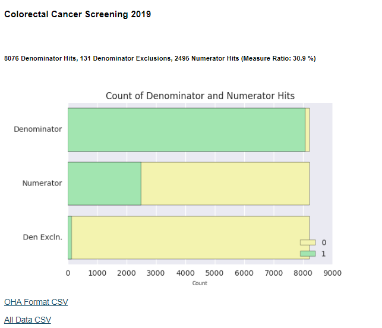
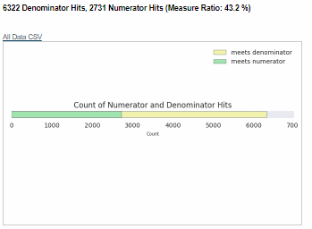
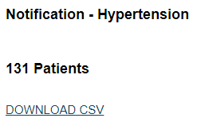
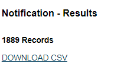
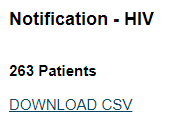

# Reliance Insight Report Catalog

### NOTICE ###
In response to the COVID-19 crisis, Reliance is working to help our stakeholders with actionable data. We have released two reports, available to all Reliance data contributors in the Notifications Dashboard, in the hopes that accurate data can help coordinate care to those in need and help slow the spread of the virus.  

The [*COVID-19 Symptoms and Comorbidities Report*](#covid-19-symptoms-with-comorbidities) identifies patients who have symptoms (or other coded concepts) that qualify them as potentially afflicted with the COVID-19 disease. The report is meant to be a “wide-net” identification report to help Reliance stakeholders aggregate data from the community and see in one view who may have COVID-19. It then appends useful data about those patients to coordinate appropriate care. Some examples of those additional data elements are: demographic information including address, clinical message info (date of service, record type, sending facility, encounter temperature reading if available, COVID-19 related DX code), and whether the patient has a previous diagnosis of several known comorbidities.   

The [*COVID-19 Lab Results Report*](#covid-19-lab-results) identifies lab results specific to COVID-19 infection. The report searches the Reliance dataset for relevant results regardless of whether an infection is detected or otherwise. Patient demographics and test information are included for each result. Report filters are also included for:  

* Result Type (LAB, MICRO, BLB, PTH, RAD)
* COVID19 Result Status (ALL RESULTS, DETECTED, NOT DETECTED)
* Final Status (FINAL, PRELIMINARY, CORRECTED, INCOMPLETE, UNMAPPED)
* State (ALL STATES and states by 2 letter abbreviation)
* Include Transcriptions (checkbox)

Having the most current contact information for patients and members is especially critical during the outbreak.

The [*Patient Contact Info Report*](#patient-contact-info), now available on all Insight dashboards, searches the Reliance dataset for the latest contact information available for patients such as primary address and phone, next of kin phone, and email. For each data element, the date of service from the source is also listed so users understand how contemporary the information is.

The Reliance Team would like to re-emphasize that COVID-19 situation is rapidly evolving, along with the quantity and content of clinical data we are receiving from the community.
We will continue to rapidly iterate on this reporting as we receive input and perform additional data validation. For examples of what other [SHIEC](https://strategichie.com/) HIEs nationally are doing click [here](https://strategichie.com/wp-content/uploads/2020/03/SHIEC_COVID-19_one-pager-Ppt-12-Merged-3-27-20-FINAL-1.pdf). Here are some additional data elements we are planning or considering (either in the current report or in other views/reports):

* viral test status (COVID-19 specific, rapid flu, PCR respiratory panel)
* social risk factor statuses such as indications of housing or food insecurity
* referral for COVID-19 testing
* indications of a quarantine order
* aggregated or deidentified views for public health usage (including maps)
* timeseries trending

 We welcome feedback and suggestions to prioritize our efforts and to improve the usefulness of our data. Please direct any questions or comments to the helpdesk@reliancehie.org  

## Table of Contents
**A. [OHA 2020 CCO Incentive and Performance Reports](#a-oha-2020-cco-incentive-and-performance-reports)**  
**B. [OHA 2019 CCO Incentive and Performance Reports](#a-oha-2019-cco-incentive-and-performance-reports)**  
**C. [QCDR Reports](#c-qcdr-reports)**  
**D. [HEDIS Reports](#d-hedis-reports)**  
**E. [Uniform Data System (UDS) Reports](#e-uniform-data-system-uds-reports)**  
**F. [Certified Community Behavioral Health Clinics (CCBHC) Measures](#f-certified-community-behavioral-health-clinics-ccbhc-measures)**  
**G. [Custom Reports](#g-custom-reports)**  
**H. [Notification Reports](#h-notification-reports)**  
**I. [Social Determinants of Health (SDOH) Reports](#i-social-determinants-of-health-reports)**  
**J. [Appendix](#j-appendix)**  	

### Click on a report name below for a detailed description

## [A. OHA 2020 CCO Incentive and Performance Reports](#oha-2019-cco-incentive-and-performance-reports)
| Report Name    | Description               |
| -------------  |-------------              |
| [Alcohol and Drug Misuse: Screening, Brief Intervention and Referral for Treatment (SBIRT)](#alcohol-and-drug-misuse-screening-brief-intervention-and-referral-for-treatment-sbirt-todo)        | **IN PROGRESS**   Percentage of patients ages 12 years and older who have had a qualifying outpatient visit or home visit during the measurement year with one or more screening, brief intervention, and referral to treatment services.         |
| [Childhood immunization status](#childhood-immunization-status)        | Percentage of children that turned 2 years old during the measurement year and had the Dtap, IPV, MMR, HiB, HepB, and VZV vaccines by their second birthday.         |
| [Cigarette smoking prevalence ](#cigarette-smoking-prevalence-todo)        | **IN PROGRESS**   Percentage of Medicaid members ages 13 and older who currently smoke cigarettes or use other tobacco products.         |
| [Diabetes: HbA1c Poor Control](#diabetes-hba1c-poor-control)        | Percentage of patients 18-75 years of age with diabetes who had hemoglobin A1c ˃ 9.0% during the measurement period.         |
| [Disparity measure: Emergency department utilization among members with mental illness](#emergency-department-utilization-for-individuals-experiencing-mental-illness-todo)        | **IN PROGRESS**   Rate of visits to an emergency department among adult members experiencing mental illness.         |
| [Immunizations for Adolescents](#immunizations-for-adolescents)        | Percentage of adolescents that turned 13 years old during the measurement year and had the meningococcal, Tdap, and HPV vaccines by their 13th birthday.         |
| [Initiation and Engagement of Alcohol and Other Drug Abuse or Dependence Treatment](#initiation-and-engagement-of-alcohol-and-other-drug-abuse-or-dependence-treatment-todo)        | **IN PROGRESS**   Percentage of adolescent and adult patients with a new episode of alcohol or other drug (AOD) dependence who (1) initiated treatment through an inpatient AOD admission, outpatient visit, intensive outpatient encounter or partial hospitalization within 14 days of the diagnosis and (2) who initiated treatment and who had two or more additional services with a diagnosis of AOD within 34 days of the initiation visit.         |
| [Members Receiving Preventive Dental Services, ages 1-5 (kindergarten readiness) and 6-14](#members-receiving-preventive-dental-services-ages-1-5-kingergarten-readiness-todo)        | **IN PROGRESS**   Percentage of enrolled children ages 1-5 (kindergarten readiness) and 6-14 who received a preventive dental service during the measurement year.         |
| [Mental and Physical Health and Oral Health Assessment Within 60 Days for Children in DHS Custody](#mental-and-physical-health-and-oral-health-assessment-within-60-days-for-children-in-dhs-custody-todo)        | **IN PROGRESS**   Percentage of children ages 0-17 who received a physical health assessment, children ages 1-17 who received a dental health assessment, and children ages 4-17 who received a mental health assessment within 60 days of the state notifying CCOs that the children were placed into custody with the Department of Human Services (foster care)        |
| [Oral Evaluation for Adults with Diabetes](#oral-evaluation-for-adults-with-diabetes-todo)        | **IN PROGRESS**   Percentage of adults with diabetes who received at least one oral evaluation within the reporting year.         |
| [Prenatal Postpartum Care](#prenatal-postpartum-care)        | **IN PROGRESS**   Percentage of deliveries of live births between November 6 of the year prior to the measurement year and November 5 of the measurement year that had a postpartum visit on or between 21 and 56 days after delivery.         |
| [Screening for Clinical Depression and Follow-Up Plan](#screening-for-clinical-depression-and-follow-up-plan-todo)        | **IN PROGRESS**   Percentage of patients aged 12 years and older screened for clinical depression on the date of the encounter using an age appropriate standardized depression screening tool AND if positive, a follow up plan is documented on the date of the positive screen.         |
| [Well-Child Visits in the 3rd, 4th, 5th, and 6th Years of Life (kindergarten readiness)](#well-child-visits-in-the-3rd-4th-5th-and-6th-years-of-life-kindergarten-readiness-todo)        | **IN PROGRESS**   Percentage of children ages 3 to 6 that had one or more wellchild visits with a PCP during the measurement year.        |

## [B. OHA 2019 CCO Incentive and Performance Reports](#oha-2019-cco-incentive-and-performance-reports)
| Report Name    | Description               |
| -------------  |-------------              |
| [Adolescent well-care visits](#adolescent-well-care-visits)        | Percentage of adolescents and young adults (ages 12-21) who had at least one well-care visit during the measurement year.         |
| [Ambulatory Care: Emergency Department utilization](#ambulatory-care-emergency-department-utilization)        | Rate of patient visits to an emergency department.         |
| [Childhood immunization status](#childhood-immunization-status-1)        | Percentage of children who received recommended vaccines (DTaP, IPV, MMR, HiB, Hepatitis B, VZV) before their second birthday.         |
| [Cigarette smoking prevalence ](#cigarette-smoking-prevalence)        | Bundled measure is intended to address both cessation benefits offered by CCOs and cigarette smoking prevalence: 1) Meeting minimum cessation benefit requirements 2) Submitting EHR-based cigarette smoking and tobacco prevalence data according to data submission requirements 3) Meeting benchmark or improvement target established by the Metrics & Scoring Committee.         |
| [Colorectal cancer screening](#colorectal-cancer-screening)        | Percent of adult members (ages 50-75) who had appropriate screening for colorectal cancer.         |
| [Controlling high blood pressure](#controlling-high-blood-pressure)        | Percentage of adult members (ages 18–85) with a diagnosis of hypertension (high blood pressure) whose condition was adequately controlled.         |
| [Dental Sealants on Permanent Molars for Children](#dental-sealants-on-permanent-molars-for-children)        | Percentage of children ages 6-14 who received a dental sealant during the measurement year.         |
| [Depression screening and follow up plan](#depression-screening-and-follow-up-plan)        | Percentage of members (ages 12 and older) who had appropriate screening and follow-up planning for major depression.         |
| [Developmental screening in the first 36 months of life](#developmental-screening-in-the-first-36-months-of-life)        | Percentage of children who were screened for risks of developmental, behavioral and social delays using standardized screening tools in the 12 months preceding their first, second or third birthday.         |
| [Diabetes: HbA1c Poor Control](#diabetes-hba1c-poor-control-1)        | Percentage of patients 18-75 years of age with diabetes who had hemoglobin A1c ˃ 9.0% during the measurement period.         |
| [Disparity measure: Emergency department utilization among members with mental illness](#emergency-department-utilization-for-individuals-experiencing-mental-illness)        | Rate of visits to an emergency department among adult members experiencing mental illness.         |
| [Effective contraceptive use among women at risk of unintended pregnancy](#effective-contraceptive-use-among-women-at-risk-of-unintended-pregnancy)        | Percentage of women (ages 15-50) with evidence of one of the most effective or moderately effective contraceptive methods during the measurement year: IUD, implant, contraception injection, contraceptive pills, sterilization, patch, ring, or diaphragm.         |
| [Oral Evaluation for Adults with Diabetes](#oral-evaluation-for-adults-with-diabetes)        | Percentage of adult CCO members identified as having diabetes who received at least one dental service within the reporting year.         |
| [Timeliness of Prenatal and Postpartum Care](#timeliness-of-prenatal-and-postpartum-care)        | Percentage of women with live births who received a prenatal care visit within the first trimester and percentage of women receiving postpartum care within 21-56 days of delivery.         |
| [Weight assessment and counseling in children and adolescents](#weight-assessment-and-counseling-for-nutrition-and-physical-activity-for-children-and-adolescents)        | Percentage of patients (age 3-17) who had an outpatient visit with a PCP or OB/GYN and who had evidence of the following during the measurement period. Three rates are reported. 1. Percentage of patients with height, weight, and body mass index (BMI) percentile documentation 2. Percentage of patients with counseling for nutrition 3. Percentage of patients with counseling for physical activity         |

## [C. QCDR Reports](#qcdr-reports)
| Report Name    | Description               |
| -------------  |-------------              |
| [Diabetes: Hemoglobin A1c (HbA1c) Poor Control (>9%)](#diabetes-hemoglobin-a1c-hba1c-poor-control-9)        | Percentage of patients 18-75 years of age with diabetes who had hemoglobin A1c > 9.0% during the measurement period.         |
| [Breast Cancer Screening](#breast-cancer-screening) | Percentage of women 50-74 years of age who had a mammogram to screen for breast cancer. |
| [Colorectal Cancer Screening](#colorectal-cancer-screening-2) | Percentage of adults 50-75 years of age who had appropriate screening for colorectal cancer. |
| [Preventive Care and Screening: Body Mass Index (BMI) Screening and Follow-Up Plan](#preventive-care-and-screening-body-mass-index-bmi-screening-and-follow-up-plan) | Percentage of patients aged 18 years and older with a BMI documented during the current encounter or during the previous six months AND with a BMI outside of normal parameters, a follow-up plan is documented during the encounter or during the previous six months of the current encounter.  Normal Parameters: Age 18 years and older BMI => 18.5 and < 25 kg/m2 |
| [Ischemic Vascular Disease (IVD): Use of Aspirin or Another Antiplatelet](#ischemic-vascular-disease-ivd-use-of-aspirin-or-another-antiplatelet) | Percentage of patients 18 years of age and older who were diagnosed with acute myocardial infarction (AMI), coronary artery bypass graft (CABG) or percutaneous coronary interventions (PCI) in the 12 months prior to the measurement period, or who had an active diagnosis of ischemic vascular disease (IVD) during the measurement period, and who had documentation of use of aspirin or another antiplatelet during the measurement period. |
| [Preventive Care and Screening: Tobacco Use: Screening and Cessation Intervention](#preventive-care-and-screening-tobacco-use-screening-and-cessation-intervention) | Percentage of patients aged 18 years and older who were screened for tobacco use one or more times within 24 months AND who received cessation counseling intervention if identified as a tobacco user. |
| [Controlling High Blood Pressure](#controlling-high-blood-pressure-2) | Percentage of patients 18-85 years of age who had a diagnosis of hypertension and whose blood pressure was adequately controlled (<140/90mmHg) during the measurement period. |
| [Cervical Cancer Screening](#cervical-cancer-screening) | Percentage of women 21-64 years of age who were screened for cervical cancer using either of the following criteria: * Women age 21-64 who had cervical cytology performed every 3 years * Women age 30-64 who had cervical cytology/human papillomavirus (HPV) co-testing performed every 5 years |
| [Documentation of Current Medications in the Medical Record](#) | **IN PROGRESS**   Percentage of visits for patients aged 18 years and older for which the eligible professional or eligible clinician attests to documenting a list of current medications using all immediate resources available on the date of the encounter. This list must include ALL known prescriptions, over-the-counters, herbals, and vitamin/mineral/dietary (nutritional) supplements AND must contain the medications' name, dosage, frequency and route of administration. |
| [Anti-depressant Medication Management](#) | **IN PROGRESS**   Percentage of patients 18 years of age and older who were treated with antidepressant medication, had a diagnosis of major depression, and who remained on an antidepressant medication treatment. Two rates are reported. a. Percentage of patients who remained on an antidepressant medication for at least 84 days (12 weeks). b. Percentage of patients who remained on an antidepressant medication for at least 180 days (6 months). |
| [Falls: Screening for Future Fall Risk](#) | **IN PROGRESS**   Percentage of patients 65 years of age and older who were screened for future fall risk during the measurement period. |
| [Hypertension: Improvement in Blood Pressure](#) | **IN PROGRESS**   Percentage of patients aged 18-85 years of age with a diagnosis of hypertension whose blood pressure improved during the measurement period. |
| [Maternal Depression Screening](#) | **IN PROGRESS**   The percentage of children who turned 6 months of age during the measurement year, who had a face-to-face visit between the clinician and the child during child's first 6 months, and who had a maternal depression screening for the mother at least once between 0 and 6 months of life. |
| [Functional Status Assessments for Congestive Heart Failure](#) | **IN PROGRESS**   Percentage of patients 18 years of age and older with congestive heart failure who completed initial and follow-up patient-reported functional status assessments. |
| [Depression Remission at Twelve Months](#) | **IN PROGRESS**   The percentage of patients 18 years of age or older with major depression or dysthymia who reached remission 12 months (+/- 30 days) after an index visit. |
| [Child and Adolescent Major Depressive Disorder (MDD): Suicide Risk Assessment](#) | **IN PROGRESS**   Percentage of patient visits for those patients aged 6 through 17 years with a diagnosis of major depressive disorder with an assessment for suicide risk |
| [Use of High-Risk Medications in the Elderly ](#) | **IN PROGRESS**   Percentage of patients 65 years of age and older who were ordered high-risk medications. Two rates are reported. a. Percentage of patients who were ordered at least one high-risk medication. b. Percentage of patients who were ordered at least two of the same high-risk medications. |
| [Children Who Have Dental Decay or Cavities](#) | **IN PROGRESS**   Percentage of children, age 0-20 years, who have had tooth decay or cavities during the measurement period. |

## [D. HEDIS Reports](#hedis-reports)
| Report Name    | Description               |
| -------------  |-------------              |
| [Flu Vaccinations for Adults Ages 18-64](#flu-vaccinations-for-adults-ages-18-64) | The percentage of commercial and Medicaid members 18–64 years of age who received an influenza vaccination between July 1 of the measurement year and the date when the CAHPS 5.0H survey was completed. |
| [Flu Vaccinations for Adults Ages 65 and Older](#flu-vaccinations-for-adults-ages-65-and-older)      | Description The percentage of Medicare members 65 years of age and older who received an influenza vaccination between July 1 of the measurement year and the date when the Medicare CAHPS survey was completed.  |

## [E. Uniform Data System (UDS) Reports](#uds-reports)
| Report Name    | Description               |
| -------------  |-------------              |
| [Cervical Cancer Screening](#) |	**IN PROGRESS**   Percentage of women 21-64 years of age who were screened for cervical cancer using either of the following criteria: 1) Women age 21-64 who had cervical cytology performed every 3 years 2) Women age 30-64 who had cervical cytology/human papillomavirus (HPV) co-testing performed every 5 years  |
| [Childhood Immunization Status](#childhood-immunization-status-cms) |  Percentage of children 2 years of age who had four diphtheria, tetanus and acellular pertussis (DTaP); three polio (IPV), one measles, mumps and rubella (MMR); three H influenza type B (HiB); three hepatitis B (Hep B); one chicken pox (VZV); four pneumococcal conjugate (PCV); one hepatitis A (Hep A); two or three rotavirus (RV); and two influenza (flu) vaccines by their second birthday.  |
| [Colorectal Cancer Screening](#) | **IN PROGRESS**   Percentage of adults 50-75 years of age who had appropriate screening for colorectal cancer. |  
| [Controlling High Blood Pressure](#) | **IN PROGRESS**   Percentage of patients 18-85 years of age who had a diagnosis of hypertension and whose blood pressure was adequately controlled (<140/90mmHg) during the measurement period |  
| [Coronary Artery Disease (CAD): Lipid Therapy (in progress) ](#) | **IN PROGRESS**   Percentage of patients aged 18 years and older with a diagnosis of CAD who were prescribed a lipid-lowering therapy   |  
| [Dental Sealants for Children between 6-9 Years (in progress) ](#) | **IN PROGRESS**   Percentage of children, age 6-9 years, at moderate to high risk for caries who received a sealant on a first permanent molar during the measurement period. |  
| [Diabetes: Hemoglobin A1c (HbA1c) Poor Control (>9%)](#) | **IN PROGRESS**   Percentage of patients 18-75 years of age with diabetes who had hemoglobin A1c (HbA1c) greater than 9.0 percent during the measurement period. |  
| [Early Entry into Prenatal Care (in progress) ](#) | **IN PROGRESS**   Percentage of prenatal care patients who entered prenatal care during their first trimester. |  
| [HIV Linkage to Care (in progress) ](#) | **IN PROGRESS**   Percentage of patients newly diagnosed with HIV who were seen for follow-up treatment within 90 days of diagnosis. |  
| [Ischemic Vascular Disease (IVD): Use of Aspirin or Another Antiplatelet](#) | **IN PROGRESS**   Percentage of patients aged 18 years of age and older who were diagnosed with acute myocardial infarction (AMI), or who had a coronary artery bypass graft (CABG) or percutaneous coronary interventions (PCIs) in the 12 months prior to the measurement period or who had an active diagnosis of IVD during the measurement period, and who had documentation of use of aspirin or another antiplatelet during the measurement period. |  
| [Preventive Care and Screening: Body Mass Index (BMI) Screening and Follow-Up Plan](#preventive-care-and-screening-body-mass-index-bmi-screening-and-follow-up-plan-1) | Percentage of patients aged 18 years and older with BMI documented during the most recent visit or within the previous six months to that visit and when the BMI is outside of normal parameters, a follow-up plan is documented during the visit or during the previous six months of that visit |  
| [Preventive Care and Screening: Screening for Depression and Follow-Up Plan](#) | **IN PROGRESS**   Percentage of patients aged 12 years and older screened for depression on the date of the visit using an age appropriate standardized depression screening tool and if positive, a follow-up plan is documented on the date of the positive screen. |  
| [Preventive Care and Screening: Tobacco Use: Screening and Cessation Intervention](#) | **IN PROGRESS**   Percentage of patients aged 18 and older who were screened for tobacco use one or more times within 24 months and who received cessation counseling intervention if defined as a tobacco user. |  
| [Use of Appropriate Medications for Asthma](#use-of-appropriate-medications-for-asthma) | Percentage of patients 5-64 years of age who were identified as having persistent asthma and were appropriately ordered medication during the measurement period |  
| [Weight Assessment and Counseling for Nutrition and Physical Activity for Children and Adolescents](#weight-assessment-and-counseling-for-nutrition-and-physical-activity-for-children-and-adolescents-2) | Percentage of patients 3 -17 years of age who had a medical visit and who had evidence of height, weight, and body mass index (BMI) percentile documentation and who had documentation of counseling for nutrition and who had documentation of counseling for physical activity during the measurement year |  

## [F. Certified Community Behavioral Health Clinics (CCBHC) Measures](#)
| Report Name    | Description               |
| -------------  |-------------              |
| [Deaths by Suicide](#) | Percentage of consumers aged 12 years and older who died by suicide during the measurement year  |
| [Preventive Care and Screening: Body Mass Index (BMI) Screening and Follow-Up Plan](#preventive-care-and-screening-body-mass-index-bmi-screening-and-follow-up-plan-2) | Percentage of patients aged 18 years and older with BMI documented during the most recent visit or within the previous six months to that visit and when the BMI is outside of normal parameters, a follow-up plan is documented during the visit or during the previous six months of that visit |  
| [Weight Assessment and Counseling for Nutrition and Physical Activity for Children and Adolescents](#weight-assessment-and-counseling-for-nutrition-and-physical-activity-for-children-and-adolescents-3)      |	**IN PROGRESS**   Percentage of patients (age 3-17) who had an outpatient visit with a PCP or OB/GYN and who had evidence of the following during the measurement period. Three rates are reported. 1. Percentage of patients with height, weight, and body mass index (BMI) percentile documentation 2. Percentage of patients with counseling for nutrition 3. Percentage of patients with counseling for physical activity        |
| [Controlling High Blood Pressure](#) | **IN PROGRESS**   Percentage of patients 18-85 years of age who had a diagnosis of hypertension and whose blood pressure was adequately controlled (<140/90mmHg) during the measurement period || [Deaths by Suicide ](#) | Percentage of consumers aged 12 years and older who died by suicide during the measurement year  |
| [Preventive Care and Screening: Tobacco Use: Screening and Cessation Intervention](#) | **IN PROGRESS**   Percentage of patients aged 18 and older who were screened for tobacco use one or more times within 24 months and who received cessation counseling intervention if defined as a tobacco user. |
| [Screening for Clinical Depression and Follow-Up Plan](#screening-for-clinical-depression-and-follow-up-plan)      |  Percentage of members (ages 12 and older) who had appropriate screening and follow-up planning for major depression.        |
| [Suicide Attempts](#) | The percentage of consumers aged 12 years and older who attempted suicide during the measurement year, where the suicide attempt resulted in injury requiring medical services  |
| [Follow-Up After Emergency Department Visit for Mental Health](#) | **IN PROGRESS**   The percentage of emergency department (ED) visits for consumers 6 years of age and older with a primary diagnosis of mental illness, who had an outpatient visit, an intensive outpatient encounter or a partial hospitalization for mental illness. Two rates are reported: 1. The percentage of ED visits for which the consumer received follow-up within 30 days of the ED visit. 2. The percentage of ED visits for which the consumer received follow-up within 7 days of the ED visit.  |
| [Diabetes Care For People With Serious Mental Illness: Hemoglobin A1c (HbA1c) Poor Control (>9.0%) ](#)        | **IN PROGRESS**   The percentage of consumers 18–75 years of age with a serious mental illness and diabetes (type 1 and type 2) whose most recent Hemoglobin A1c (HbA1c) level during the measurement year is >9.0%         |

## [G. Custom Reports](#custom-reports)
| Report Name    | Description               |
| -------------  |-------------              |
| [Patient Contact Info](#patient-contact-info) | This report returns a list of each patient's latest contact information, their most common address, and their most common phone number present in Reliance data. The patient list is based on the user's patient population for their specific security set (see [current patient](#current-patient-list) list below). |
| [Current Patient List](#current-patient-list) | Identifies current patient population for the user's specific security set and may also be subset to report only currently eligible Medicaid patients. |
| [Hepatitis C Diagnosis and Hepatic Labs](#hepatitis-c-diagnosis-and-hepatic-labs) | Returns all patients with a diagnosis of Hepatitis C. Includes HIV status, most recent liver panel lab results, most recent fibrosis lab results, and calculated AST to Platelet Ratio Index (APRI Score).  |
| [Diabetes by Type](#diabetes-by-type) | This report displays two outputs.  The first output is percentage of patients with type 1 diabetes who had hemoglobin A1c > 9.0% during the measurement period. The second output is percentage of patients with type 2 diabetes who had hemoglobin A1c > 9.0% during the measurement period.  |
| [Positive Pregnancy](#positive-pregnancy) | Real time identification of pregnant population |
| [Homeless](#homeless) | Real time identification of homeless population based on clinical codes and text search |
| [Food Insecurity](#food-insecurity) | Real time identification of population with indications of food insecurity based on clinical codes and text search |
| [Sexual Orientation and Gender Identity](#sexual-orientation-and-gender-identity) | The purpose of this report is to identify patients sexual orientation and or gender identity. We use a combination of text, diagnosis, loinc and snomed codes searches to identify preferences. |
| [Encounters Report](#encounters-report) | This report shows a patient's primary care provider changes based on the input time parameters. |

## [H. Notification Reports](#notification-reports)
| Report Name    | Description               |
| -------------  |-------------              |
| COVID19 Antibody Results | COVID19 Antibody Results	Aggregates COVID19-specific antibody testing results in the Reliance data set. |
| [COVID19 Symptoms & Comorbidities](#covid-19-symptoms-with-comorbidities)| Identifies patients with symptoms related to COVID-19, along with demographic information, and the relevant DX code found in the record. For each of those identified patients, it also looks back in the longitudinal record for whether the patient has a diagnosis of the following comorbidities: diabetes, hypertension, vascular disease, respiratory failure, and pulmonary disease. |
| [COVID19 Lab Results](#covid-19-lab-results)|Lab results specific to COVID-19, along with demographic information.  |
| [Current Patient List](#current-patient-list) | Identifies current patient population for the user's specific security set and may also be subset to report only currently eligible Medicaid patients. |
| [Depression Screen](#depression-screen) | Patients aged 12 and older screened for clinical depression using an age-appropriate standardized depression screening tool but were missing follow-up on the date of the positive screen. |
| [Diabetes Management](#diabetes-management) | Patients 18-75 years of age who had hemoglobin A1c greater than the user-defined threshold (Default: 7.0%). |
| [ED visits](#ed-visits) | List of patients that have visited the Emergency Department. The output shows how many times a patient has visited the ED.|
| [HIV](#hiv) | This report identifies patients that may be HIV positive. UMLS coding concept: 2.16.840.1.113883.3.464.1003.120.12.1003 |
| [Homeless](#homeless-1) | List of potentially homeless patients identified by annotations made by healthcare providers, a given home addresses of a hospital, homeless shelter or place of worship, and variations of text and standard code set identification extracted from transcribed clinical records. |
| [Hospital Discharge](#hospital-discharge) | Hospital Discharge	Identifies patients that have been discharged from an emergency or inpatient hospital visit. This report uses the ADT A03 trigger event and the patient class is "inpatient" or "Emergency" to identify patient discharges.  |
| [Hypertension](#hypertension) | Patients 18-85 years of age whose blood pressure is greater than the user-defined threshold (Default: 125/90mmHg).|
| [Lab results](#lab-results) | Identifies if patient results are available for viewing. |
| [Patient Contact Info](#patient-contact-info) | This report returns a list of each patient's latest contact information, their most common address, and their most common phone number present in Reliance data. The patient list is based on the user's patient population for their specific security set (see [current patient](#current-patient-list) list below). |
| [Positive Pregnancy](#positive-pregnancy) | Real-time identification of pregnant population |
| [Positive Pregnancy w/Opioid Dx](#pregnancy-with-opioid-abuse) | Provides a list of patients with a positive pregnancy screening and a diagnosis of opioid abuse. UMLS coding concepts: 2.16.840.1.113883.3.666.5.1595 |
| [Opioid Use](#opioid-abuse) | Identifies patients with a diagnosis of opioid abuse. UMLS coding concept: 2.16.840.1.113883.3.464.1003.106.12.1004 |
| [Readmissions](#30-day-re-admit) | List of readmissions within the measurement period that occurred less than 30 days before last discharge from a hospital. |
| [SBIRT](#alcohol-and-drug-misuse-sbirt) | Patients aged 12 and older who received appropriate "screening, brief intervention, and referral to treatment" (SBIRT) for alcohol or other substance abuse. |
| [Tobacco](#tobacco) | Patients aged 13 and older screened and positive for cigarette smoking and/or tobacco use. |

## [I. Social Determinants of Health Reports](#notification-reports)
| Report Name    | Description               |
| -------------  |-------------              |
| [SDOH Code Prevalence](#sdoh-code-prevelance) | Outputs the prevalence of SDOH-related codes (as defined by the latest SIREN compendium) within the measurement period as defined by Date of Service. |
| [SDOH Disparities](#sdoh-disparities) | Outputs the members in the population with a social risk factor code with the measurement period. Data is subset along common classifations used to identify disparities (gender, race, ethnicity) |

## [J. Appendix](#appendix)
[Community Health Record](#community-health-record)  
[Glossary](#glossary)

## OHA 2020 CCO Incentive and Performance Reports  
The Oregon Health Authority (OHA) uses quality health metrics to show how well Coordinated Care Organizations (CCOs) are improving care, making quality care accessible, eliminating health disparities, and curbing the rising cost of health care. These outcome and quality measures are developed by the OHA Metrics and Scoring Committee and can be found here:   
<http://www.oregon.gov/OHA/HPA/ANALYTICS/Pages/CCO-Baseline-Data.aspx>  
The default measurement period for the following reports is Calendar Year 2020, but the user can choose a measurement period of their choice.

### Childhood Immunization Status  
**Measure Description**
Percentage of children that turned 2 years old during the measurement year and had the Dtap, IPV, MMR, HiB, HepB, and VZV vaccines by their second birthday.  
**2020 Measure Benchmark**  
TBD  
**Denominator**  
Children who turn 2 years of age during the measurement year.  
**Required exclusions for denominator**  
Members in hospice are excluded from this measure. These members are identified using HEDIS 2020 Hospice Encounter Value Set and Hospice Intervention Value Set, with claims within the measurement year. (See HEDIS 2020 General Guideline 17 for detail.)  
OHA does not apply any optional exclusions to this measure.  
**Numerator**  
OHA is using HEDIS® 2020 Combination 2 for the CCO incentive and State Quality measure: The number of children who turned 2 years of age in the measurement year and had all the following specified vaccinations. (minimum threshold in brackets): DTaP (4), IPV (3), MMR (1), HiB (3), HepB (3), VZV (1).  
**Data Sources**  
ADTs, CCDs, LABs, Encounters, Transcriptions, and Claims   
**Input Parameters**   
Start Date, End Date, and Records to Display Below  
**Output**  
Total denominator hits, total numerator hits, measure ratio (total numerator hits/total denominator hits), stacked bar chart of measure ratio for each immunization and overall, list of patients that meet denominator and numerator requirements.  
OHA Format CSV Download, All Data CSV Download (contains all column headings below) and Immunization DOS CSV (every immunizatons and DOS for each patient)  
**Custom Modifications**  
Indications of alternative schedule or vaccination refusal in date_of_service_alt_schedule, alternative_schedule, date_of_service_refusal, and vaccination_refusal columns.  
Alternative Schedule Clinical Codes:  
ICD-10-CM: Z28.1,Z28.21,Z28.82 HCPCS: G8483,G8866  
Vaccination Refusal Clinical Codes:  
ICD-10-CM: Z91.89 ICD-9-CM: V15.89 SNOMED: 140571000119108  
Record type of denominator hit in denom_record_type column. Records types include HL7 messages (ADTs and Transcriptions), CCDs, and Claims.  
CSV export of all immunizations per patient by date of service. This export includes the sending facility of the immunization received and whether the immunization came from clinical data, claims data, or both. Filtering by yes in the from_both column will indicate an immunization that has both clinical and claims data for the same immunization on the same date of service.  
**Example Output**  
  
**Column Headings**  
`mpid_CHR | patient_date_of_birth | sex | patient_medicaid_id |
        sending_facility | date_of_service_denom | meets_denominator |
        | denom_record_type | date_of_service_alt_schedule | alternative_schedule |
        date_of_service_refusal | vaccination_refusal | date_of_service_exclusion |
        meets_denominator_exclusion |
        date_of_service_dtap |dtap_num | dtap count |
        date_of_service_ipv | ipv_num | ipv count |
        date_of_service_mmr | mmr_num | mmr count |
        date_of_service_hib | hib_num | hib count |
        date_of_service_hepb | hepb_num | hepB count |hepb_dx |
        date_of_service_vzv | vzv_num | vzv count | vzv_dx |
        all_vacs |provider_name | measurement_period_begin | measurement_period_end`

**Link to Measure Specifications**  
<https://www.oregon.gov/oha/HPA/ANALYTICS/CCOMetrics/2020-Childhood-Immunization-Status-specifications-final.pdf>

### Immunizations for Adolescents  
**Measure Description**
Percentage of adolescents that turned 13 years old during the measurement year and had the meningococcal, Tdap, and HPV vaccines by their 13th birthday.  
**2020 Measure Benchmark**  
IMA Combo 1: 86.4%  
IMA Combo 2: 40.4%  
**Denominator**  
Adolescents who turn 13 years of age during the measurement year.  
**Required exclusions for denominator**  
Members in hospice are excluded from this measure. These members are identified using HEDIS 2020 Hospice Encounter Value Set and Hospice Intervention Value Set, with claims within the measurement year. (See HEDIS 2020 General Guideline 17 for detail.)  
OHA does not apply any optional exclusions to this measure.  
**Numerator**  
The number of adolescents who turned 13 years of age in the measurement year and had all the following specified vaccinations. (minimum threshold in brackets): Meningococcal (1), Tdap (1), HPV (2)  
Combination 1: Adolescents who are numerator compliant for both the meningococcal conjugate and Tdap
indicators.  
Combination 2: Adolescents who are numerator compliant for all three indicators (meningococcal, Tdap, and HPV).  
**Data Sources**  
ADTs, CCDs, LABs, Encounters, Transcriptions, and Claims   
**Input Parameters**   
Start Date, End Date, and Records to Display Below  
**Output**  
Total denominator hits, total numerator hits, measure ratio (total numerator hits/total denominator hits), stacked bar chart of measure ratio for each immunization and overall, list of patients that meet denominator and numerator requirements.  
OHA Format CSV Download, All Data CSV Download (contains all column headings below) and Immunization DOS CSV (every immunizatons and DOS for each patient)  
**Custom Modifications**  
Indications of alternative schedule or vaccination refusal in date_of_service_alt_schedule, alternative_schedule, date_of_service_refusal, and vaccination_refusal columns.  
Alternative Schedule Clinical Codes:  
ICD-10-CM: Z28.1,Z28.21,Z28.82 HCPCS: G8483,G8866  
Vaccination Refusal Clinical Codes:  
ICD-10-CM: Z91.89 ICD-9-CM: V15.89 SNOMED: 140571000119108  
Record type of denominator hit in denom_record_type column. Records types include HL7 messages (ADTs and Transcriptions), CCDs, and Claims.  
CSV export of all immunizations per patient by date of service. This export includes the sending facility of the immunization received and whether the immunization came from clinical data, claims data, or both. Filtering by yes in the from_both column will indicate an immunization that has both clinical and claims data for the same immunization on the same date of service.  
**Example Output**  
  
**Column Headings**  
`mpid_CHR | patient_date_of_birth | sex | patient_medicaid_id |
        sending_facility | date_of_service_denom | meets_denominator |
        | denom_record_type | date_of_service_alt_schedule | alternative_schedule |
        date_of_service_refusal | vaccination_refusal | date_of_service_exclusion |
        meets_denominator_exclusion |
        date_of_service_meningococcal |meningococcal_num | meningococcal count |
        date_of_service_tdap | tdap_num | tdap count |
        date_of_service_hpv | hpv_num | hpv count |
        combo_1 | combo_2 | provider_name | measurement_period_begin | measurement_period_end`

**Link to Measure Specifications**  
<https://www.oregon.gov/oha/HPA/ANALYTICS/CCOMetrics/2020-Immunizations-for-Adolescents-specifications-final.pdf>

### Diabetes: HbA1c Poor Control
**Measure Description**  
Percentage of patients 18-75 years of age with diabetes who had hemoglobin A1c > 9.0% during the measurement period.   
**2019 Measure Benchmark**  
23.4%  
**Denominator**  
Patients 18-75 years of age with diabetes with a visit during the measurement period.  
**Required exclusions for denominator**    
Patients whose hospice care overlaps the measurement period  
Patients 66 and older who are living long term in an institution for more than 90 days during the measurement period.  
Patients 66 and older with advanced illness and frailty because it is unlikely that patients will benefit from the services being measured.  
**Numerator**  
Patients whose most recent HbA1c level (performed during the measurement period) is >9.0%.  
**Data Sources**  
ADTs, CCDs, LABs, and Encounters   
**Input Parameters**   
Start Date, End Date, and Records to Display Below  
**Output**  
Total denominator hits, total numerator hits, measure ratio (total numerator hits/total denominator hits), stacked bar chart of measure ratio, distribution plot of HbA1c values in denominator population, list of patients that meet denominator and numerator requirements.  
OHA Format CSV Download and All Data CSV Download (contains all column headings below)  
**Custom Modifications**  
Most recent BMI and blood pressure readings in date_of_service_bmi, bmi, date_of_service_bp, bp_systolic, and bp_diastolic columns.  
**Example Output**  
  
**Column Headings**  
`mpid_CHR | patient_name | patient_date_of_birth | sex | patient_medicaid_id | sending_facility | date_of_service_dx | date_of_service_qual_visit | sending_facility_num | date_of_service_num | HbA1c | provider_name | ordering_provider | meets_denominator | meets_numerator | date_of_service_bmi | bmi | date_of_service_bp | bp_systolic | bp_diastolic | measurement_period_begin | measurement_period_end`

**Link to Measure Specifications**  
<https://www.oregon.gov/oha/HPA/ANALYTICS/CCOMetrics/2020-Diabetes-Poor-Control-specifications-final.pdf>

## OHA 2019 CCO Incentive and Performance Reports  
The Oregon Health Authority (OHA) uses quality health metrics to show how well Coordinated Care Organizations (CCOs) are improving care, making quality care accessible, eliminating health disparities, and curbing the rising cost of health care. These outcome and quality measures are developed by the OHA Metrics and Scoring Committee and can be found here:   
<http://www.oregon.gov/OHA/HPA/ANALYTICS/Pages/CCO-Baseline-Data.aspx>  
The default measurement period for the following reports is Calendar Year 2019, but the user can choose a measurement period of their choice.

### Adolescent Well Care Visits
**Measure Description**  
Members age 12-21 years as of December 31 of the measurement year. See HEDIS® 2019 Technical Specifications for Health Plans (Volume 2) for details.  
**2019 Measure Benchmark**  
65.2% (administrative data only); 2018 National Medicaid 75th percentile.  
**Denominator**  
Members age 12-21 years as of December 31 of the measurement year.  
**Required exclusions for denominator:**  
Members in hospice are excluded from this measure. These members are identified using HEDIS 2019 Hospice Value Set, with claims within the measurement year. (See HEDIS 2019 General Guideline 17 for detail.)  
**Numerator**  
At least one comprehensive well-care visit during the measurement year.  
**Data Sources**  
ADTs, CCDs, LABs, and Encounters   
**Input Parameters**   
Start Date, End Date, and Records to Display Below  
**Output**  
Total denominator hits, total numerator hits, measure ratio (total numerator hits/total denominator hits), stacked bar chart of measure ratio, list of patients that meet denominator and numerator requirements.  
OHA Format CSV Download and All Data CSV Download (contains all column headings below)  

**Example Output**  
  
**Column Headings**  
`mpid_CHR | patient_name | patient_date_of_birth | sex | patient_medicaid_id | sending_facility | date_of_service_denom |sending_facility_num | date_of_service_num | meets_denominator | meets_numerator | provider_name | measurement_period_begin | measurement_period_end`

**Link to Measure Specifications**  
<https://www.oregon.gov/oha/HPA/ANALYTICS/CCOMetrics/2019-Adolescent-Well-Care-Visits.pdf>  

### Ambulatory care: Emergency Department utilization  
**Measure Description**   
Rate of patient visits to an emergency department.  
**2019 Measure Benchmark**  
43.1 / 1,000 member months; 2018 national Medicaid 90th percentile  
**Denominator**  
1,000 Member Months  
**Required exclusions for denominator**  
Members in hospice are excluded from this measure. These members are identified using HEDIS 2019 Hospice Value Set, with claims within the measurement year. (See HEDIS 2019 General Guideline 17 for detail.)  
**Numerator for Emergency Department Visits**  
Count each visit to an ED that does not result in an inpatient encounter once; count multiple ED visits on the same date of service as one visit.  
Do not include ED visits that result in an inpatient stay (Inpatient Stay Value Set).  
HEDIS 2019 General Guideline 44: When an ED or observation visit and an inpatient stay are billed on separate claims, the visit results in an inpatient stay when the ED/observation date of service occurs on the day prior to the admission date or any time during the admission (admission date through discharge date). An ED or observation visit billed on the same claim as an inpatient stay is considered a visit that resulted in an inpatient stay.  
**Numerator for Outpatient Visits**  
Count multiple codes with the same practitioner on the same date of service as a single visit. Count visits with different practitioners separately (count visits with different providers on the same date of service as different visits).  
**Required exclusions for numerator**  
Mental health and chemical dependency services are excluded, using the following codes. Note OHA began applying the exclusions at the claim line level in measurement year 2016. OHA keeps all paid claim lines (i.e., unless the entire claim was denied, the paid lines pass through the algorithm and are picked up for this exclusion).  
**Data Sources**  
ADTs, CCDs, LABs, Encounters, Transcriptions, and Claims   
**Input Parameters**   
Start Date, End Date, and Records to Display Below  
**Output**  
Total denominator hits, total numerator hits, measure ratio (total numerator hits/total denominator hits), stacked bar chart of measure ratio, list of patients that meet denominator and numerator requirements.  
OHA Format CSV Download, All Data CSV Download (contains all column headings below).  
**Example Output**  
  

**Column Headings**  
`mpid_CHR | patient_name | patient_date_of_birth | sex | patient_medicaid_id | sending_facility | date_of_service_denom | date_of_service_num | provider_name | estimated_enrollment_months | ED_count | measurement_period_begin | measurement_period_end`

**Link to Measure Specifications**  
<https://www.oregon.gov/oha/HPA/ANALYTICS/CCOMetrics/2019-Ambulatory-Care-Outpatient-ED-Utilization.pdf>  

### Childhood Immunization Status  
**Measure Description**
Percentage of children who received recommended vaccines (DTaP, IPV, MMR, HiB, Hepatitis B, VZV) before their second birthday.  
**2019 Measure Benchmark**  
81.9% 2018 National Medicaid 90th percentile (Combo 2)  
**Denominator**  
Children who turn 2 years of age during the measurement year. See HEDIS® 2019 Technical Specification for Health Plans (Volume 2) for details.  
**Required exclusions for denominator**  
OHA excludes members who are known to be deceased at the time of metric reporting.  
* Note this is a clarification of ongoing practice for OHA’s immunization metrics production, given the ALERT IIS does not provide immunization records for deceased individuals.  

**Numerator**  
OHA is using HEDIS® 2019 Combination 2 for the state performance measure: The number of children who turned 2 years of age in the measurement year and had all of the following specified vaccinations (minimum threshold in brackets): DTaP (4), IPV (3), MMR (1), HiB (3), HepB (3), VZV (1).  
**Data Sources**  
ADTs, CCDs, LABs, Encounters, Transcriptions, and Claims   
**Input Parameters**   
Start Date, End Date, and Records to Display Below  
**Output**  
Total denominator hits, total numerator hits, measure ratio (total numerator hits/total denominator hits), stacked bar chart of measure ratio for each immunization and overall, list of patients that meet denominator and numerator requirements.  
OHA Format CSV Download, All Data CSV Download (contains all column headings below) and Immunization DOS CSV (every immunizatons and DOS for each patient)  
**Custom Modifications**  
Indications of alternative schedule or vaccination refusal in date_of_service_alt_schedule, alternative_schedule, date_of_service_refusal, and vaccination_refusal columns.  
Alternative Schedule Clinical Codes:  
ICD-10-CM: Z28.1,Z28.21,Z28.82 HCPCS: G8483,G8866  
Vaccination Refusal Clinical Codes:  
ICD-10-CM: Z91.89 ICD-9-CM: V15.89 SNOMED: 140571000119108  
Record type of denominator hit in denom_record_type column. Records types include HL7 messages (ADTs and Transcriptions), CCDs, and Claims.  
CSV export of all immunizations per patient by date of service. This export includes the sending facility of the immunization received and whether the immunization came from clinical data, claims data, or both. Filtering by yes in the from_both column will indicate an immunization that has both clinical and claims data for the same immunization on the same date of service.  
**Example Output**  

**Column Headings**  
`mpid_CHR | patient_date_of_birth | sex | patient_medicaid_id |
        sending_facility | date_of_service_denom | meets_denominator |
        | denom_record_type | date_of_service_alt_schedule | alternative_schedule |
        date_of_service_refusal | vaccination_refusal | date_of_service_exclusion |
        meets_denominator_exclusion |
        date_of_service_dtap |dtap_num | dtap count |
        date_of_service_ipv | ipv_num | ipv count |
        date_of_service_mmr | mmr_num | mmr count |
        date_of_service_hib | hib_num | hib count |
        date_of_service_hepb | hepb_num | hepB count |hepb_dx |
        date_of_service_vzv | vzv_num | vzv count | vzv_dx |
        all_vacs |provider_name | measurement_period_begin | measurement_period_end`

**Link to Measure Specifications**  
<https://www.oregon.gov/oha/HPA/ANALYTICS/CCOMetrics/2019-Childhood-Immunization-Status.pdf>

### Cigarette Smoking Prevalence  
**Measure Description**  
Bundled measure is intended to address both cessation benefits offered by CCOs and cigarette smoking prevalence.  
**2019 Measure Benchmark**  
25%, Metrics and Scoring Committee consensus.  
**Rate 1**  
**Denominator**  
Unique Medicaid members 13 years old or older by the beginning of the measurement year, who had a qualifying visit with the provider during the measurement period.  
**Numerator**  
Unique members age 13 years or older who had a qualifying visit with the provider during the measurement period, who have their smoking and/or tobacco use status recorded as structured data.

**Rate 2**   
**Denominator**  
Unique Medicaid members age 13 years or older who had a qualifying visit with the provider during the measurement period and who have their smoking and/or tobacco use status recorded as structured data (Rate 1 numerator).  
**Numerator**  
Of patients in the Rate 2 denominator, those who are cigarette smokers. See below for additional information on identifying cigarette smoking in the numerator.  

**Rate 3**  
**Denominator**  
Unique Medicaid members age 13 years or older who had a qualifying visit with the provider during the measurement period and who have their smoking and/or tobacco use status recorded as structured data (Rate 1 numerator).  
**Numerator**  
Of patients in the Rate 3 denominator, those who are cigarette smokers and/or tobacco users. See below for additional information on identifying tobacco use in the numerator.   

**Required exclusions for numerator**  
Members with missing smoking or tobacco use status will be excluded from rates 2 and 3. Note that e-cigarettes and marijuana (medical or recreational) should be excluded from both
the cigarette smoking rate and the broader tobacco use rate.  In addition, the measure is focused on cigarette and tobacco use, not nicotine use.

**Data Sources**  
ADTs, CCDs, LABs, Encounters, Transcriptions, and Claims   
**Input Parameters**   
Start Date, End Date, and Records to Display Below  
**Output**  
Total denominator hits, total numerator hits, measure ratio (total numerator hits/total denominator hits), stacked bar chart of measure ratio for each rate, list of patients that meet denominator and numerator requirements.  
OHA Format CSV Download, All Data CSV Download (contains all column headings below).  

**Example Output**  
  

**Column Headings**  
`mpid_CHR | patient_name | patient_date_of_birth | sex | patient_medicaid_id |sending_facility |
        date_of_service_qual_visit | date_of_service_num1 | date_of_service_num2 | date_of_service_num3 | provider_name | meets_smoke_denominator,
        meets_numerator | meets_numerator_status_1 | meets_numerator_status_2 | measurement_period_begin | measurement_period_end`

**Link to Measure Specifications**  
<https://www.oregon.gov/oha/HPA/ANALYTICS/CCOMetrics/2019-Cigarette-Smoking-Prevalence-Bundle.pdf>  

### Colorectal Cancer Screening
**Measure Description**   
Percent of adult members (ages 51-75) who had appropriate screening for colorectal cancer.  
**2019 Measure Benchmark**  
61.1%, 2018 national commercial 50th percentile.  
**Denominator**  
Medicaid enrollees age 51-75 years as of December 31st of the measurement year. OHA will provide CCOs with the sampling frame for the chart review.  
**Required exclusions for denominator**  
Members in hospice are excluded from this measure. These members are identified using HEDIS 2019 Hospice Value Set, with claims within the measurement year. (See HEDIS 2019 General Guideline 17 for detail.)  
Exclude Medicare members 66 years of age and older as of December 31 of the measurement year who are enrolled in an Institutional SNP (I-SNP), or living long-term in an institution any time during the measurement year. OHA will exclude Institutional SNP (I-SNP) members when drawing the sample list (see footnote1 for OHA’s data source and method). OHA will also update the chart review data submission template for 2019, to allow CCOs to indicate additional I-SNP members who are identified in
the chart review process.  
Exclude members 66 years of age and older as of December 31 of the measurement year with frailty (Frailty Value Set) and advanced illness during the measurement year.  
Exclude members with either colorectal cancer or total colectomy.  
**Numerator**  
Unique number of individuals receiving at least one of the approved screenings for colorectal cancer either during the measurement year or years prior to the measurement year.  
**Data Sources**  
ADTs, CCDs, LABs, Encounters, Transcriptions, and Claims   
**Input Parameters**   
Start Date, End Date, and Records to Display Below  
**Output**  
Total denominator hits, total numerator hits, measure ratio (total numerator hits/total denominator hits), stacked bar chart of measure ratio, list of patients that meet denominator and numerator requirements.  
OHA Format CSV Download, All Data CSV Download (contains all column headings below).  

**Example Output**  
  

**Column Headings**  
`mpid_CHR | patient_name | patient_date_of_birth | sex | patient_medicaid_id | sending_facility | date_of_service_denom | meets_denominator | meets_denominator_exclusion | date_of_service_denom_excl | meets_numerator | date_of_service_num | FOBT | DOS_FOBT | flexible_sigmoidoscopy | DOS_FS | colonoscopy | DOS_colonoscopy | colonography | DOS_colonography | FIT-DNA | DOS_FITDNA | provider_name | measurement_period_begin | measurement_period_end`  

**Link to Measure Specifications**  
<https://www.oregon.gov/oha/HPA/ANALYTICS/CCOMetrics/2019-Colorectal-Cancer-Screening.pdf>  

### Controlling High Blood Pressure
**Measure Description**   
Percentage of adult members (ages 18–85) with a diagnosis of hypertension (high blood pressure) whose condition was adequately controlled.  
**2019 Measure Benchmark**  
71.0%, 2018 national Medicaid 90th percentile.  
**Denominator**  
Patients 18-85 years of age who had a diagnosis of essential hypertension within the first six months of the measurement period or any time prior to the measurement period and who received a qualifying outpatient service during the measurement period.  
**Required exclusions for denominator**  
* Patients with evidence of end stage renal disease (ESRD), dialysis or renal transplant before or
during the measurement period.
* Also exclude patients with a diagnosis of pregnancy during the measurement period.
* Exclude patients whose hospice care overlaps the measurement period.  

**Numerator**  
Patients whose blood pressure at the most recent visit is adequately controlled (systolic blood pressure <140 mmHg and diastolic blood pressure <90 mmHg) during the measurement period.    
**Data Sources**  
ADTs, CCDs, LABs, Encounters, Transcriptions, and Claims   
**Input Parameters**   
Start Date, End Date, Include Transcriptions, Include Urgent (DX and BPs from urgent care settings), and Records to Display Below  
**Output**  
Total denominator hits, total numerator hits, measure ratio (total numerator hits/total denominator hits), stacked bar chart of measure ratio, list of patients that meet denominator and numerator requirements.  
OHA Format CSV Download, All Data CSV Download (contains all column headings below).  
**Example Output**  
  

**Column Headings**  
`mpid_CHR | patient_name | patient_date_of_birth | sex | patient_medicaid_id | qual_visit_sending_facility | date_of_service_qual_visit | date_of_service_dx | date_of_service_num | sending_facility_num | bp_systolic | bp_diastolic | bp_from_urgent | meets_denominator | meets_numerator | meets_denominator_exclusion | provider_name | measurement_period_begin | measurement_period_end`

**Link to Measure Specifications**  
<https://www.oregon.gov/oha/HPA/ANALYTICS/CCOMetrics/2019-Controlling-High-Blood-Pressure.pdf>  

### Dental Sealants on Permanent Molars for Children
**Measure Description**   
Percentage of children ages 6-14 who received a dental sealant during the measurement year.  
**2019 Measure Benchmark**  
26.8%, 2017 CCO 90th percentile  
**Denominator**  
Total unduplicated number of individuals ages 6-9 and 10-14 years of age as of December 31 of the measurement year. Note the cited measures include two age ranges, 6-9 and 10-14. OHA will measure and report each of these age ranges separately, but the rates will be combined (creating a weighted average by adding numerators and denominators, rather than averaging the rates) for comparison to the benchmark and for calculating the incentive payment.  
The CCO incentive measure does not incorporate the Dental Quality Alliance criteria for identifying children at elevated caries risk the denominator. The Dental Quality Alliance is currently the specifications.  
For CMS Medicaid Child Core Set measure reporting which adopts the Dental Quality Alliance specifications for age 6-9, OHA is required to only report the members with elevated caries risk in the denominator. Elevated caries risk is determined as follows:  
* Any children with a visit with D0602 or D0603 during the measurement year; OR
* Any children with a service code among those in Table 1 in the measurement year; OR
* Any children with a service code among those in Table 1 in any of the three years prior to the measurement year (Note the child does not need to be continuously enrolled for any of these three years, this is simply a look back for any claims history).  
* The EPSDT Form CMS-416 specifications use the Federal Fiscal Year (FFY); OHA’s specifications will use the calendar year.  
* The EPSDT Form CMS-416 specifications also use September 30th as the date to determine age; OHA’s specifications will use December 31st.  

**Numerator**  
Unduplicated number of children ages 6-9 and 10-14 who received a sealant on a permanent molar tooth, as defined by HCPCS code D1351 (CDT code D1351), during the measurement year. Sealants can be placed by any dental professional for whom placing a sealant is within his or her scope of practice.  
As the majority of the dental sealant services are submitted to MMIS in the dental claim format, per EPSDT Form CMS-416 specification, only sealant services on permanent molars (including the third molars, also known as the wisdom teeth), as identified by teeth numbered 1, 2, 3, 14, 15, 16, 17, 18, 19, 30, 31, 32 will count towards the numerator.  
For the dental sealant services submitted through medical professional or facility claims, the tooth number information is not available on the claim form and therefore not required for inclusion in the numerator; any sealant code D1351 submitted through medical professional or facility claims will be included in the numerator. This is a deviation from the EPSDT Form CMS-416 specification.  
**Deviations from cited specifications for numerator**  
To encourage CCOs integration of medical practice with oral health, OHA accepts dental sealant services submitted through the medical claims format, and the CDT code D1351 alone is valid for the numerator without the tooth number specified (see numerator data requirement above). Note that while dental sealant services can be provided in medical or community-based settings and submitted through medical claims, sealants can only be placed by qualified dental providers. See the Dental Sealant Guidance Document for additional information on which provider types can provide sealants. http://www.oregon.gov/oha/HPA/ANALYTICS/Pages/CCO-Baseline-Data.aspx  
The Dental Quality Alliance specifications (and the CMS Child Core Set specifications) require determining the numerator claims from dental providers, using provider taxonomy codes (see the cited specifications for more detail). OHA CCO incentive measure specifications align with EPSDT Form CMS416 and do not use taxonomy codes in the calculation.  
**Data Sources**  
ADTs, CCDs, LABs, Encounters, Transcriptions, and Claims   
**Input Parameters**   
Start Date, End Date, and Records to Display Below  
**Output**  
Total denominator hits, total numerator hits, measure ratio (total numerator hits/total denominator hits), stacked bar chart of measure ratio for each rate, list of patients that meet denominator and numerator requirements.  
OHA Format CSV Download, All Data CSV Download (contains all column headings below).  

**Example Output**  
  
**Column Headings**  
`mpid | patient_name | patient_date_of_birth | sex | medicaid_id | sending_facility | date_of_service_denom | date_of_service_num | meets_denominator | meets_numerator organization | provider_name | race | ethnicity | measurement_period_begin | measurement_period_end `  
**Link to Measure Specifications**  
<https://www.oregon.gov/oha/HPA/ANALYTICS/CCOMetrics/2019-Dental-Sealants.pdf>  

### Depression screening and follow up plan
**Measure Description**   
Percentage of members (ages 12 and older) who had appropriate screening and follow-up planning for major depression.  
**2019 Measure Benchmark**  
N/A. Because of specification changes from 2018 to 2019, there is no performance benchmark for 2019. CCOs must report data meeting minimum population threshold for this measure in order to receive 100% of their quality pool payment.  
**Denominator**  
All patients aged 12 years and older before the beginning of the measurement period, with at least one eligible encounter during the measurement period. Eligible encounters are identified through the Depression Screening Encounter Codes Grouping Value Set (2.16.840.1.113883.3.600.1916).  
**Required exclusions for denominator**   
Patients with active diagnosis for depression or diagnosis of bipolar disorder.  
**Denominator Exceptions**  
Any of the following criteria also remove patients from the denominator:
* Patient reasons: Patient refuses to participate
* Medical Reasons: Patient is in an urgent or emergent situation where time is of the essence and to delay treatment would jeopardize the patient’s health OR situations where the patient's functional capacity or motivation to improve may impact the accuracy of results of standardized depression assessment tools. For example: certain court appointed cases or cases of delirium
status.  

**Numerator**  
Patients screened for clinical depression on the date of the encounter, using an age appropriate standardized tool AND if positive, a follow-up plan is documented on the date of the positive screen.   
**Data Sources**  
ADTs, CCDs, LABs, Encounters, Transcriptions, and Claims   
**Input Parameters**  
Start Date, End Date, Records to Display Below, Only use qualifying encounter codes, and Include Transcriptions  
**Output**  
Total denominator hits, total numerator hits, measure ratio (total numerator hits/total denominator hits), stacked bar chart of measure ratio, list of patients that meet denominator and numerator requirements.  
OHA Format CSV Download, All Data CSV Download (contains all column headings below).  
**Example Output**  
  
**Column Headings**  
`mpid_CHR | patient_name | patient_date_of_birth | sex | patient_medicaid_id | sending_facility | provider_name | date_of_service_qual_visit |
        meets_denominator | meets_denominator_exclusions_active | meets_denominator_exclusions_bipolar | meets_denominator_exceptions | date_of_service_screen |numerator_screen |
        date_of_service_pos |meets_num_pos | date_of_service_pos_fol | meets_num_pos_fol | meets_numerator | measurement_period_begin | measurement_period_end`

**Link to Measure Specifications**  
<https://www.oregon.gov/oha/HPA/ANALYTICS/CCOMetrics/2019-Depression-Screening.pdf>

### Developmental Screening in the First 36 months of Life
**Measure Description**   
Percentage of children who were screened for risks of developmental, behavioral and social delays using standardized screening tools in the 12 months preceding their first, second or third birthday.  
**2019 Measure Benchmark**  
80.0%; from Metrics and Scoring Committee consensus  
**Denominator**  
Children who turn 1, 2, or 3 years of age in the measurement year and had continuous enrollment in a CCO for the 12 months prior to their birthdate in the measurement year, regardless if they had a medical/clinical visit or not in the measurement year. See Core Set of Children’s Health Care Quality Measures for details.   
**Numerator**  
Children in the denominator who had a claim with CPT code 96110 in the 12 months preceding the birthday in the measurement year. See new Clarification section below.  
**Data Sources**  
ADTs, CCDs, LABs, Encounters, Transcriptions, and Claims   
**Input Parameters**  
Start Date, End Date, and Records to Display Below   
**Output**  
Total denominator hits, total numerator hits, measure ratio (total numerator hits/total denominator hits), stacked bar chart of measure ratio, list of patients that meet denominator and numerator requirements.  
OHA Format CSV Download, All Data CSV Download (contains all column headings below).  
**Example Output**  
  
**Column Headings**  
`mpid_CHR | patient_date_of_birth | sex | patient_medicaid_id | sending_facility | date_of_service_denom | date_of_service_num | meets_denominator | meets_numerator | provider_name | measurement_period_begin | measurement_period_end`

**Link to Measure Specifications**  
<https://www.oregon.gov/oha/HPA/ANALYTICS/CCOMetrics/2019-Developmental-Screening.pdf>

### Diabetes: HbA1c Poor Control
**Measure Description**  
Percentage of patients 18-75 years of age with diabetes who had hemoglobin A1c > 9.0% during the measurement period.   
**2019 Measure Benchmark**  
21.7% 2018 national Commercial 90th percentile.  
**Denominator**  
Patients 18-75 years of age who had a diagnosis of diabetes during the measurement period and who received a qualifying outpatient service during the measurement period.  
**Required exclusions for denominator**    
Patients who were in hospice care during the measurement year  
**Numerator**  
Patients whose most recent HbA1c level (performed during the measurement period) is >9.0%.  
**Data Sources**  
ADTs, CCDs, LABs, and Encounters   
**Input Parameters**   
Start Date, End Date, and Records to Display Below  
**Output**  
Total denominator hits, total numerator hits, measure ratio (total numerator hits/total denominator hits), stacked bar chart of measure ratio, distribution plot of HbA1c values in denominator population, list of patients that meet denominator and numerator requirements.  
OHA Format CSV Download and All Data CSV Download (contains all column headings below)  
**Custom Modifications**  
Most recent BMI and blood pressure readings in date_of_service_bmi, bmi, date_of_service_bp, bp_systolic, and bp_diastolic columns.  
**Example Output**  
  
**Column Headings**  
`mpid_CHR | patient_name | patient_date_of_birth | sex | patient_medicaid_id | sending_facility | date_of_service_dx | date_of_service_qual_visit | sending_facility_num | date_of_service_num | HbA1c | provider_name | ordering_provider | meets_denominator | meets_numerator | date_of_service_bmi | bmi | date_of_service_bp | bp_systolic | bp_diastolic | measurement_period_begin | measurement_period_end`

**Link to Measure Specifications**  
<https://www.oregon.gov/oha/HPA/ANALYTICS/CCOMetrics/2019-Diabetes-HbA1c-Poor-Control.pdf>

### Emergency Department Utilization for Individuals Experiencing Mental Illness
**Measure Description**   
Rate of visits to an emergency department among adult members experiencing mental illness.  
**2019 Measure Benchmark**  
87.7 / 1,000 member months; 2017 CCO 90th percentile.  
**Denominator**  
 Estimated 1,000 member month of the adult members enrolled with the organization, who are identified as having experienced mental illness. The adult members are identified as age 18 or older at the end of the measurement year. OHA uses claims with a 36-month rolling look back period, and the members who had two or more visits1 with any of the principal diagnoses in the Members Experiencing Mental Illness Value Set are identified for inclusion in the denominator. *Note: estimated enrollment months are calculated from patients' 2018 enrollment rate (member months/measurement months) mutiplied by 36 months.*  
**Numerator**  
Number of emergency department visits when the member is enrolled with the organization. Count each visit to an ED that does not result in an inpatient encounter once; count multiple ED visits on the same date of service as one visit. Do not include ED visits that result in an inpatient stay.  
**Required exclusions for numerator**  
Mental health and chemical dependency services are excluded.   
**Data Sources**  
ADTs, CCDs, LABs, Encounters, Transcriptions, and Claims   
**Input Parameters**   
Start Date, End Date, and Records to Display Below  
**Output**  
Total denominator hits, total numerator hits, measure ratio (total numerator hits/total denominator hits), stacked bar chart of measure ratio, list of patients that meet denominator and numerator requirements.  
Export all ED Visits by MPID CSV Download, OHA Format CSV Download, All Data CSV Download (contains all column headings below).  
**Example Output**  
  
**Column Headings**  
`mpid_CHR | patient_name | patient_date_of_birth | sex | patient_medicaid_id | sending_facility | date_of_service_denom | date_of_service_num | provider_name | enrollment_months | ED_count | measurement_period_begin | measurement_period_end`

**Link to Measure Specifications**  
<https://www.oregon.gov/oha/HPA/ANALYTICS/CCOMetrics/2019-Disparity-Measures-ED-Utilization-Among-Members-Experiencing-Mental-Illness.pdf>

### Effective contraceptive use among women at risk of unintended pregnancy
**Measure Description**   
Percentage of women (ages 15-50) with evidence of one of the most effective or moderately effective contraceptive methods during the measurement year: IUD, implant, contraception injection, contraceptive pills, sterilization, patch, ring, or diaphragm.   
**2019 Measure Benchmark**  
53.9%. 2017 CCO 90th percentile.  
**Denominator**  
All women ages 15-50 as of December 31 of the measurement year who were continuously enrolled in a CCO for the 12-month measurement period.  
Note: OHA will also be measuring and reporting on adolescent and adult women separately, by ages 15-
17 and ages 18-50. The all-age rate (age 15-50) will be tied to the CCO’s incentive payment.  
**Required exclusions for denominator**   
Remove from the denominator any women with history through December 31 of the measurement year for the following: Hysterectomy; Bilateral oophorectomy; Other female reproductive system removal, destruction, resection related to hysterectomy; natural menopause; premature menopause due to survey, radiation, or other factors; Congenital anomalies of female genital organs; Female infertility.  
Among women in the denominator who were not numerator compliant, exclude those with a pregnancy claim from the measurement year.         
**Numerator**  
Women in the denominator with evidence of female sterilization anytime throughout the claims history in OHA’s system, or one of the following methods of contraception during the measurement year: IUD, implant, contraception injection, contraceptive pills, patch, ring, or diaphragm using the OHA Numerator Code Table, and the National Drug Codes (NDC) table (posted online separately).  
**Data Sources**  
ADTs, CCDs, LABs, Encounters, Transcriptions, and Claims   
**Input Parameters**  
Start Date, End Date, and Records to Display Below   
**Output**  
Total denominator hits, total numerator hits, measure ratio (total numerator hits/total denominator hits), stacked bar chart of measure ratio, list of patients that meet denominator and numerator requirements.  
OHA Format CSV Download, All Data CSV Download (contains all column headings below).  
**Custom Modifications**  
Individual long-acting reversible contraceptives from numerator hits are identified in sterlization, iud, hormonal_implant, injectable, oral_contraceptive, patch, vaginal_ring, diaphragm, surveillance, and unspecified columns.  
**Example Output**  
  
**Column Headings**  
`mpid_CHR | patient_name | patient_date_of_birth | sex | patient_medicaid_id | sending_facility | date_of_service_denom | date_of_service_num | meets_denominator |meets_denominator_exclusion | meets_numerator | meets_numerator_exclusion | provider_name | sterilization | iud | hormonal_implant | injectable | oral_contraceptive | patch | vaginal_ring | diaphragm | surveillance | unspecified | measurement_period_begin | measurement_period_end`

**Link to Measure Specifications**  
<https://www.oregon.gov/oha/HPA/ANALYTICS/CCOMetrics/2019-Effective-Contraceptive-Use.pdf>

### Oral Evaluation for Adults with Diabetes  
**Measure Description**  
Percentage of adult CCO members identified as having diabetes who received at least one dental service within the reporting year.  
**2019 Measure Benchmark**  
28.0%, 2017 CCO 75th percentile.  
**Denominator**  
Unduplicated members age 18 and above as of December 31 of the measurement year with diabetes identified from claim/encounter data or pharmacy data, during the measurement year or the year prior to the measurement year: (qualify for any one of the following criteria occurring over both years)  
* At least two outpatient visits (Outpatient Value Set), observation visits (Observation Value Set), ED visits (ED Value Set), or nonacute inpatient encounters (Nonacute Inpatient Value Set) on different dates of service, with a diagnosis of diabetes (Diabetes Value Set). Visit type need not be the same for the two visits.  
* At least one acute inpatient encounter (Acute Inpatient Value Set) with a diagnosis of diabetes (Diabetes Value Set).  
* Dispensed insulin or hypoglycemics/antihyperglycemics on an ambulatory basis (Diabetes Medications List).  

**Required exclusions for denominator**   
DQA requires exclusion for members identified with gestational diabetes or steroid-induced diabetes (HEDIS 2019 Diabetes Exclusions Value Set), but who do not have a diagnosis of diabetes (HEDIS 2019 Diabetes Value Set) in any care settings. This is originally an optional exclusion for the HEDIS Comprehensive Diabetes Care measure, and DQA adopts the logic as a required denominator exclusion.  
**Numerator**  
Number of unduplicated member in the denominator who received a comprehensive, periodic or periodontal oral evaluation in the measurement year, identified by any of the following CDT codes: D0120, D0150, or D0180.  
**Data Sources**  
ADTs, CCDs, LABs, Encounters, Transcriptions, and Claims   
**Input Parameters**  
Start Date, End Date, and Records to Display Below   
**Output**  
Total denominator hits, total numerator hits, measure ratio (total numerator hits/total denominator hits), stacked bar chart of measure ratio, list of patients that meet denominator and numerator requirements.  
OHA Format CSV Download, All Data CSV Download (contains all column headings below).  
**Example Output**  
  
**Column Headings**  
`mpid | patient_name | patient_date_of_birth | sex | medicaid_id | sending_facility | date_of_service_denom | meets_denominator | meets_denominator_exclusion | date_of_service_denom_excl | meets_numerator | date_of_service_num provider_name | measurement_period_begin | measurement_period_end`  
**Link to Measure Specifications**  
<https://www.oregon.gov/oha/HPA/ANALYTICS/CCOMetrics/2019-Oral-Evaluation-Adults-Diabetes.pdf>  

### Timeliness of Prenatal and Postpartum Care  
**Measure Description**   
Percentage of pregnant women who received a prenatal care visit within the first trimester or within 42 days of enrollment in Medicaid.  
**2019 Prenatal Care Benchmark**  
90.8%; 2018 national Medicaid 90th percentile (hybrid).  
**2019 Postpartum Care Benchmark**   
69.3%; 2018 national Medicaid 75th percentile (hybrid).  
**Denominator**  
All live birth deliveries between November 6 of the year prior to the measurement year, and November 5 of the measurement year, and the members of the organization who meet the continuous enrollment criteria.  
**Required exclusions for denominator**   
Members in hospice are excluded from this measure. These members are identified using HEDIS 2019 Hospice Value Set, with claims within the measurement year. (See HEDIS 2019 General Guideline 17 for detail.)  
**Numerator**  
A prenatal visit in the first trimester. Reliance Insight does not currently have the necessary data elements to perform enrollment logic.  
**Required exclusions for numerator**
**Data Sources**  
ADTs, CCDs, LABs, Encounters, Transcriptions, and Claims   
**Input Parameters**  
Start Date, End Date, and Records to Display Below     
**Output**  
Total denominator hits, total numerator hits, measure ratios (total numerator hits/total denominator hits), stacked bar chart of measure ratio, list of patients that meet denominator and numerator requirements.  
OHA Format CSV Download, All Data CSV Download (contains all column headings below).  
**Example Output**  
    
**Column Headings**  
`mpid | patient_name | patient_date_of_birth | sex | patient_medicaid_id | meets_denominator | sending_facility_delivery | delivery_date | first_trimester_end | non_live_birth | sending_facility_num | prenatal_visit_provider | date_of_service_num | pregnancy_dx | meets_prenatal_numerator | sending_facility_pp | postpartum_visit_provider | meets_postpartum_numerator | measurement_period_begin | measurement_period_end`

**Link to Measure Specifications**  
<https://www.oregon.gov/oha/HPA/ANALYTICS/CCOMetrics/2019-Timeliness-Prenatal-Postpartum-Care.pdf>  

### Weight Assessment and Counseling for Nutrition and Physical Activity for Children and Adolescents
**Measure Description**   
Percentage of patients (age 3-17) who had an outpatient visit with a PCP or OB/GYN and who had evidence of the following during the measurement period. Three rates are reported: 1. Percentage of patients with height, weight, and body mass index (BMI) percentile documentation,  2. Percentage of patients with counseling for nutrition 3. Percentage of patients with counseling for physical activity, 3. Percentage of patients with counseling for physical activity.   
**2019 Measure Benchmark**  
32.7%, using a simple average across all 3 reported rates (MIPS 2018 benchmark— Decile 8, 70th percentile).  
**Denominator**  
Patients 3-17 years of age with at least one outpatient visit with a primary care physician (PCP) or an obstetrician/gynecologist (OB/GYN) during the measurement period.    
**Required exclusions for denominator**   
 Patients who have a diagnosis of pregnancy during the measurement period or who were in hospice care during the measurement year.         
**Numerator**  
* Numerator 1: Patients who had a height, weight and body mass index (BMI) percentile recorded during the measurement period.
* Numerator 2: Patients who had counseling for nutrition during a visit that occurs during the measurement period.
* Numerator 3: Patients who had counseling for physical activity during a visit that occurs during the measurement period.  

**Data Sources**  
ADTs, CCDs, LABs, Encounters, Transcriptions, and Claims   
**Input Parameters**  
Start Date, End Date, and Records to Display Below     
**Output**  
Total denominator hits, total numerator hits, measure ratio (total numerator hits/total denominator hits), stacked bar chart of measure ratio, list of patients that meet denominator and numerator requirements.  
OHA Format CSV Download, All Data CSV Download (contains all column headings below).  
**Example Output**  
  
**Column Headings**  
`mpid_CHR | patient_name | patient_date_of_birth | sex | patient_medicaid_id | sending_facility | date_of_service_qual_visit | date_of_service_num1 | date_of_service_num2 | date_of_service_num3 | date_of_service_exclusion | meets_denominator | meets_numerator1 | meets_numerator2 | meets_numerator3 | meets_denominator_exclusion | provider_name | measurement_period_begin | measurement_period_end`

**Link to Measure Specifications**  
<https://www.oregon.gov/oha/HPA/ANALYTICS/CCOMetrics/2019-Weight-Assessment-and-Counseling.pdf>  

## QCDR Reports
The Centers for Medicare & Medicaid Services (CMS) has accepted Reliance’s application to provide Qualified Clinical Data Registry (QCDR) for the 2018 performance period of the Merit-based Incentive Payment System (MIPS).   As the only authorized QCDR in Oregon, Reliance provides you with additional opportunities to optimize your EHR interface with Reliance and maximize your revenue.  
For more information on the Reliance QCDR, MIPS Reporting, and the Quality Payment Program (QPP) please visit <http://reliancehie.org/reliance-accepted-as-a-cms-qualified-clinical-data-registry-qcdr/>  
Reliance is authorized to support the following 8 clinical quality measures/eCQMs on behalf of participants who wish to use Reliance to submit MIPS reporting.  

### Diabetes: Hemoglobin A1c (HbA1c) Poor Control (>9%)
**Measure Description**  
Percentage of patients 18-75 years of age with diabetes who had hemoglobin A1c > 9.0% during the measurement period.   
**Denominator**  
Patients 18-75 years of age with diabetes with a visit during the measurement period  
**Numerator**  
Patients whose most recent HbA1c level (performed during the measurement period) is >9.0%.  
**Data Sources**  
ADTs, CCDs, LABs, and Encounters   
**Input Parameters**   
Start Date, End Date, and Records to Display Below  
**Output**  
Total denominator hits, total numerator hits, measure ratio (total numerator hits/total denominator hits), stacked bar chart of measure ratio, distribution plot of HbA1c values in denominator population, list of patients that meet denominator and numerator requirements.  
All Data CSV Download (contains all column headings below)  
**Example Output**  
  
**Column Headings**  
` mpid | patient_name | patient_date_of_birth | sex | patient_medicaid_id | sending_facility | date_of_service_denom | date_of_service_num | HbA1c | organization | provider_name | ordering_provider | race | ethnicity | meets_denominator | meets_numerator | measurement_period_begin | measurement_period_end `  
**Link to Measure Specifications**  
<https://ecqi.healthit.gov/ecqm/measures/cms122v5>  

### Breast Cancer Screening
**Measure Description**   
Percentage of women 50-74 years of age who had a mammogram to screen for breast cancer.  
**Denominator**  
Women 51-74 years of age with a visit during the measurement period.  
**Numerator**  
Women with one or more mammograms during the measurement period or the 15 months prior to the measurement period  
**Required exclusions for denominator**  
Women who had a bilateral mastectomy or who have a history of a bilateral mastectomy or for whom there is evidence of a right and a left unilateral mastectomy  
**Data Sources**  
ADTs, CCDs, LABs, Encounters, Transcriptions, and Claims   
**Input Parameters**   
Start Date, End Date, and Records to Display Below  
**Output**  
Total denominator hits, total numerator hits, measure ratio (total numerator hits/total denominator hits), stacked bar chart of measure ratio, list of patients that meet denominator and numerator requirements.  
All Data CSV Download (contains all column headings below).  
**Example Output**  
  
**Column Headings**  
`mpid_CHR | patient_name | patient_date_of_birth | sex | patient_medicaid_id | sending_facility | date_of_service_denom | date_of_service_num | organization | provider_name | meets_denominator | meets_numerator | measurement_period_begin | measurement_period_end`

**Link to Measure Specifications**  
<https://ecqi.healthit.gov/ecqm/measures/cms125v5>  

### Colorectal Cancer Screening
**Measure Description**   
Percent of adult members (ages 51-75) who had appropriate screening for colorectal cancer.  
**Denominator**  
Patients 50-75 years of age with a visit during the measurement period  
**Numerator**  
Patients with one or more screenings for colorectal cancer. Appropriate screenings are defined by any one of the following criteria:  
* Fecal occult blood test (FOBT) during the measurement period   Flexible sigmoidoscopy during the measurement period or the four years prior to the measurement period
* Colonoscopy during the measurement period or the nine years prior to the measurement period  

**Required exclusions for denominator**  
Patients with a diagnosis or past history of total colectomy or colorectal cancer  
**Data Sources**  
ADTs, CCDs, LABs, Encounters, Transcriptions, and Claims   
**Input Parameters**   
Start Date, End Date, and Records to Display Below  
**Output**  
Total denominator hits, total numerator hits, measure ratio (total numerator hits/total denominator hits), stacked bar chart of measure ratio, list of patients that meet denominator and numerator requirements.  
All Data CSV Download (contains all column headings below).  
**Example Output**  
  
**Column Headings**  
`mpid_CHR | patient_date_of_birth | sex | patient_medicaid_id | sending_facility | date_of_service_denom | date_of_service_num | date_of_service_exclusion | organization | provider_name | meets_denominator | meets_numerator | meets_denominator_exclusion | measurement_period_begin | measurement_period_end`  
**Link to Measure Specifications**  
<https://ecqi.healthit.gov/ecqm/measures/cms130v5>  

###  Preventive Care and Screening: Body Mass Index (BMI) Screening and Follow-Up Plan
**Measure Description**   
Percentage of patients 18 and older who had one eligible encounter during the measurement year with a documented BMI during the encounter or during the previous twelve months, AND when the BMI is outside of normal parameters, a follow-up plan is documented during the encounter or during the previous twelve months of the current encounter.  
**Denominator**  
All patients 18 and older on the date of the encounter with at least one eligible encounter during the measurement period.  
**Required exclusions for denominator**  
Patients who are pregnant; or receiving palliative carem; or who refuse measurement of height and/or weight; or refuse follow-up.         
**Denominator Exceptions**  

Patients with a documented Medical Reason:  
* Elderly Patients (65 or older) for whom weight reduction/weight gain would complicate other underlying health conditions such as the following examples:
     * Illness or physical disability
     * Mental illness, dementia, confusion
     * Nutritional deficiency, such as Vitamin/mineral deficiency
* Patients in an urgent or emergent medical situation where time is of the essence and to delay treatment would jeopardize the patient's health status.  

**Numerator**  
Patients with a documented BMI during the encounter or during the previous six months, AND when the BMI is outside of normal parameters, a follow-up plan is documented during the encounter or during the previous six months of the current encounter.    
**Data Sources**  
ADTs, CCDs, LABs, Encounters, Transcriptions, and Claims   
**Input Parameters**  
Start Date, End Date, and Records to Display Below     
**Output**  
Total denominator hits, total numerator hits, measure ratio (total numerator hits/total denominator hits), stacked bar chart of measure ratio, list of patients that meet denominator and numerator requirements.  
All Data CSV Download (contains all column headings below).  
**Example Output**  
  
**Column Headings**  
`mpid_CHR | patient_name | patient_date_of_birth | sex | patient_medicaid_id | sending_facility | date_of_service_denom | date_of_service_num1 | date_of_service_num2 | date_of_service_num3 | date_of_service_exclusion | meets_denominator | meets_numerator1 | meets_numerator2 | meets_numerator3 | meets_denominator_exclusion | provider_name | measurement_period_begin | measurement_period_end`  

**Link to Measure Specifications**  
<https://ecqi.healthit.gov/ecqm/measures/cms069v5>

### Ischemic Vascular Disease (IVD): Use of Aspirin or Another Antiplatelet
**Measure Description**   
Percentage of patients 18 years of age and older who were diagnosed with acute myocardial infarction (AMI), coronary artery bypass graft (CABG) or percutaneous coronary interventions (PCI) in the 12 months prior to the measurement period, or who had an active diagnosis of ischemic vascular disease (IVD) during the measurement period, and who had documentation of use of aspirin or another antiplatelet during the measurement period.  
**Denominator**  
Patients 18 years of age and older with a visit during the measurement period who had an AMI, CABG, or PCI during the 12 months prior to the measurement year or who had a diagnosis of IVD overlapping the measurement year  
**Numerator**  
Patients who had an active medication of aspirin or another antiplatelet during the measurement year  
**Required exclusions for denominator**  
Patients who had documentation of use of anticoagulant medications overlapping the measurement year  
**Data Sources**  
ADTs, CCDs, LABs, Encounters, Transcriptions, and Claims   
**Input Parameters**   
Start Date, End Date, and Records to Display Below  
**Output**  
Total denominator hits, total numerator hits, measure ratio (total numerator hits/total denominator hits), stacked bar chart of measure ratio, list of patients that meet denominator and numerator requirements.  
All Data CSV Download (contains all column headings below).  
**Example Output**  
  
**Column Headings**  
`mpid_CHR | patient_date_of_birth | sex | patient_medicaid_id | sending_facility | date_of_service_denom | date_of_service_num | date_of_service_exclusion | organization | provider_name | meets_denominator | meets_numerator | meets_denominator_exclusion | measurement_period_begin | measurement_period_end`  
**Link to Measure Specifications**  
<https://ecqi.healthit.gov/ecqm/measures/cms164v5>  

### Preventive Care and Screening: Tobacco Use: Screening and Cessation Intervention
**Measure Description**   
Percentage of patients aged 18 years and older who were screened for tobacco use one or more times within 24 months AND who received cessation counseling intervention if identified as a tobacco user.
**Denominator**  
All patients aged 18 years and older seen for at least two visits or at least one preventive visit during the measurement period  
**Numerator**  
Patients who were screened for tobacco use at least once within 24 months AND who received tobacco cessation intervention if identified as a tobacco user  
**Required exceptions for denominator**  
Documentation of medical reason(s) for not screening for tobacco use (eg, limited life expectancy, other medical reason)  
**Data Sources**  
ADTs, CCDs, LABs, Encounters, Transcriptions, and Claims   
**Input Parameters**   
Start Date, End Date, and Records to Display Below  
**Output**  
Total denominator hits, total numerator hits, measure ratio (total numerator hits/total denominator hits), stacked bar chart of measure ratio, list of patients that meet denominator and numerator requirements.  
All Data CSV Download (contains all column headings below).  
**Example Output**  
  
**Column Headings**  
`mpid_CHR | sending_facility | patient_date_of_birth | sex | patient_medicaid_id | provider_name | date_of_service_denom | meets_denominator | date_of_service_num | meets_numerator | smoker_status | date_of_service_cessation | smoke_cessation | meets_exception | measurement_period_begin | date_of_service_exception | measurement_period_end`  
**Link to Measure Specifications**  
<https://ecqi.healthit.gov/ecqm/measures/cms138v5>  

### Controlling High Blood Pressure
**Measure Description**   
Percentage of patients 18-85 years of age who had a diagnosis of hypertension and whose blood pressure was adequately controlled (<140/90mmHg) during the measurement period  
**Denominator**  
Patients 18-85 years of age who had a diagnosis of essential hypertension within the first six months of the measurement period or any time prior to the measurement period  
**Numerator**  
Patients whose blood pressure at the most recent visit is adequately controlled (systolic blood pressure <140 mmHg and diastolic blood pressure <90 mmHg) during the measurement period.    
**Required exclusions for denominator**  
Patients with evidence of end stage renal disease (ESRD), dialysis or renal transplant before or during the measurement period. Also exclude patients with a diagnosis of pregnancy during the measurement period.  
**Data Sources**  
ADTs, CCDs, LABs, Encounters, Transcriptions, and Claims   
**Input Parameters**   
Start Date, End Date, Include Transcriptions, and Records to Display Below  
**Output**  
Total denominator hits, total numerator hits, measure ratio (total numerator hits/total denominator hits), stacked bar chart of measure ratio, list of patients that meet denominator and numerator requirements.  
All Data CSV Download (contains all column headings below).  

**Example Output**  
  

**Column Headings**  
`mpid_CHR | patient_name | patient_date_of_birth | sex | patient_medicaid_id | sending_facility | date_of_service_denom | date_of_service_num | sending_facility_num | bp_systolic | bp_diastolic | meets_denominator | meets_numerator | meets_denominator_exclusion | provider_name | measurement_period_begin | measurement_period_end`

**Link to Measure Specifications**  
<https://ecqi.healthit.gov/ecqm/measures/cms165v5>  

### Cervical Cancer Screening
**Measure Description**
Percentage of women 21-64 years of age who were screened for cervical cancer using either of the following criteria:
* Women age 21-64 who had cervical cytology performed every 3 years
* Women age 30-64 who had cervical cytology/human papillomavirus (HPV) co-testing performed every 5 years  

**Denominator**  
Women 23-64 years of age with a visit during the measurement period    
**Required exclusions for denominator**  
Women who had a hysterectomy with no residual cervix  
**Numerator**  
Women with one or more screenings for cervical cancer. Appropriate screenings are defined by any one of the following criteria:  
* Cervical cytology performed during the measurement period or the two years prior to the measurement period for women who are at least 21 years old at the time of the test  
* Cervical cytology/human papillomavirus (HPV) co-testing performed during the measurement period or the four years prior to the measurement period for women who are at least 30 years old at the time of the test  xs

**Data Sources**  
ADTs, CCDs, LABs, Encounters, Transcriptions, and Claims   
**Input Parameters**   
Start Date, End Date, and Records to Display Below  
**Output**  
Total denominator hits, total numerator hits, measure ratio (total numerator hits/total denominator hits), stacked bar chart of measure ratio, list of patients that meet denominator and numerator requirements.  
All Data CSV Download (contains all column headings below)  
**Example Output**  
  
**Column Headings**  
`mpid_CHR | patient_date_of_birth | sex | patient_medicaid_id | sending_facility | date_of_service_denom | date_of_service_num | date_of_service_denom_excl | meets_denominator | meets_numerator | meets_denominator_exclusion | provider_name | measurement_period_begin | measurement_period_end`

**Link to Measure Specifications**  
<https://ecqi.healthit.gov/ecqm/measures/cms124v5>

## HEDIS Reports
HEDIS is a tool used by more than 90 percent of America's health plans to measure performance on important dimensions of care and service. Because so many plans collect HEDIS data, and because the measures are so specifically defined, HEDIS makes it possible to compare the performance of health plans on an apples-to-apples basis. Health plans also use HEDIS results themselves to see where they need to focus their improvement efforts.  
See <http://www.ncqa.org/hedis-quality-measurement> for details.  

### Flu Vaccinations for Adults Ages 18-64
**Measure Description**  
The percentage of commercial and Medicaid members 18–64 years of age who received an influenza vaccination between July 1 of the measurement year and the date when the CAHPS 5.0H survey was completed.  
**Denominator**  
Patients 18 to 64 years as of July 1 of the measurement year.  
**Numerator**  
Patients that have had their flu shot or spray since July 1st of the measurement year.  
**Data Sources**  
ADTs, CCDs, LABs, Encounters, Transcriptions, and Claims   
**Input Parameters**   
Start Date, End Date, and Records to Display Below  
**Output**  
Total denominator hits, total numerator hits, measure ratio (total numerator hits/total denominator hits), stacked bar chart of measure ratio, list of patients that meet denominator and numerator requirements.  
All Data CSV Download (contains all column headings below)  
**Example Output**  
  
**Column Headings**  
`mpid_CHR | patient_name | patient_date_of_birth | sex | patient_medicaid_id | sending_facility | date_of_service_denom | date_of_service_num | sending_facility_num | meets_denominator | meets_numerator | provider_name | measurement_period_begin | measurement_period_end`  
**Link to Measure Specifications**  
See HEDIS® 2017 Technical Specifications for Health Plans (Volume 2) for details.  

### Flu Vaccinations for Adults Ages 65 and Older  
**Measure Description**  
Description The percentage of Medicare members 65 years of age and older who received an influenza vaccination between July 1 of the measurement year and the date when the Medicare CAHPS survey was completed.  
**Denominator**  
Patients 65 and Older as of July 1 of the measurement year.  
**Numerator**  
Patients that have had their flu shot or spray since July 1st of the measurement year.  
**Data Sources**  
ADTs, CCDs, LABs, Encounters, Transcriptions, and Claims   
**Input Parameters**   
Start Date, End Date, and Records to Display Below  
**Output**  
Total denominator hits, total numerator hits, measure ratio (total numerator hits/total denominator hits), stacked bar chart of measure ratio, list of patients that meet denominator and numerator requirements.  
All Data CSV Download (contains all column headings below)  
**Example Output**  
  
**Column Headings**  
`mpid_CHR | patient_name | patient_date_of_birth | sex | patient_medicaid_id | sending_facility | date_of_service_denom | date_of_service_num | sending_facility_num | meets_denominator | meets_numerator | provider_name | measurement_period_begin | measurement_period_end`  
**Link to Measure Specifications**  
See HEDIS® 2017 Technical Specifications for Health Plans (Volume 2) for details.  

## UDS Reports
Each year, health center grantees and look-alikes report on their performance using the measures defined in the Uniform Data System (UDS). The UDS is a standardized reporting system that provides consistent information about health centers and look-alikes.  
See <https://bphc.hrsa.gov/datareporting/reporting/index.html> for detail.

### Childhood Immunization Status (CMS)  
**Measure Description**  
Percentage of children 2 years of age who had four diphtheria, tetanus and acellular pertussis (DTaP); three polio (IPV), one measles, mumps and rubella (MMR); three H influenza type B (HiB); three hepatitis B (Hep B); one chicken pox (VZV); four pneumococcal conjugate (PCV); one hepatitis A (Hep A); two or three rotavirus (RV); and two influenza (flu) vaccines by their second birthday.  
**Denominator**  
Children who turn 2 years of age during the measurement period and who have a visit during the measurement period.  
**Numerator**  	
Children who have evidence showing they received recommended vaccines, had documented history of the illness, had a seropositive test result, or had an allergic reaction to the vaccine by their second birthday.  
**Data Sources**  
ADTs, CCDs, LABs, Encounters, and Claims   
**Input Parameters**   
Start Date, End Date, and Records to Display Below  
**Output**  
Total denominator hits, total numerator hits, measure ratio (total numerator hits/total denominator hits), stacked bar chart of measure ratio for each immunization and overall, list of patients that meet denominator and numerator requirements.  
All Data CSV Download (contains all column headings below) and Immunization DOS CSV (every immunizatons and DOS for each patient)

**Example Output**  

**Column Headings**  
`mpid | patient_date_of_birth | sex | patient_medicaid_id |
        sending_facility | date_of_service_denom | meets_denominator |
        date_of_service_dtap |dtap_num | dtap count | dtap_dx |
        date_of_service_ipv | ipv_num | ipv count | ipv_dx |
        date_of_service_mmr | mmr_num | mmr count |mmr_dx |
        date_of_service_hib | hib_num | hib count |hib_dx |
        date_of_service_hepb | hepb_num | hepB count | hepb_dx |
        date_of_service_vzv | vzv_num | vzv count | vzv_dx |
        date_of_service_pcv | pcv_num | pcv count | pcv_dx |
        date_of_service_hepa | hepa_num | hepa count | hepa_dx |
        date_of_service_rv_2dose | rv_2dose_num | rv_2dose_count | rv_dx |
        date_of_service_rv_3dose | rv_3dose_num | rv_3dose_count |rv_num | flu_num |flu_dx |
        all_vacs | organization | provider_name | race | ethnicity |measurement_period_begin | measurement_period_end`

**Link to Measure Specifications**  
<https://ecqi.healthit.gov/system/files/ecqm/measures/CMS117v5_2.html>

###  Preventive Care and Screening: Body Mass Index (BMI) Screening and Follow-Up Plan
**Measure Description**   
Percentage of patients 18 and older who had one eligible encounter during the measurement year with a documented BMI during the encounter or during the previous twelve months, AND when the BMI is outside of normal parameters, a follow-up plan is documented during the encounter or during the previous twelve months of the current encounter.  
**Denominator**  
All patients 18 and older on the date of the encounter with at least one eligible encounter during the measurement period.  
**Required exclusions for denominator**  
Patients who are pregnant; or receiving palliative carem; or who refuse measurement of height and/or weight; or refuse follow-up.         
**Denominator Exceptions**  

Patients with a documented Medical Reason:  
* Elderly Patients (65 or older) for whom weight reduction/weight gain would complicate other underlying health conditions such as the following examples:
     * Illness or physical disability
     * Mental illness, dementia, confusion
     * Nutritional deficiency, such as Vitamin/mineral deficiency
* Patients in an urgent or emergent medical situation where time is of the essence and to delay treatment would jeopardize the patient's health status.  

**Numerator**  
Patients with a documented BMI during the encounter or during the previous six months, AND when the BMI is outside of normal parameters, a follow-up plan is documented during the encounter or during the previous six months of the current encounter.    
**Data Sources**  
ADTs, CCDs, LABs, Encounters, Transcriptions, and Claims   
**Input Parameters**  
Start Date, End Date, and Records to Display Below     
**Output**  
Total denominator hits, total numerator hits, measure ratio (total numerator hits/total denominator hits), stacked bar chart of measure ratio, list of patients that meet denominator and numerator requirements.  
All Data CSV Download (contains all column headings below).  
**Example Output**  
  
**Column Headings**  
`mpid_CHR | patient_name | patient_date_of_birth | sex | patient_medicaid_id | sending_facility | date_of_service_denom | date_of_service_num1 | date_of_service_num2 | date_of_service_num3 | date_of_service_exclusion | meets_denominator | meets_numerator1 | meets_numerator2 | meets_numerator3 | meets_denominator_exclusion | provider_name | measurement_period_begin | measurement_period_end`  

**Link to Measure Specifications**  
<https://ecqi.healthit.gov/ecqm/measures/cms069v5>  

###  Use of Appropriate Medications for Asthma
**Measure Description**   
Percentage of patients 5-64 years of age who were identified as having persistent asthma and were appropriately ordered medication during the measurement period  
**Denominator**  
Patients 5-64 years of age with persistent asthma and a visit during the measurement period.  
**Required exclusions for denominator**  
Patients with a diagnosis of emphysema, COPD, obstructive chronic bronchitis, cystic fibrosis or acute respiratory failure that overlaps the measurement period.  
**Numerator**  
Patients who were ordered at least one prescription for a preferred therapy during the measurement period.  
**Data Sources**  
ADTs, CCDs, LABs, Encounters, Transcriptions, and Claims   
**Input Parameters**  
Start Date, End Date, and Records to Display Below     
**Output**  
Total denominator hits, total numerator hits, measure ratio (total numerator hits/total denominator hits), stacked bar chart of measure ratio, list of patients that meet denominator and numerator requirements, and patient age stratification(ages 5-11, 12-18, 19-50, and 51-64).  
All Data CSV Download (contains all column headings below).  
**Example Output**  
  
  
**Column Headings**  
`mpid_CHR | patient_name | patient_date_of_birth | patient_current_age | sex | patient_medicaid_id | patient_mrn | sending_facility | date_of_service_denom | date_of_service_num | date_of_service_exclusion | meets_denominator | meets_numerator | meets_denominator_exclusion | provider_name | measurement_period_begin | measurement_period_end`  

**Link to Measure Specifications**  
<https://ecqi.healthit.gov/ecqm/measures/cms126v5>  

### Weight Assessment and Counseling for Nutrition and Physical Activity for Children and Adolescents
**Measure Description**   
Percentage of patients (age 3-17) who had an outpatient visit with a PCP or OB/GYN and who had evidence of the following during the measurement period. Three rates are reported: 1. Percentage of patients with height, weight, and body mass index (BMI) percentile documentation,  2. Percentage of patients with counseling for nutrition 3. Percentage of patients with counseling for physical activity, 3. Percentage of patients with counseling for physical activity.   
**Denominator**  
Patients 3-17 years of age with at least one outpatient visit with a primary care physician (PCP) or an obstetrician/gynecologist (OB/GYN) during the measurement period.    
**Required exclusions for denominator**   
Patients who have a diagnosis of pregnancy during the measurement period  
**Numerator**  
* Numerator 1: Patients who had a height, weight and body mass index (BMI) percentile recorded during the measurement period.
* Numerator 2: Patients who had counseling for nutrition during a visit that occurs during the measurement period.
* Numerator 3: Patients who had counseling for physical activity during a visit that occurs during the measurement period.  

**Data Sources**  
ADTs, CCDs, LABs, Encounters, Transcriptions, and Claims   
**Input Parameters**  
Start Date, End Date, and Records to Display Below     
**Output**  
Total denominator hits, total numerator hits, measure ratio (total numerator hits/total denominator hits), stacked bar chart of measure ratio, list of patients that meet denominator and numerator requirements.  
All Data CSV Download (contains all column headings below).  
**Example Output**  
  
**Column Headings**  
`mpid_CHR | patient_name | patient_date_of_birth | sex | patient_medicaid_id | sending_facility | date_of_service_denom | date_of_service_num1 | date_of_service_num2 | date_of_service_num3 | date_of_service_exclusion | meets_denominator | meets_numerator1 | meets_numerator2 | meets_numerator3 | meets_denominator_exclusion | provider_name | measurement_period_begin | measurement_period_end`

**Link to Measure Specifications**  
<https://ecqi.healthit.gov/ecqm/measures/cms155v5>  

## Custom Reports  
These reports of interest do not conform to one of the major reporting programs like CMS eCQMs, CCO Incentive Metrics, or HEDIS. In addition, Reliance Insight offers the tools necessary to allow users to develop their own queries and reports to meet the business needs of the organization.  For those that have more complex reporting needs or prefer to rely on the expertise of Reliance, the Insight Team provides consultation and report building and works with the organization to validate the data and reporting outputs to ensure the accuracy and completeness of the data.  

### Patient Contact Info
**Measure Description**  
This report returns a list of each patient's latest contact information, their most common address, and their most common phone number present in Reliance data. The patient list is based on the user's patient population for their specific security set (see current patient list below). The date that each data element was updated at its source is also shared.  
**Data Sources**  
ADTs, CCDs, LABs, Transcriptions, and Claims   
**Input Parameters**  
Start Date, End Date, and Records to Display Below  
**Output**  
List of current patients with contact information fields
All Data CSV Download (contains all column headings below).  
**Column Headings**  
`mpid | medicaid_id | patient_full_name | date_of_service | patient_street_address | patient_city | patient_state | patient_zip | latest_phone_date | patient_phone | patient_alt_phone_date | patient_alt_phone | next_of_kin_phone_date | next_of_kin_phone | patient_email_date | patient_email | address_mode (most common) | phone_mode (most common)`

### Current Patient List  
**Measure Description**  
Identifies current patient population for the user's specific security set and may also be subset to report only currently eligible Medicaid patients.   
**Data Sources**  
Reliance Patient Summary store or Medicaid Patient store  
**Input Parameters**  
Records to Display Below and Medicaid Only checkbox  
**Output**  
List of current patients with contact information fields
All Data CSV Download (contains all column headings below).  
**Example Output**  
  
**Column Headings**  
`mpid_CHR | medicaid_id | patient_first_name | patient_last_name | patient_sex | patient_date_of_birth | provider_name`

### Hepatitis C Diagnosis and Hepatic Labs  
**Measure Description**
Returns demographic info and lab results for all patients with a diagnosis of Hepatitis C any time within the measurement period or any time prior. HepC Dx value sets: Chronic Hepatitis C (2.16.840.1.113762.1.4.1056.66)  
**Labs (if present in database)**  
`APRI, Fibrosis Stage, ALT SerPl-cCnc [IU/L] (LOINC 1742-6), AST SerPl-cCnc [IU/L] (LOINC 1920-8), Albumin [g/dL] in Serum or Plasma (LOINC 1751-7), Bilirubin.total [mg/dL] in Serum or Plasma (LOINC 1975-2), INR in Platelet poor plasma by Coagulation assay (LOINC 6301-6), Platelets [10^9/L] (LOINC 777-3), Hep C virus Ab Serum (LOINC 16128-1), Hep C virus RNA SerPl NAA+probe-Log IU [log 10 IU/mL] (LOINC 38180-6), Hep C virus RNA SerPl NAA+probe-aCnc [IU/mL] (LOINC 11011-4), Hep C virus genotype (32286-7)`  
Additional info on [APRI](https://www.mdcalc.com/ast-platelet-ratio-index-apri)  
**Data Sources**  
ADTs, CCDs, LABs, Encounters, Transcriptions, and Claims   
**Input Parameters**  
Start Date, End Date, and Records to Display Below     
**Output**  
List of patients that meet diagnosis criteria and their demographic and lab information.
All Data CSV Download (contains all column headings below).  
**Example Output**  
  
**Column Headings**  
`mpid_CHR | patient_date_of_birth | sex | patient_medicaid_id | DX sending facility | hiv_positive | type2_dx | APRI | order date | result date of service | lab sending facility |lab description |LOINC code | lab result | measurement_period_begin | measurement_period_end`

### Diabetes by Type
**Measure Description**  
Percentage of patients with diabetes Type I or II who had hemoglobin A1c > 9.0% during the measurement period   
**Denominator Type I**  
Patients who had a diagnosis of diabetes Type I during or any time prior to the measurement period and who received a qualifying visit during the measurement period.  
**Denominator Type II**  
Patients who had a diagnosis of diabetes of diabetes Type II during or any time prior to the measurement period and who received a qualifying visit during the measurement period.  
**Numerator Type I**  
Patients with Type I diabetes whose most recent HbA1c level (performed during the measurement period) is >9.0%.  
**Numerator Type II**  
Patients with Type II diabetes whose most recent HbA1c level (performed during the measurement period) is >9.0%.  
**Data Sources**  
ADTs, CCDs, LABs, and Encounters   
**Input Parameters**   
Start Date, End Date, and Records to Display Below  
**Output**  
Total denominator hits, total numerator hits, measure ratio (total numerator hits/total denominator hits), stacked bar chart of measure ratio, distribution plot of HbA1c values in denominator population, list of patients that meet denominator and numerator requirements.  
Type I and Type II All Data CSV (contains all column headings below), Type I Diabetes Data CSV, Type II Diabetes Data CSV  
**Example Output**  
  
  
**Column Headings**  
`mpid_CHR | patient_date_of_birth | patient_current_age | sex | patient_medicaid_id | sending_facility | date_of_service_denom | sending_facility_num | date_of_service_num | HbA1c | provider_name | ordering_provider | meets_denominator_type1 | meets_numerator_type1 | meets_denominator_type2 | meets_numerator_type2 | measurement_period_begin | measurement_period_end`  

### Positive Pregnancy
**Measure Description**  
Patients that present with any sort of pregnancy diagnosis. Diagnosis set is defined by UMLS (2.16.840.1.113883.3.600.1.1623). Pregnancy terminations, miscarriages and live birth are excluded.
**Data Sources**  
ADTs, CCDs, LABs, and Encounters   
**Input Parameters**   
Start Date, End Date, and Records to Display Below  
**Output**  
List of patients with a diagnosis of pregnancy.  
All Data CSV Download (contains all column headings below)  
**Example Output**  
  
**Column Headings**  
`mpid_CHR | sending_facility | patient_date_of_birth | sex | patient_medicaid_id | patient_full_name | patient_phone | provider_name | date_of_service | measurement_period_begin | measurement_period_end`

### Homeless
**Measure Description**  
Patients that present with clinical codes and text phrases (eg lives in car) associated with homelessness.   
**Data Sources**  
ADTs, CCDs, LABs, Transcriptions, Claims and Encounters   
**Input Parameters**   
Start Date, End Date, and Records to Display Below  
**Output**  
List of patients with a potential indication of homelessness.

All Data CSV Download (contains all column headings below)  
**Example Output**  
  
**Column Headings**  
`mpid | sending_facility | patient_date_of_birth | sex | patient_medicaid_id | patient_full_name | patient_phone | provider_name | date_of_service | measurement_period_begin | measurement_period_end`

### Food Insecurity
**Measure Description**  
Patients that present with clinical diagnosis codes and text phrases associated with food insecurity. Please see this [guide](http://www.frac.org/wp-content/uploads/Overview_of_Food_Insecurity_Coding_Report_Final-1.pdf) for codes utilized in the report.  
**Data Sources**  
ADTs, CCDs, LABs, Claims and Encounters   
**Input Parameters**   
Start Date, End Date, and Records to Display Below  
**Output**  
List of patients with a potential indication of food insecurity.

All Data CSV Download (contains all column headings below)  
**Example Output**  
  
**Column Headings**  
`mpid | sending_facility | patient_date_of_birth | sex | patient_medicaid_id | patient_name | patient_phone | provider_name | date_of_service | measurement_period_begin | measurement_period_end`

### Sexual Orientation and Gender Identity
**Measure Description**  
The purpose of this report is to identify patients sexual orientation and or gender identity. We use a combination of text, diagnosis, loinc and snomed codes searches to identify preferences. Please note this report only returns patients that have reported their preferences in their medical records.
**Data Sources**  
ADTs, CCDs
**Input Parameters**   
Start Date, End Date, and Records to Display Below  
**Output**  
List of patients with their gender identity and a list of patients with their sexual orientation.

All Data CSV Download (contains all column headings below)  
**Example Output**  
  
**Column Headings**  
`mpid | sending_facility | medicaid_id | patient_name | patient_date_of_birth | patient_age | patient_sex | sexual_orientation | date_of_service`

### Encounters Report
**Measure Description**   
This report shows a patient's primary care provider changes based on the input time parameters.    
**Data Sources**   
ADTs, CCDs, Claims and Encounters    
**Input Parameters**    
Start Date, End Date, and Records to Display Below     
**Output**    
List of patients sorted by encounter date, showing the primary care provider on record     

All Data CSV Download     
 
**Column Headings**     
`mpid_CHR	| patient_first_name |	patient_last_name |	record_primary_care_provider	| record_primary_care_provider_id	| diagnosis_info	| sending_facility	| record_type	date_of_service	| assigned_location	| visit_number	| patient_class |	provider_name |	patient_local_id |	patient_date_of_birth |	patient_sex |	patient_city |	patient_street_address | patient_zip	uri`

## Notification Reports  
These reports are to be included for all ADT contributors with access to the Reliance Community Health Record.

### COVID-19 Symptoms with Comorbidities
**Measure Description**  
Identifies patients with symptoms related to COVID-19, along with useful demographic information, and the relevant DX code found in the record. For each of those identified patients, it also looks back in the longitudinal record for whether the patient has a diagnosis of the following (two year lookback from end of measurement range) comorbidities: diabetes, hypertension, vascular disease, respiratory failure, and pulmonary disease.  
**Symptom and Other COVID-19 Related Codes Used to Identify Patients**  
SNOMED CODES: 840539006, 840534001, 840544004, 840536004, 840535000, 840533007, 840546002  
ICD-10 CODES: U07.1, B34.2, B97.29, H67.9, I40.0, J06.9, J12.89, J16.8, J18.0, J18.8, J18.9, J22, J80, R68.89, Z20.828  
LOINC CODES: 94309-2, 94306-8, 94307-6, 94308-4, 91312-6, 94310-0, 94311-8, 94313-4, 94313-4, 94313-2, 94315-9, 94316-7  
EPIC CUSTOM CODES: 598375, 72701, 341841  
HRV CODES: 1990, 1988  
**Data Sources**  
ADTs, CCDs, LABs, Claims and Encounters   
**Input Parameters**   
Start Date, End Date, and Records to Display Below  

All Data CSV Download (contains all column headings below)  

**Column Headings**  
`mpid | medicaid_id | patient_name | patient_date_of_birth | patient_age | patient_sex | patient_street_address,patient_city | patient_state | patient_zip,patient_county,date_of_service | sending_facility | record_type | temperature_reading | admit_reason | covid_related_code | diabetes_dx | htn_dx,vascular_dx | respiratory_failure | pulmonary_dx`

### COVID-19 Lab Results
**Measure Description**  
Identifies lab results specific to COVID-19, along with useful demographic information. *NOTE: the report currently pulls all test results and may include mulitple results for the same patient, test, and result on the same date of service. Users that wish to aggregate and produce summary statistics may want to download the data and deduplicate according to their needs.*  

**COVID-19 Result Codes Used to Identify Patients**  
LOINC CODES: 41000-1, 50219-5, 75325-1 , 94309-2, 94500-6, 94531-1, 19145-2, 91312-6, 94307-6, 94308-4, 94309-2, 94310-0, 94311-8, 94313-2, 94313-4, 94315-9, 94316-7
CUSTOM RESULT CODES: 106, 12305003, 1231500384, 12536, 1627867, 4439, 4520, L951.1333   
**Data Sources**  
LABs and TRANSCRIBED Results  
**Input Parameters**    
* Start Date, End Date
* Result Type (LAB, MICRO, BLB, PTH, RAD)
* COVID19 Result Status (ALL RESULTS, DETECTED, NOT DETECTED)
* Final Status (FINAL, PRELIMINARY, CORRECTED, INCOMPLETE, UNMAPPED)
* State (ALL STATES and states by 2 letter abbreviation)
* Inlcude Transcriptions (checkbox)

All Data CSV Download (contains all column headings below)  

**Column Headings**  
`mpid | sending_facility | medicaid_id |  patient_name | patient_date_of_birth | patient_age | patient_sex,patient_city,patient_state,patient_zip | date_of_service | lab_results_rawname | lab_results_normalized | result_name | result_status | result_type | attending | ordering`

### Alcohol and Drug Misuse (SBIRT)
**Measure Description**  
Provides a list of patients aged 12 and older who received appropriate screening, brief intervention, and referral to treatment (SBIRT) for alcohol or other substance abuse.  
**Data Sources**  
ADTs, CCDs, LABs, Claims and Encounters   
**Input Parameters**   
Start Date, End Date, and Records to Display Below  
**Output**  
List of patients aged 12 and older that received appropriate SBIRT for alcohol or other substance abuse.  

All Data CSV Download (contains all column headings below)  
**Example Output**  
  
**Column Headings**  
`mpid | sending_facility | patient_date_of_birth | patient_age | patient_sex | patient_medicaid_id | patient_name | date_of_service | attending`

### Tobacco
**Measure Description**  
This report provides a list of patients aged 13 and older screened and positive for cigarette smoking and/or tobacco use.  
**Data Sources**  
ADTs, CCDs, LABs, Claims and Encounters   
**Input Parameters**   
Start Date, End Date, and Records to Display Below  
**Output**  
List of patients aged 13 and older that screened as tobacco users during the start and end date given.  

All Data CSV Download (contains all column headings below)  
**Example Output**  
  
**Column Headings**  
`mpid | sending_facility | patient_date_of_birth | patient_age | patient_sex | patient_medicaid_id | patient_name | date_of_service | attending`

### Diabetes Management
**Measure Description**  
Patients 18-75 years of age with who had hemoglobin A1c greater than the user defined threshold (Default: 7.0%).  
**Data Sources**  
ADTs, CCDs, LABs, Claims and Encounters   
**Input Parameters**   
Start Date, End Date, and Records to Display Below  
**Output**  
List of patients aged 18-75 with an HbA1c > 9.0%  

All Data CSV Download (contains all column headings below)  
**Example Output**  
  
**Column Headings**  
`mpid | sending_facility | patient_date_of_birth | patient_age | patient_sex | patient_medicaid_id | patient_name | date_of_service | last_HbA1c | attending | ordering`

### Homeless
**Measure Description**  
The purpose of this report is to identify patients that may be homeless. We use a combination of diagnosis codes and text based searches to identify possible homeless patients.  
**Data Sources**  
ADTs, CCDs, LABs, TRANs, Claims and Encounters   
**Input Parameters**   
Start Date, End Date, and Records to Display Below  
**Output**  
List of patients that have indications of homeless.

All Data CSV Download (contains all column headings below)  
**Example Output**  
  
**Column Headings**  
`mpid | sending_facility | patient_date_of_birth | patient_street_address | patient_age | patient_sex | patient_medicaid_id | patient_name | date_of_service | attending`

### Hypertension
**Measure Description**  
Patients 18-85 years of age whose blood pressure is greater than the user defined threshold (Default: 125/90mmHg).  
**Data Sources**  
ADTs, CCDs, LABs, TRANs, Claims and Encounters   
**Input Parameters**   
Start Date, End Date, and Records to Display Below  
**Output**  
List of patients 18-85 years of age whose blood pressure exceeded 125/90mmHg.

All Data CSV Download (contains all column headings below)  
**Example Output**  
  
**Column Headings**  
`mpid | sending_facility | patient_date_of_birth | patient_age | patient_sex | patient_medicaid_id | patient_name | date_of_service | bp_systolic | bp_diastolic | attending`

### Depression Screen
**Measure Description**  
This report identifies patients aged 12 and older who were screened for clinical depression using an age appropriate standardized depression screening tool but were missing follow-up on the date of the positive screen.  
**Data Sources**  
ADTs, CCDs, LABs, TRANs, Claims and Encounters   
**Input Parameters**   
Start Date, End Date, and Records to Display Below  
**Output**  
List of patients aged 12 and older screened for clinical depression using an age appropriate standardized depression screening tool but were missing follow-up on the date of the positive screen.  

All Data CSV Download (contains all column headings below)  
**Example Output**  
  
**Column Headings**  
`mpid | sending_facility | patient_date_of_birth | patient_age | patient_sex | patient_medicaid_id | patient_name | date_of_service_pos | meets_num_pos_fol`

### ED Visits
**Measure Description**  
This report provides a list of patients that have visited the Emergency Department. The output shows how many times a patient has visited the ED and provides a column to show if a patient has any indication of mental illness. Mental illness is defined according to the Oregon Health Authority Members Experiencing Mental Illness Value Set that is defined here:  <https://www.oregon.gov/oha/HPA/ANALYTICS/CCOData/disparity-ED-utilization-mental-illness-2018.pdf>  

The output of this report is ordered by patients with the most ED visits and most recent admit times.  
**Data Sources**  
ADTs, CCDs, LABs, TRANs, Claims and Encounters   
**Input Parameters**   
Start Date, End Date, and Records to Display Below  
**Output**  
List of patients that have visited the emergency department.

All Data CSV Download (contains all column headings below)  
**Example Output**  
  
**Column Headings**  
`mpid | sending_facility | patient_date_of_birth | patient_age | admit_time | chief_complaint | mental_illness_indicated | patient_sex | patient_medicaid_id | patient_name | date_of_service | attending | count`

### >30 day re-admit
**Measure Description**  
This report generates a list of readmissions within the measurement period that occurred less than 30 days before last discharge from a hospital.   
**Data Sources**  
ADTs, CCDs, LABs, TRANs, Claims and Encounters   
**Input Parameters**   
Start Date, End Date, and Records to Display Below  
**Output**  
List of readmissions that occured less than 30 days before last discharge from a hospital.

All Data CSV Download (contains all column headings below)  
**Example Output**  
  
**Column Headings**  
`mpid | sending_facility | patient_date_of_birth | patient_age | patient_sex | patient_medicaid_id | patient_name | index_time | index_facility | readmission_time | readmission_facility | days_since_discharge | attending`

### Positive Pregnancy
**Measure Description**  
The purpose of this report is to identify patients with a positive pregnancy screening.  
**Data Sources**  
ADTs, CCDs, LABs, TRANs, Claims and Encounters   
**Input Parameters**   
Start Date, End Date, and Records to Display Below  
**Output**  
List of patients that have indications of pregnancy.

All Data CSV Download (contains all column headings below)  
**Column Headings**  
`mpid | sending_facility | patient_date_of_birth | patient_age | patient_sex | patient_medicaid_id | patient_name | date_of_service | attending`

### Pregnancy with opioid abuse
**Measure Description**  
The purpose of this report is to identify patients with a positive pregnancy screening and have a diagnosis of opioid abuse.  
**Data Sources**  
ADTs, CCDs, LABs, TRANs, Claims and Encounters   
**Input Parameters**   
Start Date, End Date, and Records to Display Below  
**Output**  
List of patients that have indications of pregnancy with opioid abuse diagnosis.

All Data CSV Download (contains all column headings below)  
**Example Output**  
  
**Column Headings**  
`mpid | sending_facility | patient_date_of_birth | patient_age | patient_sex | patient_medicaid_id | patient_name | date_of_service | attending`

### Lab results
**Measure Description**  
The purpose of this report is to identify if patient results are available for viewing.  
**Data Sources**  
ADTs, CCDs, LABs, TRANs, Claims and Encounters   
**Input Parameters**   
Result Type, Start Date, End Date, Final Result Status, Include Transcriptions, and Records to Display Below  
**Output**  
List of patients that have results available.

All Data CSV Download (contains all column headings below)  
**Example Output**  
  
**Column Headings**  
`mpid | sending_facility | patient_date_of_birth | patient_age | patient_sex | patient_medicaid_id | patient_name | date_of_service | result_name | result_status | result_type | attending | ordering`

### Opioid abuse
**Measure Description**  
The purpose of this report is to identify patients that have a diagnosis of opioid abuse.  
**Data Sources**  
ADTs, CCDs, LABs, TRANs, Claims and Encounters   
**Input Parameters**   
Start Date, End Date, and Records to Display Below  
**Output**  
List of patients that have indications of an opioid abuse diagnosis.

All Data CSV Download (contains all column headings below)  
**Example Output**  
  
**Column Headings**  
`mpid | sending_facility | patient_date_of_birth | patient_age | patient_sex | patient_medicaid_id | patient_name | date_of_service | attending`

### HIV
**Measure Description**  
The purpose of this report is to identify patients that have a diagnosis of HIV.  
**Data Sources**  
ADTs, CCDs, LABs, TRANs, Claims and Encounters   
**Input Parameters**   
Start Date, End Date, and Records to Display Below  
**Output**  
List of patients that have indications of an HIV diagnosis.

All Data CSV Download (contains all column headings below)  
**Example Output**  
  
**Column Headings**  
`mpid | sending_facility | patient_date_of_birth | patient_age | patient_sex | patient_medicaid_id | patient_name | date_of_service | attending`

### Hospital Discharge
**Measure Description**  
The purpose of this report is to identify patients that have been discharged from an emergency or inpatient hospital visit. This report uses the ADT A03 trigger event
and patient class is Inpatient or Emergency to identify patient discharges.  
**Data Sources**  
ADTs
**Input Parameters**   
Start Date, End Date, and Records to Display Below  
**Output**  
List of patients that have been discharged from and emergency or inpatient visit.

All Data CSV Download (contains all column headings below)  
**Example Output**  
  
**Column Headings**  
`mpid | sending_facility | medicaid_id | patient_name | patient_date_of_birth | patient_street_address | patient_age | patient_sex | discharge_time | diagnosis_info | attending_provider | primary_care_provider'`

## Social Determinants of Health Reports
As more providers and EHR vendors are able to encode social risk factor information Reliance is able to extract SDOH concepts from HL7, CCDA, and claims data. Our dataset continues to grow and enrich with SDOH data types and sources.

### SDOH Code Prevelance
**Measure Description**  
This report outputs the prevalence of SDOH-related [codes](#clinical-codes-utilized-in-sdoh-code-prevalence-report) (as defined by the [latest SIREN compendium](https://sirenetwork.ucsf.edu/tools-resources/resources/compendium-medical-terminology-codes-social-risk-factors)) within the measurement period as defined by Date of Service:  
* Total Patients With SDOH-related codes.  
*  Total Clinical Msgs With SDOH-related codes.  
*  Unique Patients and Number of Clinical Msgs with SDOH-related codes by Month.  
*  Top 25 Breakdown of Messages with SDOH Codes by Sending Facility.  
*  Breakdown of Messages with SDOH Codes By Record Type.  
*  Top 25 Breakdown of Messages with SDOH Codes By Patient Zip.  
*  Detailed table of all clinical messages with SDOH codes.  

**Data Sources**  
ADTs, Labs, CCDs   
**Input Parameters**   
Show Patient Level Detail (checkbox), Start Date (DOS), End Date (DOS), and Records to Display Below  
**Output**  
List of patient records with an SDOH code present.  

All Data CSV Download (contains all column headings below)  

**Column Headings**  
`mpid_CHR | patient_full_name | sending_facility | msgid | record_type | patient_zip | date_of_service_denom`  

### SDOH Disparities  
**Measure Description**  
Outputs the members in the population with a social risk factor code with the measurement period. Data is subset along common classifations used to identify disparities (gender, race, ethnicity). Returns the sending facility, date of service, and numerator status (1 or 0) among several SDOH risk domains: financial, housing, food, transportation, and social. The report looks only for specific ICD-10 and SNOMED codes that have been identified by SIREN to encode SDOH risk factors.

**Data Sources**  
ADTs, Labs, CCDs   
**Input Parameters**   
Start Date (DOS), End Date (DOS), Show Patient Level Detail (checkbox), Records to Display Below  
**Output**  
List of patients in the initial population and their numerator status per social risk factor.

All Data CSV Download (contains all column headings below)  

**Column Headings**  
`mpid | patient_name | medicaid_id | patient_date_of_birth | patient_current_age | sex | race | ethnicity | patient_language | marital status | patient_street_address | patient_city | patient_state | patient_zip | provider_name | sending_facility_financial | date_of_service_financial | financial_numerator | sending_facility_food | date_of_service_food | food_numerator | sending_facility_housing | date_of_service_housing | housing_numerator | sending_facility_transportation | date_of_service_transportation | transportation_numerator | sending_facility_social | date_of_service_social | social_numerator | measurement_period_begin | measurement_period_end`  

## Appendix

### Community Health Record  
The Community Health Record (CHR) is a tool that allows users to more easily access patient records. The CHR gives users access to to their entire patient population and facilities a patient has visited across the entire health information exchange. The CHR consists of following main sections: Patient Lookup, the initial patient search that must be completed before viewing a patient.  Lastname or Medical Record Number (MRN) are required to search for a patient.  A combination of Lastname and minimum first three letters of a patient name is also allowed; Patient Info, patient demographics only if the patient is not a member of the users organization or patient demographics and a list of providers, problems, medications, allergies, procedures, and medical insurance information;  Patient Summary, a quick overview of the patient with the five most recent Admits/Discharges/Registrations, Labs, Radiology, Transcribed Reports, Medications List, and Filled Medication messages; Admits/Discharges/Registrations, all ADT messages associated with a patient; Labs, all lab messages associated with a patient; Transcribed Reports, all transcription messages associated with a patient; Radiology, all radiology messages associated with a patient; CCDs, all Continuity of Care Documents (CCDs) associated with a patient; Medications List, all medications associated with a patient from either HL7 or CCD messages; Filled Medications, all filled medications associated with a patient from National Council for Prescription Drug Programs (NCPDP) messages; Observation/Vitals, all vitals associated with a patient; and All, a combination of all HL7 and CCD messages associated with a patient.  
Note that all grids and sections in the CHR are displayed in reverse chronological order.  All tabs display information for the last two years, but this can be changes by clicking the filter icon to search for any date range.  

### Clinical Codes Utilized in SDOH Code Prevalence Report  
**ICD10 Codes:**   
(E63.9, F43.9, O9A.3, O9A.31, O9A.311, O9A.312, O9A.313, O9A.319, O9A.32, O9A.33, O9A.4, O9A.41, O9A.411, O9A.412, O9A.413, O9A.419, O9A.42, O9A.43, O9A.5, O9A.51, O9A.511, O9A.512, O9A.513, O9A.519, O9A.52, O9A.53, R45.8, R45.89, R46.8, R46.89, T74.02, T74.1, T74.11, T74.12, T74.2, T74.21, T74.22, T74.3, T74.31, T74.32, T74.9, T74.91, T74.92, T76.02, T76.1, T76.11, T76.12, T76.2, T76.21, T76.22, T76.3, T76.31, T76.32, T76.9, T76.91, X58, Z55.0, Z55.1, Z55.2, Z55.3, Z55.4, Z55.8, Z55.9, Z56.0, Z56.1, Z56.2, Z56.3, Z56.4, Z56.5, Z56.6, Z56.8, Z56.82, Z56.89, Z56.9, Z59.0, Z59.1, Z59.4, Z59.5, Z59.6, Z59.7, Z59.8, Z60.2, Z60.3, Z60.4, Z60.5, Z60.8, Z60.9, Z62.8, Z62.81, Z62.9, Z63.0, Z63.3, Z63.31, Z63.5, Z63.7, Z63.71, Z63.79, Z63.8, Z63.9, Z65.0, Z65.1, Z65.2, Z65.3, Z65.4, Z65.5, Z65.9, Z72.8, Z72.89, Z73.2, Z73.3, Z73.4, Z73.8, Z73.89, Z73.9, Z75.3, Z75.9, Z77.011, Z77.120, Z91.120, Z91.4, Z91.41, Z91.410, Z91.411, Z91.412, Z91.419, Z91.8, Z91.82, Z91.89)  
**CPT Codes:**   
(98960, 98961, 98962, 98966, 98967, 98968, 99082, 99401, 99402, 99403, 99404, 99411, 99412)  
**SNOMED Codes:**  
(1602006, 2658000, 7584007, 9629004, 9906005, 10139004, 10586006, 12347001, 13117000, 13834002, 16071307, 18676001, 22575004, 22759000, 23996006, 31332003, 33758007, 36877009, 37216006, 37240003, 41905003, 41920009, 44943004, 46017004, 49919000, 55539008, 64299003, 64816001, 65421000, 66615003, 67197000, 71099008, 74715005, 77565007, 79365001, 80123004, 85483007, 87852001, 95925006, 95926007, 102497008, 105411000, 105412007, 105413002, 105414008, 105418006, 105422001, 105423006, 105477005, 105486000, 105491004, 105492006, 105495008, 105497000, 105508004, 105514006, 105526001, 105527005, 105532006, 105535008, 105536009, 105568001, 105577008, 110480002, 129698004, 129891007, 134280000, 160686000, 160687009, 160690003, 160695008, 160696009, 160700001, 160702009, 160703004, 160706007, 160715000, 160716004, 160725005, 160729004, 160752000, 160753005, 160754004, 160788005, 160791005, 160802003, 160810002, 160825002, 160848007, 160860008, 160862000, 160863005, 160875000, 160899000, 160900005, 160902002, 160903007, 160904001, 160909006, 160933000, 160935007, 160936008, 160937004, 160941000, 160942007, 160943002, 161022007, 161023002, 161036002, 161051006, 161062006, 161112004, 161114003, 161131005, 161132003, 161133008, 161140009, 161147007, 161148002, 161154001, 161155000, 162218007, 170996007, 171001002, 171002009, 171004005, 182891003, 183103000, 183349001, 183351002, 183353004, 183418007, 183421009, 183681001, 185955000, 185955000, 185956004, 185956004, 185957008, 185957008, 185960001, 185961002, 213012007, 213013002, 217634009, 217635005, 223433009, 224166006, 224169004, 224170003, 224171004, 224172006, 224174007, 224175008, 224176009, 224177000, 224187001, 224188006, 224190007, 224191006, 224199008, 224226001, 224229008, 224231004, 224232006, 224233001, 224234007, 224239002, 224241001, 224248007, 224251000, 224252007, 224253002, 224254008, 224256005, 224257001, 224258006, 224259003, 224260008, 224262000, 224271009, 224290001, 224291002, 224294005, 224295006, 224313002, 224321008, 224325004, 224332008, 224333003, 224336006, 224339004, 224340002, 224342005, 224357003, 224358008, 224365000, 224368003, 224375002, 224376001, 224381005, 224382003, 224384002, 224385001, 224386000, 224402001, 224459001, 224461005, 224462003, 224465001, 224467009, 224468004, 224471007, 224474004, 224780008, 224897008, 225322005, 225329001, 225422009, 225521004, 225806000, 225828000, 226060000, 228136006, 228137002, 228138007, 228140002, 228615008, 228647003, 228651001, 229062007, 242039002, 243067002, 243070003, 243071004, 243071004, 243747004, 248052004, 248164005, 266935003, 266936002, 266939009, 266940006, 266944002, 266957005, 267076002, 275643002, 276050006, 276059007, 276065007, 276069001, 276070000, 276073003, 276074009, 276074009, 276075005, 276075005, 276091008, 276092001, 276096003, 276103000, 276104006, 276125006, 276126007, 276127003, 276128008, 276129000, 278838006, 281576008, 281662004, 281663009, 284477001, 285134002, 285840007, 286441005, 286442003, 286443008, 286444002, 286445001, 301029007, 301719009, 301720003, 301721004, 301722006, 301723001, 302124002, 302153001, 302256002, 302807005, 304639001, 306090001, 306151002, 306240005, 306366006, 306367002, 306977006, 307109002, 307110007, 309251006, 309252004, 309630000, 309683008, 310207003, 312051009, 312386004, 312616000, 312618004, 312619007, 312635000, 312651008, 313069005, 313070006, 313072003, 313073008, 313080005, 313082002, 313083007, 315043002, 315245004, 315594003, 315595002, 315600006, 361063004, 370881007, 370883005, 370884004, 370974004, 370975003, 370982004, 371006005, 371779005, 372058001, 372067001, 384743009, 384811003, 385721005, 385722003, 385723008, 385724002, 385726000, 385727009, 385759002, 385761006, 385766001, 385767005, 385877003, 385878008, 385879000, 385894001, 385983001, 385985008, 385990006, 386287001, 386306006, 386323002, 386442002, 386453008, 386458004, 386497007, 386498002, 390790000, 395094003, 397660003, 397756006, 397864009, 401333005, 404189009, 405187002, 405188007, 405189004, 405190008, 406130004, 406132007, 406133002, 406542000, 408364003, 408992000, 409059003, 409062000, 409065003, 410102001, 410235003, 410236002, 410237006, 410279000, 410287004, 410288009, 410292002, 410293007, 410296004, 410297008, 410300003, 410304007, 410314003, 410315002, 410318000, 410319008, 410320002, 410327004, 410328009, 410332003, 410333008, 410340009, 410341008, 410344000, 410351009, 410353007, 410363004, 410364005, 410365006, 410377001, 410381001, 410382008, 410387002, 410388007, 410391007, 410392000, 410395003, 410408009, 410414002, 410418004, 410422009, 410423004, 412732008, 413288008, 413301003, 413309001, 413323004, 413330005, 413332002, 413457006, 414418009, 414936000, 415185004, 415271004, 416142000, 416625007, 416898003, 416936003, 417427001, 418150003, 418635006, 419024006, 419482003, 419951006, 420066004, 420180008, 422423006, 422491004, 422551000, 422611005, 422649009, 422651008, 422716006, 422722002, 422761005, 422766000, 422786001, 422865007, 422869001, 422883004, 422913006, 422941005, 423049000, 423079007, 423115005, 423147000, 423170008, 423174004, 423238001, 423344000, 423402005, 423528005, 423593006, 423706007, 423785008, 423797009, 423798004, 423824003, 423859003, 423899000, 424029000, 424085009, 424300006, 424393004, 424423005, 424466003, 424509006, 424553001, 424573006, 424582000, 424629004, 424673000, 424673000, 424739004, 424839007, 424858003, 424860001, 424994000, 425022003, 425111004, 425203001, 425209002, 425275009, 425726009, 428632006, 431027007, 431719007, 432527004, 438772002, 439908001, 441879005, 442084003, 442244004, 442347009, 443314009, 445075008, 445272000, 446497005, 446654005, 449892005, 473453008, 473462005, 697949003, 697950003, 697951004, 698631004, 698631004, 699230004, 700254002, 700506009, 702526004, 702562003, 702579009, 702954001, 703521002, 704103001, 704300009, 704372000, 704400005, 704421005, 704489009, 704658004, 706875005, 706879004, 706892001, 707087005, 707842005, 707843000, 709753004, 709758008, 709764001, 710127000, 710149006, 710156000, 710351004, 710742009, 710769005, 710822009, 710897005, 710910007, 710911006, 710913009, 710921003, 710924006, 710925007, 710962009, 710998001, 711080006, 711115006, 711281004, 712739009, 712991000, 713059005, 713109004, 713458007, 713820002, 714852007, 714854008, 714858006, 714859003, 716421004, 716470000, 716565009, 716730006, 716736000, 718532008, 720025009, 720428004, 720684005, 720741001, 720823003, 733423003, 733817003, 741062008, 5311000175103, 5371000175108, 5491000175103, 5501000175107, 5521000175101, 5731000175109, 53521000124104, 61601000119107, 125161000119103, 149141000119102, 166491000119100, 166491000119100, 207871000119100, 237461000119103, 288441000119106, 288521000119101, 288561000119106, 288671000119101, 288681000119103, 289431000119109, 428481000124106, 432681000124109, 441151000124104, 445061000124103, 445071000124105, 445081000124108, 445091000124106, 445281000124101, 450011000124105, 450901000124108, 451601000124109, 451611000124107, 452801000124103, 453151000124103, 453161000124101, 453181000124106, 453531000124101, 453681000124101, 453761000124102, 453771000124109, 453821000124101, 454061000124102, 454181000124108, 454681000124103, 454861000124109, 10756261000119102, 10756301000119105, 10760941000119102, 10760981000119107, 10761021000119102, 10761061000119107, 10987541000119104, 12242871000119109, 12399131000119105, 12399291000119101, 15936461000119100, 15936461000119100, 16305561000119106, 19260001000004109, 19270001000004103)  

### Glossary
__Denominator__    
The lower part of a fraction used to calculate a rate, proportion, or ratio. The denominator is associated with a given patient population that may be counted as eligible to meet a measure’s inclusion requirements.  The denominator is a subset of the initial patient population (IPP) and might be the same as the IPP.  
__Exceptions__    
The members of the denominator that were considered for membership in the numerator, but were rejected, and meet the logic required for the exception criteria.  
__Exclusions__    
The members of the denominator that should not be considered for inclusion in the numerator.  
__Initial Patient Population__      
The set of patients (or episodes of care) to be evaluated by the measure.    
__Measurement Period__    
The time period for which the eMeasure applies.  
__Numerator__      
A subset of the Denominator. The numerator criteria are the processes or outcomes expected for each patient, procedure, or other unit of measurement defined in the denominator.    
__Performance Ratio__    
Performance Ratio = Numerator Count / (Denominator Count – Exclusion Count – Exception Count)  
